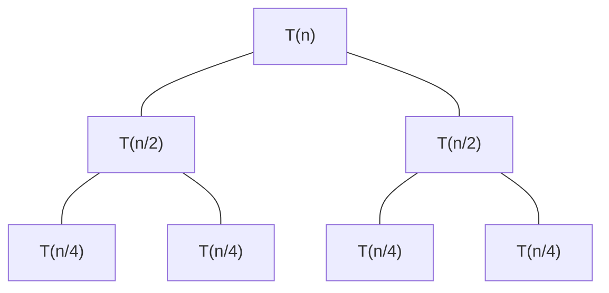

標籤: #DataStructure #algorithm #list 

---

[TOC]

---

# Solving

To solve [[#Big-O Notation]] of a recursion function, we have three methods:

1. [[#Substitution Method]]: We guess a bound and then use mathematical induction to prove our guess correct.
2. [[#Recursion Tree Method]]: This method converts the recurrence into a [[Tree]] whose nodes represent the costs incurred at various levels of the recursion. We use techniques for bounding summations to solve the recurrence.
3. [[#Master Method]]: This method provides bounds for recurrence of the form $T(n) = aT(n / b) + f(n)$.

The first one is used to prove your answer, and the second one is used to guess an answer. Therefore, you are probably going to use both of them.

The following example is the process of solving [[#Big-O Notation]] for [[Merge Sort]] algorithm. Merge sort needs at most 

$$T(n) = T(\lfloor n / 2 \rfloor) + T(\lceil n / 2 \rceil) + c_1n$$

operations where $T(1) = c_2$.

## Substitution Method

The substitution method for solving recurrences comprises two steps:

1. Guess the form of the solution. We can do it using [[#Recursion Tree Method]].
2. Use mathematical induction to find the constants and show that the solution works. See the example below.

### Example

Assume we guessed that 

$$T(n) \leq dn\log_2 n + en$$

for some constant $d > 0$, $e > 0$ in the [[#Recursion Tree Method]] section.

We use mathematical induction to prove that this guess is correct:

For $n = 1$, 

$$T(1) = c_2 \leq d \log_2 1 + e$$

if we pick $e \geq c_2$.

Suppose

$$T(n) \leq dn \log_2 n + en$$

for every $n < k$.

For $n = k$, 

$$T(k) = 
T(\lfloor k / 2 \rfloor) + 
T(\lceil k / 2 \rceil) + c_1k$$

$$\leq 2T(k / 2) + c_1k$$

$$\leq 2(d \cdot k / 2 \cdot \log_2(k / 2) + 
e \cdot k / 2) + c_1k$$

$$ = dk \cdot \log_2(k / 2) + ek + c_1 k$$

$$ = dk \cdot \log_2 k - dk + ek + c_1k$$

$$\leq dk \cdot \log_2 k + ek \quad(\text{if we pick } d \geq c_1)$$

By induction on $k$, our guess is correct. Thus, 

$$T(n) = O(n \log_2 n)$$

## Recursion Tree Method

In this section, we are going to use recursion tree method to take a guess of the [[Merge Sort]]'s [[#Big-O Notation]].

We simply need a guess, therefore we may drop the floor and the ceiling functions and ignore the constants. We get:

$$T(n) = 
\left\{
	\begin{array}{}
		2T(n / 2) + n & \text{if } n > 1 \\
		1             & \text{if } n = 1
	\end{array}
\right.$$

Based on the function above, we draw the following tree:

Each node has an approx value:

| node       | approx value |
| ---------- | ------------ |
| $T(n)$     | $n$          |
| $T(n / 2)$ | $n / 2$      |
| $T(n / 4)$ | $n / 4$      | 

The tree has a depth of $\log_2 n$. Each layer takes $n$ time, therefore the toral cost is $O(n\log_2 n)$.

## Master Method

The master method is the faster way for solving recurrences of the form

$$T(n) = aT(n / b) + f(n)$$

Where

$$a \geq 1, \quad b > 1, \quad f(n) = \Theta(n^K \log^Pn)$$

We have three cases

$$
\begin{array}{l}
	\text{Case 1: } & \text{if } \log_ba > K &
	\text{then } \Theta(n^{\log_ba}) \\
	\text{Case 2: } & \text{if } \log_ba = K & 
	\left\{
		\begin{array}{l}
			\text{if } P > -1 & \Theta(n^K \log^{P + 1}n) \\
			\text{if } P = -1 & \Theta(n^K \log\log n) \\
			\text{if } P < -1 & \Theta(n^K)
		\end{array}
	\right. \\
	\text{Case 3: } & \text{if }\log_ba < K &
	\left\{
		\begin{array}{l}
			\text{if } P \geq 0 & \Theta(n^K \log^Pn) \\
			\text{if } P < 0 & O(n^K)
		\end{array}
	\right.
\end{array}
$$

---

參考資料:

Fundamentals of Data Structure, 2nd edition
Introduction to Algorithm, 3rd edition

---

link:

