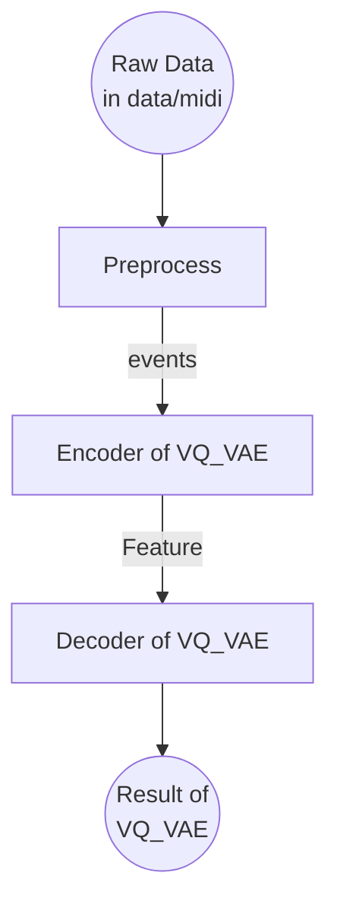
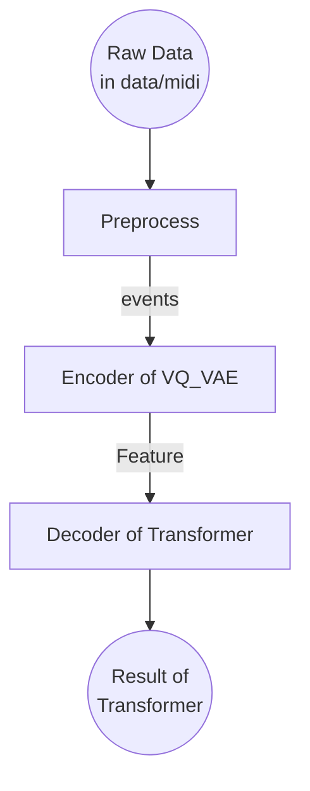

# Spring 2023 Introduction to Artificial Intelligence Final Project

## 1. Introduction

在課堂上我們看到了Generative AI 創作文字、影像等，這讓我們好奇可不可以應用在音樂上面。究竟Generative AI可不可以做出與某個作曲家類似的作品？音樂的風格可以被找出規律嗎？多個音樂家的風格可以利用Generative AI被良好的融合嗎？

作為產生音樂的模型，使用者肯定是創作者偏多，並且他們使用的檔案格式以MIDI檔案占大多數。因此我們希望可以做出一個可以產生MIDI檔案的模型，並帶給使用者創作的靈感。

## 2. Related work

### 2.1. Bachsformer - Github

[pier-maker92/bachsformer - Github](https://github.com/pier-maker92/bachsformer)

我們的模型以這個repository中的程式碼為主要架構，並且修改部份程式碼。

這個project 將輸入的midi以四分之一小節切割，利用VQ-VAE產生16個codebooks。接下來decoder-only transformer會利用這16個codebooks訓練產生原本的輸入。

### 2.2. What are Autoencoders? 介紹 - Medium

- [What are Autoencoders? - Medium](https://medium.com/ai-academy-taiwan/what-are-autoencoders-175b474d74d1)

這篇教學介紹了Auto Encoders的架構以及原理。由於VQ_VAE為Auto Encoder的其中一種變形，因此為了了解VQ_VAE，我們參考了這篇文章。

### 2.3. \[魔法陣系列\] AutoEncoder 之術式解析 - Ithelp

- [\[魔法陣系列\] AutoEncoder 之術式解析 - 2019 iT 邦幫忙鐵人賽](https://ithelp.ithome.com.tw/articles/10206869)

這篇教學一樣介紹了Auto Encoders，不過他介紹了不同種類的AE，並且做了比較與整理。裡面包含了VAE的架構與原理，可以幫助我們對VQ_VAE的了解，因此我們參考這篇文章。

### 2.4. 帶你認識Vector-Quantized Variational AutoEncoder - 理論篇 - Medium

- [帶你認識Vector-Quantized Variational AutoEncoder - 理論篇 - Medium](https://medium.com/ai-academy-taiwan/%E5%B8%B6%E4%BD%A0%E8%AA%8D%E8%AD%98vector-quantized-variational-autoencoder-%E7%90%86%E8%AB%96%E7%AF%87-49a1829497bb)

前面兩篇介紹了AE和AE底下的一些種類，但是沒有介紹到VQ_VAE，但是這一篇介紹了VQ_VAE的原理。因此我們參考了這一篇文章學習VQ_VAE的架構。

### 2.5. Neural Discrete Representation Learning - Arxiv

- [Neural Discrete Representation Learning - Arxiv](https://arxiv.org/abs/1711.00937v2)

這篇為 VQ_VAE 的論文，除了介紹了原理之外，也看到作者利用VQ_VAE對圖片、音訊與影片資料的成果。

### 2.6. Day 20. 深度學習模型 - Attention 和 Transformer - Ithelp

- [Day 20. 深度學習模型 - Attention 和 Transformer - Ithelp](https://ithelp.ithome.com.tw/articles/10304388)

這篇文章中講解了Attention 與Transformer的概念，由於此project的Decoder使用了Transformer，因此此篇文章有助於理解Transformer的原理。

### 2.7. 【機器學習2021】Transformer (上/下) - youtube

- [【機器學習2021】Transformer (上) - YouTube](https://www.youtube.com/watch?v=n9TlOhRjYoc)
- [【機器學習2021】Transformer (下) - YouTube](https://www.youtube.com/watch?v=N6aRv06iv2g)

此兩部影片用漸進的方法從簡單的Sequence-to-sequence概念到Transformer都講解的很清楚，有助於理解Transformer的架構與可以解決的問題。

### 2.8. Generating music with sentiment using Transformer-GANs - Arxiv

- [Generating music with sentiment using Transformer-GANs - Arxiv](https://arxiv.org/abs/2212.11134)

這篇論文提供了一個利用Transformer產生音樂的例子。

### 2.9. Jukebox: A Generative Model for Music - Arxiv

- [Jukebox: A Generative Model for Music - Arxiv](https://arxiv.org/abs/2005.00341)
- [论文阅读 - Jukebox: A Generative Model for Music - CSDN](https://blog.csdn.net/zjuPeco/article/details/116159855)

這篇論文和 Bachsformer 一樣利用了VQ_VAE和Transformer來生成音樂，不同的點在於他還生成了歌詞。但是需要的算力非常龐大，在V100 GPU上讀20秒的音樂且訓練需要花費3小時，因此我們僅有參考。

### 2.10. 十分钟理解Transformer - CSDN

- [十分钟理解Transformer - CSDN](https://zhuanlan.zhihu.com/p/82312421)

此篇貼文解釋了Transformer較詳細的數學，並且實際試著運算整個模型的過程。這個實際運算的演示讓我們更了解Transformer在做的事情。

### 2.11. VQ-VAE/VQGAN及改良工作小汇总

- [VQ-VAE/VQGAN及改良工作小汇总 - 知乎](https://zhuanlan.zhihu.com/p/569120964)

此篇文章引述了一些論文，講解了VQ_VAE還可以改善的點。雖然因為時間關係我們無法照著上面的內容改良，但是其引述到的論文值得參考。

### 2.12. 论文解读 | Transformer 原理深入浅出 - 知乎

- [论文解读 | Transformer 原理深入浅出 - 知乎](https://zhuanlan.zhihu.com/p/110219298)

這篇文章包含到了一些其他篇文章沒有講解的公式，並且裡面有一些作圖。這篇文章中的公式解釋值得參考。

### 2.13. 【DL】第 7 章 ：用于音乐生成的Transformers和 MuseGAN - CSDN

- [【DL】第 7 章 ：用于音乐生成的Transformers和 MuseGAN - CSDN](https://blog.csdn.net/sikh_0529/article/details/129371849#t12)

這篇文章提到了Transformer與MuseGAN。本來我們打算也分析MuseGAN的表現，但是MuseGAN的環境一直沒辦法成功。雖然沒有使用到，但是我們認為在未來嘗試MuseGAN是一件有價值的事，因此列在這裡參考。

### 2.14. minGPT - Github

- [minGPT - Github](https://github.com/karpathy/minGPT.git)

在Transformer部份，Bachsformer使用了minGPT作為Transformer 的implementation。minGPT作為一個精簡的implementation，讓我們了解到Transformer最基礎的架構用code寫出來會是什麼樣子。

## 3. Dataset

- [bytedance/GiantMIDI-Piano - Github](https://github.com/bytedance/GiantMIDI-Piano.git)

Giant MIDI Piano是由ByteDance製作的AI模型，他把YouTube上的鋼琴音檔轉換為MIDI檔案，提供我們資料集。

因為我們需要訓練一些曲風的鋼琴譜，因此我們希望曲風的種類越多，資料量越大越好。在查詢時，我們發現這個資料集的作曲者非常多樣，並且一些知名作者的譜非常多，適合拿來訓練。

這個資料集是經由AI模型轉檔，所以難免會有誤差，但是仍然是很完整的素材。

### 3.1. 曲子個數統計

以下列出幾種曲風和曲子個數：

| 曲風     | 曲子個數 |
| -------- | -------- |
| baroq    | 189      |
| classcal | 211      |
| romance  | 457      | 

以下列出作曲家和他的曲子個數：

| 作曲家       | 曲子個數 |
| ------------ | -------- |
| Bach         | 129      |
| Beethoven    | 76       |
| Chopin       | 96       |
| Debussy      | 27       |
| Handel       | 57       |
| Liszt        | 141      |
| Lully        | 3        |
| Mendelssohn  | 25       |
| Mozart       | 72       |
| Rachmaninoff | 21       |
| Schubert     | 99       |
| Schumann     | 48       | 

### 3.2. 預處理

由於資料集已經是midi檔案，因此不需要將他轉換檔案。不過，為了將資料集量化，需要將MIDI檔讀成方便處理的格式。以下為將MIDI檔轉換為 `events` 的步驟：

> Input: `filepath`, a string of the path of the MIDI file
> Output: `events`, a list of tuples, each tuple contains the start time, end time and note.

1. 利用`mido`套件中的`MidiFile`函式讀取MIDI檔案

```python
from mido import MidiFile
tracks = MidiFile('midi_file.mid').tracks
```

`tracks`為每個音軌組成的陣列。

2. 利用兩個`for`迴圈將每個音軌中的每個訊息讀取出來

```python
for track in tracks:
    for msg in track:
        print(msg)
        # process MIDI file
```

3. `msg`擁有兩種，其中一種記錄了音符的訊息，另一種記錄了meta data的訊息，我們只需要處理前者

```python
for track in tracks:
    for msg in track:
        if msg.is_meta:
            continue
        elif msg.type.split('_')[0] == 'note':
            print(msg)
            # process note message
```

4. 對於每一個 `note` 開頭的訊息，我\們可以分成兩種：

- `note_on`：音符開始，代表按下鋼琴鍵
- `note_off`：音符結束，代表放開鋼琴鍵

```python
for track in tracks:
    for msg in track:
        if msg.is_meta:
            continue
        elif msg.type.split('_')[0] == 'note':
            if msg.type == 'note_on':
                print('note on')
                # process note on message
            elif msg.type == 'note_off':
                print('note off')
                # process note off message
```

5. 要將每個音的按下時間與放開時間記錄下來，我們可以用一個`list`來記錄。

- 將按下的時間記錄在`start_events`陣列中
- 將按下的音符記錄在`notes_on`陣列中

```python
for track in tracks:
    notes_on = np.empty(0).astype(int)
    start_events = np.empty(0).astype(int)
    for msg in track:
        if msg.is_meta:
            continue
        elif msg.type.split('_')[0] == 'note':
            if msg.type == 'note_on': # append note and start time
                start_events = np.hstack((start_events, msg.time))
                notes_on = np.hstack((notes_on, msg.note))
            elif msg.type == 'note_off':
                # process note off message
```

6. 當音符放開時，我們將開始時間、結束時間、音符記錄在`events`陣列中，並把`notes_on`與`start_events`中的相對應的音符與開始時間刪除。

```python
events = []
for track in tracks:
    notes_on = np.empty(0).astype(int)
    start_events = np.empty(0).astype(int)
    for msg in track:
        if msg.is_meta:
            continue
        elif msg.type.split('_')[0] == 'note':
            if msg.type == 'note_on': # append note and start time
                start_events = np.hstack((start_events, msg.time))
                notes_on = np.hstack((notes_on, msg.note))
            elif msg.type == 'note_off':
                # get note index of released note
                note_idx = np.where(notes_on == note)[0]
                # get start time of released note
                start_event = start_events[note_idx][0]
                # append start time, end time and note
                events.append(((start_event, msg.time, note)))
                # remove note and start time from array
                notes_on = np.delete(notes_on, note_idx)
                start_events = np.delete(start_events,note_idx[0])
```

7. 最後，我們將`events`陣列中的每個元素排序。

```python
events.sort()
return events
```

## 4. Baseline

我們希望可以做出一個可以產生音樂的model。由於結果是偏向創意成份，並且我們只有成功讓main approach 動起來（另外一個model，museGAN架設環境失敗），因此我們沒有用來比較的baseline。

## 5. Main Approach

### 5.1. 介紹

為了完整的描述我們的模型，我們必須先知道Auto Encoder與其種類，接著介紹VQ_VAE與transformer，最後介紹我們的模型。

### 5.2. Auto Encoder

#### 5.2.1. 架構

下圖為Auto Encoder的架構，在圖片中以圖像作為例子。

![[Pasted image 20230603180956.png]]

Auto Encoder分為三個部份，Encoder、Bottleneck與Decoder。這個模型的運作方式如下：

1. Encoder: 輸入經過encoder，壓縮為一個較小的向量。
2. Bottleneck: 此較小的向量在圖中稱為為Latent Space Representation。由於此向量相較原本的輸入資料量較少，因此稱為Bottleneck。
3. Decoder: Bottleneck的資料經過Decoder，變回原本輸入的大小。

Auto Encoder會盡量讓輸出與輸入一樣，Loss的定義如下：

$$
\sum_{i = 1}^{n} (x_i - \hat x_i)^2
$$

下圖將架構以代號定義：

![[Pasted image 20230603182305.png]]

Auto Encoder 有一些特性：

- 此模型盡量將輸入與輸出的差距減小，因此只要有資料集作為輸入即可，為unsupervised learning。
- Encoder 可以作為 non-linear 的 dimension reduction 的方法。
- 可以將輸入轉換為具代表性的特徵。

#### 5.2.2. Encoder

Encoder 可以將輸入經過一些hidden layer，轉換為latent vector $C$。$C$ 可以有以下稱呼：

- code
- latent vector
- latent space

Encoder有以下值得注意的性質：

- $C$代表輸入經過非線性轉換壓縮後的特徵。
- $C$為低維向量，代表Encoder有降維提取出特徵的功能。
- Encoder中的hidden layers擁有非線性轉換的activation function，能夠做到non-linear dimension reduction。

#### 5.2.3. Decoder

Decoder 將latent vector $C$ 盡量還原成輸入的資料。Decoder 可以將低維的向量 $C$ 轉換為高維的資料。

#### 5.2.4. Loss function

一般loss function 都會使用cross entropy，不過為了簡單表示loss function，這邊使用mean square error:

$$
\sum_{i = 1}^{n} (x_i - \hat x_i)^2
$$

這個loss的值會使用back propagation去更新前面encoder與decoder的權重。

### 5.3. Variational Auto Encoder

下圖為 Variational Auto Encoder的架構，與Auto Encoder的差別為latent vector $C$會限制要遵照高斯分佈。

![[Pasted image 20230603185015.png]]

由於高斯分佈可以利用平均值 $\mu$與標準差 $\Sigma$ 表示，因此 latent vector $C$ 可以用以下三個參數表示：

- $\mu$: 平均值
- $\Sigma$: 標準差
- $\epsilon$: offset

$$C = \left[
	\begin{array}{}
		c_1 \\
		c_2 \\
		\vdots \\
		c_n
	\end{array}
\right]$$

Latent vector $C$ 中的 element定義如下：

$$c_i = \text{exp}(\Sigma_i) \times \epsilon_i + \mu_i$$

與 Auto Encoder 相同，Variational Auto Encoder也需要定義Loss Function。這裡的Loss Function與Auto Encoder看起來會不一樣，因為Auto Encoder有具體的 $c_i$ 值，而透過 Variational Auto Encoder 產生的 latent vector $C$ 利用了 $\Sigma_i, \epsilon_i, \mu_i$ 表示，因此Loss Function 定義如下。

$$\sum_{i = 1}^{n} (1 + \Sigma_i  -(\mu_i)^2 - \text{exp}(\Sigma_i))$$

Variational Auto Encoder 可以利用高斯分佈來解讀向量中的每一個維度分別代表什麼意思，並生成結果。

### 5.4. Denoising Auto Encoder

![[Pasted image 20230603192150.png]]

Denoising Auto Encoder 的原理和 Auto Encoder 很像，差別在於輸入端與輸出端的比較。

- 輸入端會將原始的資料隨機加上噪聲，再放進 Auto Encoder 裡面。
- 輸出端在計算 Loss Function 時，會利用原始的圖片。

這種輸入端與輸出端代表我們在訓練模型將輸入真正重要的特徵提取為latent vector $C$，而噪聲會被過濾掉。接著經過Decoder解碼後，就可以得到沒有噪聲的結果。

### 5.5. Sparse Auto Encoder

![[Pasted image 20230603192758.png]]

Sparse Auto Encoder 在latent vector $C$ （上圖中顯示為$Z$）特徵上大部分的值都是0。而在實作上與Auto Encoder的差別在於 Loss Function 的決定，在 Sparse Auto Encoder 的 Loss Function 中會加入L1正則化，公式如下：

$$
\sum_{i = 1}^{n} (x_i - \hat x_i)^2 + \lambda\sum_{i = 1}^n \vert c_i\vert
$$

- $\lambda$: L1 penalty 的權重。

上式在 Loss Function 的基礎上再加上一個L1 penalty，使 $c_i$ 的數值總和盡量變小。因為 $c_i$ 的數值總合必須盡量小，且又要將特徵擷取為 latent vector $C$，所以值會集中在幾個節點中，其他的節點會是0。

這個作法的優點在於每個節點會專精於特定的特徵，使特徵的擷取更精準。

### 5.6. Vector-Quantized Variational Auto Encoder

![[Pasted image 20230603194914.png]]

Vector-Quantized Variational Auto Encoder 是 VAE 經過改良後的版本。他會利用以下步驟生成輸出：

1. Encoder 將輸入編碼為 Feature Map $Z_e(x)$。
2. Feature Map 中 D 維的特徵向量與 Codebooks 中 $K$ 個向量作比較，以最接近的編碼的向量索引取代 $Z_e(x)$，作為藍色的 Feature Map $q(z \vert x)$。
3. 將特徵 $q(z \vert x)$ 轉換為 $z_q(x)$。
4. Decoder 將特徵 $q(z\vert x)$ 轉換為輸出 $p(x \vert z_q)$

在上述步驟2中，我們以最接近的編碼向量取代原本的值，因此我們沒辦法像前面幾個方法一樣使用 back propagation 計算梯度並更新權重。為了解決這個問題，我們可以利用一種近似的方法。雖然我們沒辦法得到Vector Quantization Step 和其前面的誤差，但是我們仍然有$z_q(x)$ 造成的誤差，我們可以將此誤差直接當作$z_e(x)$ 的誤差進行 back propagation，在上圖中為紅線條的箭頭。此方法稱為 Straight-through Estimator。

上圖中提到了Codebooks，我們希望其盡量涵蓋各種輸入可能擁有的特徵。因此在訓練時，Codebooks中的參數也會被調整。調整的方法可以用$z_e(x)$ 相對Codebooks 向量 $e_i$ 的Loss Function加上 L2 norm計算梯度來調整。

$$L = \log p(x\vert z_q(x)) + 
\vert\vert \text{sg}[z_e(x)] - e \vert\vert_2^2 + 
\beta\vert\vert z_e(x) - \text{sg}[e] \vert\vert_2^2$$

在論文中，作者將VQ_VAE應用在許多領域，不僅有圖片，還有音訊與影片。在音訊的實驗中，作者利用了許多演講的錄音放進VQ_VAE模型中。作者發現演講的錄音在VQ_VAE還原後只保留了內容資訊，並排除了語調與語氣，因此VQ_VAE可以擷取出真正重要的特徵。

### 5.7. Transformer

![[Pasted image 20230603232005.png]]

一般的Transformer模型採用以上架構，分成了Encoder（左側）與Decoder（右側）。在此次project 中，我們僅使用右側Decoder的部份，而左側Encoder的部份採用了VQ_VAE。

右側的Decoder以Encoder所產生的特徵與前面幾次的輸出作為輸入，一步一步產生出輸出。由於會以前面幾次的輸入作為參數，因此可以較好的將前後的小節對起來。在本次產生音樂的用途中，利用Transformer的Decoder應該可以達成前後呼應的效果。

### 5.8. MIDI

MIDI是一種紀錄了音色、音高、力度與持續時間的檔案，相較於一般的音訊檔案只紀錄了音訊，MIDI在生成後更方便創作者修改裡面的內容。

![[Pasted image 20230604121108.png]]

MIDI檔案的這種易讀取的性質，也讓我們可以做出對應的Embedding，並找出較精準的規律。

### 5.9. 檔案架構

```
.
├── data
│   ├── midi
│   └── vocab
├── generated
├── generate.py
├── train_transformer.py
├── train_vq_vae.py
├── transformer_decoder_only
│   ├── bpe.py
│   ├── model.py
│   ├── trainer.py
│   └── utils.py
└── vq_vae
    ├── ludovico-mini
    │   ├── ludovico-mini.json
    │   └── state_dict
    ├── midi_tools.py
    ├── tools.py
    └── vq_vae.py
```

- `data`: 資料夾，裡面包含了兩個資料夾。
	- `midi`: 資料夾，可以將訓練資料集放在裡面。訓練時會將副檔名為`mid`的檔案過濾出來。
	- `vocab`: 用來暫存codebooks轉換為vocabulary的資料夾。
- `generated`: 資料夾，產生出來的音樂檔案會放在裡面。
- `generate.py`: 生成音樂。
- `train_transformer.py`: 訓練transformer。
- `train_vq_vae.py`: 訓練vq_vae。
- `transformer_decoder_only`: 資料夾，transformer的api放在這裡面。
- `vq_vae`: 資料夾，vq_vae的api與midi的預處理放在這裡面。

### 5.10. 執行步驟

此程式的執行分成以下步驟：

1. 準備資料集，將同一種曲風/創作者的midi檔案放在`data/midi`資料夾裡面。
2. 執行`train_vq_vae.py`，此script會讀取`data/midi`資料夾中的檔案，並訓練VQ_VAE模型。

```python
python3 train_vq_vae.py
```

此模型的流程圖如下：



在此訓練中：

- Preprocess：原本的MIDI曲子會經過預處理，並且變成一個陣列 `events`。此陣列裡面含有多個tuples，每個tuple代表了一個按鍵從按下到放開的event，包含了三個元素：按下時間、放開時間與音階。
- Encoder: 這裡採用VQ_VAE的Encoder，將 `events` 陣列的特徵提取出來。此特徵由16個codebooks產生。
- Decoder：這裡採用VQ_VAE的Decoder，將 feature 解碼為原本的輸入曲子。
- Back propagation：經過Loss function 的計算後，會修正codebooks的數值、Decoder與Encoder的權重。

3. 執行`train_transformer.py`，此script會利用VQ_VAE模型的Encoder來訓練transformer模型的decoder。

```python
python3 train_transformer.py
```



- 可以看到此步驟與上一個步驟相似，只是Decoder由原本的VQ_VAE改為Transformer。
- 此Decoder會將feature（由16個codebooks產生）轉換為結果。
- 此結果會用來與輸入比較，並拿來修改Transformer中的權重。
- 利用Transformer是必要的。由於Transformer利用到了attention，所以可以讓模型對音樂的上下文更有理解。否則音樂的生成就只是單單將不同的和絃詞彙填入，而沒有任何的連貫。

4. 執行`generate.py`，此script會利用上面訓練的模型產生一首曲子，並存在`generated`資料夾裡面。

```python
python3 generate.py
```

### 5.11. 修復bug

原本的程式碼有幾個地方有bug，在放入我們的資料集時，採樣及預處理的地方有一些bug。這些bug可能是因為作者自己測試的資料集並非用手彈奏，而是用譜產生的。以此產生的MIDI檔案拍點都會在位置上，並且按下的按鍵與放開的按鍵數目會是一樣的。

但是我們的資料集有許多誤差：

- 用手彈奏的音不可能完全在拍點上。作者沒有考慮到小節第32個拍點後半的部份，程式遇到這部份會出錯。
- 由AI產生的MIDI檔案有一些奇怪的地方，譬如會連續按下同一個按鍵兩次，再連續放開同一個按鍵兩次。
- 除了重複按下按鍵的情形，也有沒有按下，卻有放開按鍵的event。

除了這些bug之外，我們也發現作者在讀取檔案的時候副檔名的讀取並不正確。

為了解決這些bug，我們修復了以下部份。

#### 5.11.1. 取樣的bug

以下為原始的程式碼：

```python
grid_start_index = round(
	(t_start%self.bar_length)/self.compress_ratio
)
grid_end_index = round(
	(t_end%self.bar_length)/self.compress_ratio
)
```

可以看到上面將480個取樣點經過compress_ratio變成32個取樣點。由於轉換是採用四捨五入，因此轉換後的取樣點有0~32的範圍（包含）。

這個會有問題，因為32個取樣點範圍其實是從0~31，因此上面的程式應該採用向下取整。

```python
grid_start_index = int(
	(t_start%self.bar_length)//self.compress_ratio
)
grid_end_index = int(
	(t_end%self.bar_length)//self.compress_ratio
)
```

#### 5.11.2. 重複按下的按鍵

考慮一種情況，依照時間順序分別發生以下事件：

1. 按下第15個鍵
2. 按下第15個鍵
3. 放開第15個鍵
4. 放開第15個鍵

這種情況在真實情況中不可能發生，因為在一個鍵尚未放開的時候不可能再按下一次。但是在我們的資料集中有這種情形，因此我們必須要處理這類的情況。

以下為修改過後的程式碼：

```python
if msg.velocity and msg.type=="note_on":
	# update notes one
	notes_on = np.hstack( (notes_on,note) )
	start_events = np.hstack( (start_events,cur_time) )
# note off
else:
	note_idx = np.where(notes_on==note)[0]
	start_event = start_events[note_idx][0]
	events.append(((start_event,cur_time,note)))
	notes_on = np.delete(notes_on,note_idx[0]); start_events = np.delete(start_events,note_idx[0])
```

#### 5.11.3. 處理沒按下卻放開的event

這類event較少出現，但是還是有。這種情形應該要忽略，因此我們可以用一個`try`包起來。以下是修改後的程式碼：

```python
# note on
if msg.velocity and msg.type=="note_on":
	# update notes one
	notes_on = np.hstack( (notes_on,note) )
	start_events = np.hstack( (start_events,cur_time) )
# note off
else:
	try:
		# print("notes_on:", notes_on)
		# print("note:", note)
		# print('start_events:', start_events)
		note_idx = np.where(notes_on==note)[0]
		# print("note_idx:", note_idx)
		start_event = start_events[note_idx][0]
		events.append(((start_event,cur_time,note)))
		# print("removing note_idx:", note_idx[0])
		notes_on = np.delete(notes_on,note_idx[0]); start_events = np.delete(start_events,note_idx[0])
	except:
		print("file:",filepath, "has a problem of note off")
```

#### 5.11.4. MIDI副檔名

以下為原本的程式碼：

```python
tunes = [
	t for t in os.listdir(work_dir) 
	if t.split(".")[1] == "mid"
]
```

可以看到他使用了`"."`來隔開檔名，並把第二段字串當作判斷副檔名的標準。在我們的資料集中，有些檔名包含點，譬如：

```
Bach, Johann Sebastian, Duetto No.3 in G major, BWV 804, 7Dc3en1ntpM.mid
```

其中的`No.3`就包含了點。這會導致原本的程式碼認為這個檔案不是MIDI檔，因此應該修改為以下程式碼：

```python
tunes = [
	t for t in os.listdir(work_dir) 
	if t.split(".")[1] == "mid"
]
```

## 6. Evaluation Metric

在訓練時，作者提供了 vq_vae_loss 與 perplexity 的計算。

vq_vae_loss定義在`vq_vae/tools.py`:

```python
def vq_vae_loss(self, output, target):
	loss = nn.BCELoss(reduction='none')(output, target)
	return torch.mean(loss)
```

此project 中計算loss function 的方式為 Binary Cross Entropy，公式如下：

$$l(x, y) = L = \{l_1, \dots, l_N\}^T, \quad l_n = -w_n [y_n \cdot \log x_n + (1 - y_n) \cdot \log (1 - x_n)]$$

$$\text{vq\_vae\_loss} = 
\text{ave}(L) = \frac{1}{N}\sum_{i = 1}^N l_i$$

perplexity的算法定義在`vq_vae/vq_vae.py`:

```python
perplexity = torch.exp(-torch.sum(avg_probs * torch.log(avg_probs + 1e-10)))
```

- `avg_probs`: 每個codebook的平均組成的陣列

$$\text{perplexity} = \exp(-\sum_{i = 1}^{16} p_i \cdot \log(p_i))$$

## 7. Results & Analysis

在最後，我們達成了以下任務：

- [x] 了解模型的架構
- [x] 能讀取MIDI檔案並訓練出模型
- [x] 能基於資料集創作音樂
- [ ] 嘗試修改參數並比較結果
	- [x] 修改 epoch
	- [ ] 修改hidden layer 中的參數

以下為修改epoch分別為5和10得到的結果：

![[Pasted image 20230604024959.png]]

- 較少epoch會使結構較為凌亂，並且小節區分的地方比較不明顯。此外，雖然較小的段落可以聽出組織，但每個段落聽起來各自獨立。
- 較多的epoch會使結構較為整齊，段落感變強，並且和諧感也較佳。另外，大的段落組織比較分散，但是有許多重複的樂句組織。

根據聆聽的結果，我們可以看出單純將樂曲放進去後，模型可以學會大略的樂句組織，並且可以產生出簡單的上行與下行的旋律。但是聽起來並沒有利用到較進階的技巧，譬如轉換大小調。

在將所產生的樂曲打開後，可以看到所產生的和弦並不符合樂理，譬如以下的譜並不是樂理中有的三和弦：

![[Pasted image 20230604030257.png|400]]

但也有少部份的地方符合樂理，譬如以下：

![[Pasted image 20230604030741.png|300]]

- 第二個和弦為Bø7/F（B半減七和弦，第二轉位）
- 第三個和弦為Em/G（E小三和弦，第一轉位）

儘管有部份和弦符合樂理，和弦的排列並沒有符合常見的排列。

由於在前面修bug與架環境花了許久，並且在訓練模型時花了許多時間，因此最後沒有時間再去修改其他參數並測試與比較結果。

## 8. Error Analysis

由於訓練時間不足，並且我們沒有利用其他模型進行比較，因此我們僅能從樂理的角度下去討論我們的成果。雖然無法量化樂理的分析結果，但是我們可以從樂譜中看到模型成功理解樂理概念。

在一些論文中，我們看到他們的誤差分析方法是用自己的模型與SOTA method比較。由於時間不夠，且人手也不足，因此我們沒有餘力再使用另一個模型與自己做比較。如果未來有機會的話，可以朝著這一塊來分析自己的模型。

## 9. Future Work

### 9.1. 環境建立問題

Bachsformer是別人寫的model，我們沿用了它並且嘗試建立環境。預設的conda建構檔在Windows 11以及Linux皆會失敗，只有在mac OS順利運作。

考慮這一點，我們的模型無法在所有電腦上面輕鬆執行，因此未來我們應該把`bachsformer.yml`改善，讓其他系統在依照這個列表建立conda環境時也可以一鍵建立成功。

### 9.2. 嘗試修改內部卷積層

在修改內部卷積層時，我們修改的參數與許多功能衝突，因此我們沒有辦法在時限內完成修改。

我們相信現在的模型還可以經過fine-tune後出現更好的效果，因此我們未來可以嘗試進行fine-tune。

### 9.3. 訓練資料的挑選

這次我們僅考慮不同樂派或不同作曲家的曲子放進去訓練，但是在看到訓練結果後，我們發現訓練的方向有可能不對。

從產生的曲子中，我們很難看出曲子與樂派有關聯性，並且音符的排列與和弦的種類與樂理相差甚遠。因此我們覺得在未來訓練上應該用以下幾種分類：

- 使用相同和聲排列的樂曲（例如I–V–vi–iii–IV–I–IV–V、C–Am–F–G7等）
- 有相同大調或小調的樂曲
- 樂曲架構排列上相似（譬如A-B-A排列）

### 9.4. 加長訓練時間

為了在deadline前產生多個樂派的結果，我們僅使用最多10個epoch。但是在我們試過5個與10個後，我們發現增加epoch時我們的模型還有更多進步的空間。因此未來可以通過增加epoch來達成較好的效果。

### 9.5. 深入了解Implementation

我們在這次project只有了解到原理，並且看到相對應的實作架構，但我們不見得知道每一行程式碼代表的意思。未來如果需要自己架設模型，難免會需要自己implement訓練方法，因此未來了解minGPT與VQ_VAE的實作方法也非常有幫助。

## 10. Code

Repository of code: [LittleD3092/creative-musician - Github](https://github.com/LittleD3092/creative-musician.git)
URL: https://github.com/LittleD3092/creative-musician.git

## 11. Contribution of each member

| 成員   | 工作內容     | 比例 |
| ------ | ------------ | ---- |
| 王敬智 | paper閱讀    | 50%  |
|        | dataset整理  |      |
|        | 投影片製作   |      |
|        | 報告內容撰寫 |      |
|        | 模型訓練     |      |
|        | 程式測試     |      |
|        | 架構討論     |      |
| 吳典謀 | paper閱讀    | 50%  | 
|        | 報告內容撰寫 |      |
|        | 投影片修飾   |      |
|        | 程式碼修改   |      |
|        | 架構討論     |      |

## 12. References

### 12.1. Related Papers:

[1] Dhariwal, Prafulla, et al. "Jukebox: A generative model for music." arXiv preprint arXiv:2005.00341 (2020), https://arxiv.org/abs/2005.00341.

[2] Han, Sangjun, Hyeongrae Ihm, and Woohyung Lim. "Symbolic Music Loop Generation with VQ-VAE." arXiv preprint arXiv:2111.07657 (2021), https://arxiv.org/abs/2111.07657.

[3] Neves, Pedro, Jose Fornari, and João Florindo. "Generating music with sentiment using Transformer-GANs." arXiv preprint arXiv:2212.11134 (2022), https://arxiv.org/abs/2212.11134.

[4] Van Den Oord, Aaron, and Oriol Vinyals. "Neural discrete representation learning." Advances in neural information processing systems 30 (2017), https://arxiv.org/abs/1711.00937v2.

### 12.2. Introduction Networks:

[5] “【機器學習2021】Transformer (上).” YouTube, 26 March 2021, https://www.youtube.com/watch?v=n9TlOhRjYoc.

[6] “【機器學習2021】Transformer (下).” YouTube, 9 April 2021, https://www.youtube.com/watch?v=N6aRv06iv2g. 

[7] “【DL】第 7 章 ：用于音乐生成的Transformers和 MuseGAN_music transformer_Sonhhxg_柒的博客.” CSDN博客, 8 March 2023, https://blog.csdn.net/sikh_0529/article/details/129371849#t12. 

[8] “一起幫忙解決難題，拯救 IT 人的一天.” iT 邦幫忙::一起幫忙解決難題，拯救IT 人的一天, https://ithelp.ithome.com.tw/articles/10206869. 

[9] “一起幫忙解決難題，拯救 IT 人的一天.” iT 邦幫忙::一起幫忙解決難題，拯救IT 人的一天, https://ithelp.ithome.com.tw/articles/10304388. 

[10] “论文阅读- Jukebox: A Generative Model for Music_jukebox: a generative model for music prafulla_七元权的博客.” CSDN博客, 30 April 2021, https://blog.csdn.net/zjuPeco/article/details/116159855. 

[11] “十分钟理解Transformer - 知乎.” 知乎专栏, https://zhuanlan.zhihu.com/p/82312421. 

[12] “论文解读| Transformer 原理深入浅出- 知乎.” 知乎专栏, https://zhuanlan.zhihu.com/p/110219298. 

[13] “帶你認識Vector-Quantized Variational AutoEncoder - 理論篇.” Medium, 28 April 2020, https://medium.com/ai-academy-taiwan/%E5%B8%B6%E4%BD%A0%E8%AA%8D%E8%AD%98vector-quantized-variational-autoencoder-%E7%90%86%E8%AB%96%E7%AF%87-49a1829497bb. 

[14] “VQ-VAE/VQGAN及改良工作小汇总.” 知乎专栏, 28 September 2022, https://zhuanlan.zhihu.com/p/569120964. 

[15] “What are Autoencoders?. 簡單介紹Autoencoder的原理，以及常見的應用。 | by Yu-Ru Tsai | Taiwan AI Academy.” Medium, 9 March 2019, https://medium.com/ai-academy-taiwan/what-are-autoencoders-175b474d74d1. 