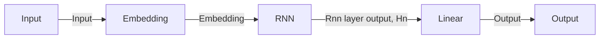

# Homework 2 Report

109611066 吳典謀

## Part 0

The text go through the following process:

- `remove_stopwords`, the default function provided by TA.
- `remove_tags`, my own function using `re.compile('<.*?>')` and `re.sub()` to remove the html tags.
- `WordNetLemmatizer()` to lemmatize the text.
- Element function `lower()` of `str` to convert the text to lowercase.
- `re.sub(r'[^a-zA-Z]', ' ', text)` to remove all the non-alphabetic characters.
- `tokenizer.tokenize()` and `strip()` to remove the leading and trailing whitespaces of each word.

An example of the text after the process:

Original text:

```
"One of the other reviewers has mentioned that after watching just 1 Oz episode you'll be hooked. They are right, as this is exactly what happened with me.<br /><br />The first thing that struck me about Oz was its brutality and unflinching scenes of violence, which set in right from the word GO. Trust me, this is not a show for the faint hearted or timid. This show pulls no punches with regards to drugs, sex or violence. Its is hardcore, in the classic use of the word.<br /><br />It is called OZ as that is the nickname given to the Oswald Maximum Security State Penitentary. It focuses mainly on Emerald City, an experimental section of the prison where all the cells have glass fronts and face inwards, so privacy is not high on the agenda. Em City is home to many..Aryans, Muslims, gangstas, Latinos, Christians, Italians, Irish and more....so scuffles, death stares, dodgy dealings and shady agreements are never far away.<br /><br />I would say the main appeal of the show is due to the fact that it goes where other shows wouldn't dare. Forget pretty pictures painted for mainstream audiences, forget charm, forget romance...OZ doesn't mess around. The first episode I ever saw struck me as so nasty it was surreal, I couldn't say I was ready for it, but as I watched more, I developed a taste for Oz, and got accustomed to the high levels of graphic violence. Not just violence, but injustice (crooked guards who'll be sold out for a nickel, inmates who'll kill on order and get away with it, well mannered, middle class inmates being turned into prison bitches due to their lack of street skills or prison experience) Watching Oz, you may become comfortable with what is uncomfortable viewing....thats if you can get in touch with your darker side."
```

Processed text:

```
'one reviewer mentioned watching oz episode hooked right exactly happened me the first thing struck oz brutality unflinching scene violence set right word go trust show faint hearted timid show pull punch regard drug sex violence hardcore classic use word it called oz nickname given oswald maximum security state penitentary focus mainly emerald city experimental section prison cell glass front face inwards privacy high agenda em city home many aryans muslims gangsta latinos christians italians irish scuffle death stare dodgy dealing shady agreement never far away i would say main appeal show due fact go show dare forget pretty picture painted mainstream audience forget charm forget romance oz mess around first episode ever saw struck nasty surreal say ready watched developed taste oz got accustomed high level graphic violence violence injustice crooked guard sold nickel inmate kill order get away well mannered middle class inmate turned prison bitch due lack street skill prison experience watching oz may become comfortable uncomfortable viewing thats get touch darker side'
```

### Problem 1: list `stopwords` not found

The `remove_stopwords` function use `ToktokTokenizer` to tokenize the text and then remove the stopwords according to the `stopwords` list provided by `nltk.corpus`.

When testing the `remove_stopwords`, I stumbled upon an error about `Resource wordnet not found.`

After some research, I found this stackoverflow post: [Resource corpora/wordnet not found on Heroku](https://stackoverflow.com/questions/13965823/resource-corpora-wordnet-not-found-on-heroku) and followed its instructions for fixing it. Later I found that google colab somehow fixed the problem, but the solution is still necessary if you want to run the code locally.

### Note 1: Why I removed non-alphabetic characters

After the lemmatization process, I found that there are some apostrophes left in the text. For example, the word `I'm` is lemmatized to `'`. I afraid that there might be more problems like this, so I decided to remove all the non-alphabetic characters.

## Part 1

### Question 1: Concept of perplexity

Perplexity is a measure of how well a model predicts. When the perplexity is low, the model is good at predicting the next word.

If the training data contains noise or is poorly annotated, the model will have a high perplexity.

### Result 1: Outputs of the model

1. without preprocess:


2. with `remove_stopwords`:


3. with custom preprocess:


In the second case, the perplexity is slightly higher, and the model is not as good as the first case. I think this is because the `remove_stopwords` function remove words and cause the ngram model unable to predict the next word.

In the third case, the perplexity and accuracy are slightly worse than the first case, but better than the second case. Compared to first case, I think the reason it is worse is the same as the second case. Compared to the second case, the reason it is better is that the custom preprocess function remove some noise in the text.

## Part 2

### Question 1: Two pre-training steps in BERT

The two pre-training steps in BERT are:

1. Masked Language Model (MLM): Randomly mask some words in the input and predict the masked words.
2. Next Sentence Prediction (NSP): Predicting whether the second sentence is the next sentence of the first sentence.

### Question 2: Four different BERT application scenarios

Some of the BERT application scenarios are:

1. Text classification: Classify the text into different categories.
2. Question answering: Answer the question based on the context.
3. Named entity recognition: Identify and classify names in the text, such as person names, organization names, location names, etc.
4. Language generation: Generate text based on the input, such as text completion, text summarization, etc.

### Question 3: Difference between BERT and distilBERT

DistilBERT is a model that is smaller and faster than BERT. It is a variant of the original BERT model, with fewer layers and parameters.

### Result 1: F1 score


### Question 4: Relation of the Transformer and BERT and the core of the Transformer

Transformer is a neural network architecture. The core of the Transformer is the attention mechanism, which allows the model to compute the representation of each token by considering the other tokens.

BERT is a pretrained model based on the Transformer.

## Part 3

### Question 1: Difference between vanilla RNN and LSTM

RNN uses hidden state to store the information of the previous time step, while LSTM uses a more sophisticated gating mechanism to select the information to be stored in cell state.

### Question 2: Meaning of each dimension of the input and output for each layer in the model

The dimensions of the input and output for each layer in the model are:

- Input: `(seq_len, batch_size)`
- Embedding: `(seq_len, batch_size, embedding_dim)`
- Rnn layer output: `(seq_len, batch_size, hidden_size*2)
- Hn (hidden layer): `((bidirectional ? 2 : 1) * num_layers, batch_size, hidden_size)`
- Output: `(batch_size, num_classes)`

The graph below shows the process of the model. Each layer is represented by a box, and the arrows represent the flow of data.



The parameters used in the dimension:

- `seq_len`: The length of the sequence. May vary depend on different sentence length.
- `batch_size`: The number of comments in a batch.
- `embedding_dim`: The dimension of the embedding vector.
- `hidden_size`: The dimension of the hidden state.
- `num_layers`: The number of layers in the RNN. If `bidirectional` is `True`, the number of layers in the RNN is `num_layers * 2`.
- `num_classes`: The number of classes. In our case, we have 2 classes: positive and negative.

### Result 1: F1 score


## Discussion

### Question 1: Innovation of NLP field

The evolution from ngram to LSTM and BERT reflects a trend toward more complex models.

Ngram is a simple model that only considers adjacent text. Note that this method is not suitable for long sentences because previous words are not considered.

LSTM is a more complex model that uses cell state and hidden state to store information. It is suitable for long sentences because it can consider the information of previous words.

BERT is a recent model that is more complex than LSTM. It is a pretrained model based on the Transformer. It uses self-attention mechanism to consider different parts of the text. Because it is a pretrained model, it can be fine-tuned on a relatively small dataset and achieve good results.

The evolution of these models means that we use NLP to analyze more complex text, also we wish to obtain better results without having to collect a large amount of data.

### Question 2: Problems I meet

One of the major problems I met is the syntax of the modules used. For example, the `torch` module has a lot of functions and it is hard to find the right one and implement it correctly.

When facing this problem, I usually search the internet for implementations that solve similar problems. I find it hard to figure out the dimensions of the LSTM model, so I searched the internet and come across this video: [L15.7 An RNN Sentiment Classifier in PyTorch](https://www.youtube.com/watch?v=KgrdifrlDxg&list=LL&index=1&ab_channel=SebastianRaschka). Starting from 21 minutes, the author shows the implementation of the model and explains the dimensions of each layer. This video helps me a lot.

Other than that, I also met some `nltk` problems when running code locally. This problem is mentioned in [[#Part 0]]. I solved this problem by searching similar problems on the internet and I find the solution in a stackoverflow post.