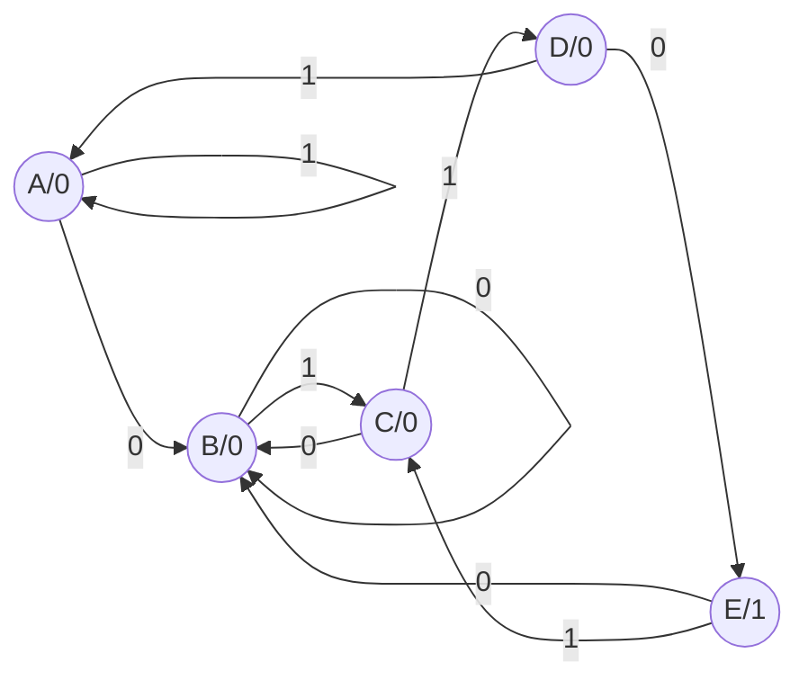

Student ID: 109611066
Name: 吳典謀

The last digit of my student ID is `6`. The BCD code is `0b0110`. 

| State | Prefix Represented |
| ----- | ------------------ |
| `A`   | empty              |
| `B`   | `0b0`              |
| `C`   | `0b01`             |
| `D`   | `0b011`            |
| `E`   | `0b0110`           |

The state diagram of the model is as follows:



The state table of the model is as follows:

| i   | Current State | Next State | Output |
| --- | ------------- | ---------- | ------ |
| 0   | A             | B          | 0      |
| 0   | B             | B          | 0      |
| 0   | C             | B          | 0      |
| 0   | D             | E          | 0      |
| 0   | E             | B          | 1      |
| 1   | A             | A          | 0      |
| 1   | B             | C          | 0      |
| 1   | C             | D          | 0      |
| 1   | D             | A          | 0      |
| 1   | E             | C          | 1      | 

Using the state table, I modify the demo code `SeqRcgn.v`:

```verilog
`timescale 1ns/10ps
module SeqRcgn (out,x,clk,reset_) ;
// Port declarations
output out ;
input x,clk,reset_ ;

reg out ;
reg[2:0] state, next_state ;
	
parameter A= 3'b000, B=3'b001, C=3'b011, D=3'b010, E=3'b110;

always@ (posedge clk or negedge reset_)
	if(!reset_)	// an asynchronous reset_
		state = A ;
	else
		state = next_state ;

always@ (state or x)
    case(state)		// state transition
    A:
		if(x)
			next_state = A ;
		else
			next_state = B ;
	B:
		if(x)
			next_state = C ;
		else
			next_state = B ;
	C:
		if(x)
			next_state = D ;
		else
			next_state = B ;
	D:
		if(x)
			next_state = A ;
		else
			next_state = E ;
	E:
		if(x)
			next_state = C ;
		else
			next_state = B ;
	default:
		next_state = 3'bxxx ;
	endcase
		
always@ (state)
	case (state)
	A, B, C, D:
		out = 0 ;
	E:
		out = 1 ;
	default:
		out = 1'bx ;
	endcase
	
endmodule

module test_SeqRcng ;

reg x, clk, reset_ ;

//SeqRcgn instance
    SeqRcgn SR1 (out, x, clk, reset_) ;

//Stimulus
initial
begin
	clk = 1'b0 ;
	repeat(30)
		#10 clk = ~clk ;
end
	
initial
begin
  x = 0 ; reset_ = 0;
  #15  reset_ = 1; x = 1 ;
  #20  x = 0 ;
  #20  x = 1 ;
  #20  x = 0 ;
  #20  x = 1 ;
  #20  x = 1 ;
  #20  x = 1 ;
  #20  x = 0 ;
  #20  x = 1 ;
  #20  x = 1 ;
  #20  x = 0 ;
  #20  x = 1 ;
  #20  x = 1 ;
  #20  x = 1 ;
  #20  x = 0 ;
  #20  x = 1 ;  
  
end

//Display results
initial
begin
  $display("                time out  x   clk  reset_");
  $monitor($time, "  %b   %b   %b   %b", out, x, clk, reset_) ;
end

initial
begin
$dumpfile("SeqRcgn.vcd");
$dumpvars;
end

endmodule
```

Result:

![[Pasted image 20230427154323.png]]

The state transition happens at `clk` positive edge, so sampling the `x`, `state` before and after `clk` positive edge, and `out` before positive edge, we have the following chart:

| x   | state (before transition) | state (after transition) | out (before transition) |
| --- | ------------------------- | ------------------------ | ----------------------- |
| 1   | 000(A)                    | 000(A)                   | 0                       |
| 0   | 000(A)                    | 001(B)                   | 0                       |
| 1   | 001(B)                    | 011(C)                   | 0                       |
| 0   | 011(C)                    | 001(B)                   | 0                       |
| 1   | 001(B)                    | 011(C)                   | 0                       |
| 1   | 011(C)                    | 010(D)                   | 0                       |
| 1   | 010(D)                    | 000(A)                   | 0                       |
| 0   | 000(A)                    | 001(B)                   | 0                       |
| 1   | 001(B)                    | 011(C)                   | 0                       |
| 1   | 011(C)                    | 010(D)                   | 0                       |
| 0   | 010(D)                    | 110(E)                   | 0                       |
| 1   | 110(E)                    | 011(C)                   | 1                       |
| 1   | 011(C)                    | 010(D)                   | 0                       |
| 1   | 010(D)                    | 000(A)                   | 0                       |

Note that on the row 3rd from the bottom, the output is `1`. This refers that from the 4th row to the 7th row from the bottom, the inputs are `0110`, that matches the BCD code of 6.

Also note that the states changes from A to E when the inputs matches `0110`.