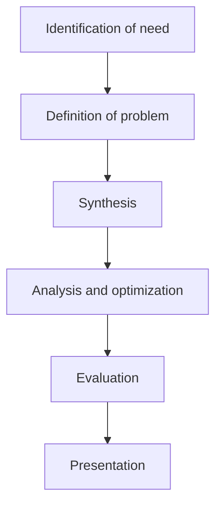

標籤: #Mechanical-Engineering-Design 

---

[TOC]

---

# Phases

There are six phases of design process as follows.

Note that the graph above does not include side arrows for simplicity. Designing can go wrong, and their is always going back to previous steps.

## 1. Identification of Need

This is the start of design. This is a highly creative process, because the need often comes from a feeling of "something is not right".

## 2. Definition of Problem

The problem is written by a definition about what the "black box" can do. The input, output, characteristics, and specification are included in the definition.

## 3. Synthesis

Often called the invention of the concept or concept design. Various schemes must be proposed, investigated, and quantified in terms of established metrics.

## 4. Analysis and Optimization

The system performance is analyzed and compared, and the worse one is discarded. If a design does not pass on this step, we will go back to [[#3 Synthesis]].

There is a high chance that a design will not pass this step.

## 5. Evaluation

This step often includes testing the prototype in a lab. This is the final proof of the whole process, the system should be able to fulfill its mission defined in [[#2 Definition of Problem]].

There will be engineering problems (such as is it easily maintained and adjusted?) and non-engineering problems (such as is it profitable?). The design should be able to overcome all these problems.

## 6. Presentation

In this step, the designer will communicate to superiors. The designer should prove to them that this solution is a better one than others. One may succeed and get higher pay after this step. However, if a design does not pass this step, all the efforts in step 1 ~ 5 will be in vain.

---

參考資料:

Mechanical Engineering Design class

---

link:

