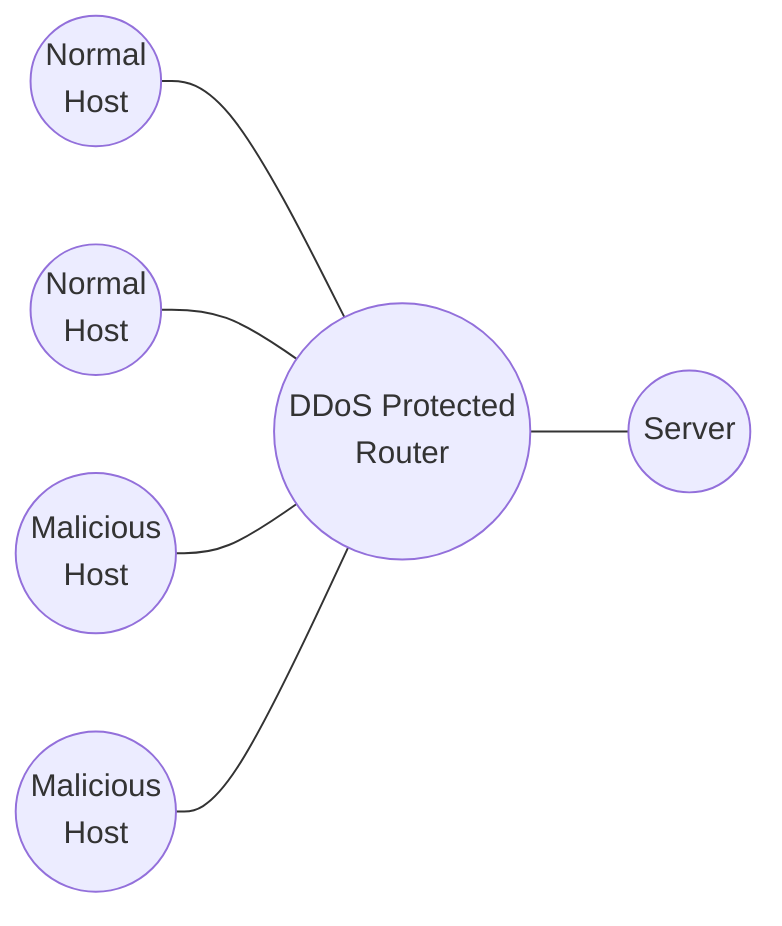

# DDOS Detection

with entropy based method

109611066 吳典謀

---

---

Basic Entropy Detection

$$
H = -\sum_{i=1}^{n} p_i \log_2 p_i
$$

---

Cumulative Entropy Detection

$$
Z_n = X_n - 2\alpha
$$

$$
\left\{
\begin{array}{ll}
y_n = y_{n-1} + Z_n & \text{if } y_{n-1} + Z_n > 0 \\
y_n = 0 & \text{otherwise} \\
y_0 = 0 & \text{(initial value)}
\end{array}
\right.
$$

---

Time-based Entropy Detection

$$
V = [-1, -1, ..., -1]
$$

$$
\begin{array}{}
Z_n &=& X_n - 2\alpha
\end{array}
$$

$$
\begin{array}{}
v_{\rm new} &=& \left\{
\begin{array}{ll}
1 & \text{if } Z_n > 0 \\
-1 & \text{if } Z_n < 0 \\
v_{\rm old} & \text{otherwise}
\end{array}
\right.
\end{array}
$$

---

Basic Entropy

| Paper Results             | Project Results     |
| ------------------------- | ------------------- |
| ![[paper-basic.png]]      | ![[basic.png]]      |

---

Cumulative Entropy

| Paper Results             | Project Results     |
| ------------------------- | ------------------- |
| ![[paper-cumulative.png]] | ![[cumulative.png]] |

---

Time-Based

| Paper Results             | Project Results     |
| ------------------------- | ------------------- |
| ![[paper-time-based.png]] | ![[time-based.png]] |