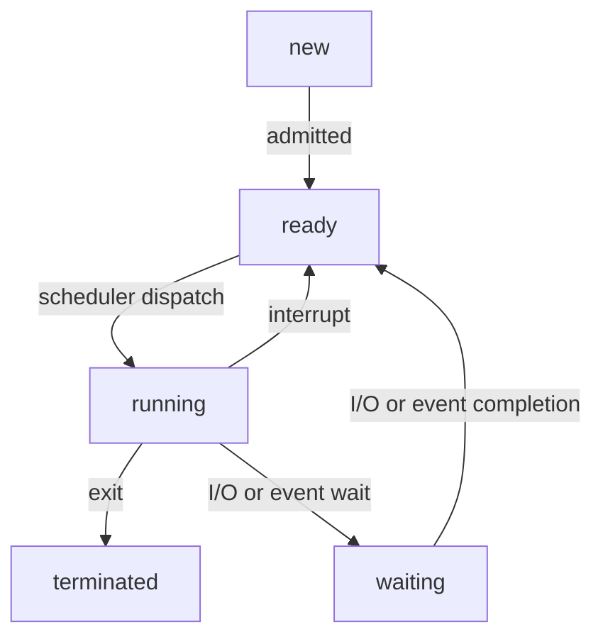

Tag: #operating-system 
Previous: [[Process]]
Link: 

[TOC]

---

As a process executes, it changes **state**.

A process may be in one of the following states:

- **New**: The process is being created.
- **Running**: Instructions are being executed.
- **Waiting**: The process is waiting for some event to occur.
- **Ready**: The process is waiting to be assigned to a processor.
- **Terminated**: The process has finished execution.

> Note: The names of states vary between systems, but these states are common.

The [[State Diagram|state diagram]] corresponding to the states:

---

# Reference

1. 

---

# Note

This note is included in GitHub repository [My-Vault](https://github.com/LittleD3092/My-Vault.git). Clone this repository and open it in [obsidian](https://obsidian.md/) to enable utilities like wikilinks and graph view.