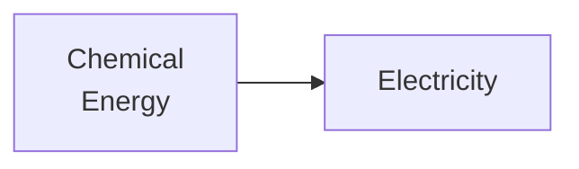

Tag: #sustainable-energy 
Previous: [[Forms of Energy]]
Link: 

[TOC]

---

A fuel cell consists of: (<u>2</u>)

- Fuel (often hydrogen)
- Oxidizing agent (often oxygen)

Fuel cell converts chemical energy of a fuel to electricity, as the following figure shows: (<u>1</u>, <u>2</u>)

Related topics:

- Types of fuel cells:
	- [[Polymer Electrolyte Membrane Fuel Cells]] (PEM)
	- [[Solid Oxide Fuel Cells]] (SOFCs)
	- [[Molten Carbonate Fuel Cells]] (MCFCs)
	- [[Alkaline Fuel Cells]] (AFCs)
	- [[Phosphoric Acid Fuel Cells]] (PAFCs)

| Type  | Operating Temperature ($\degree \rm C$) | Usage |
| ----- | --------------------------------------- | ----- |
| PEM   | 60~100                                  | Passenger vehicles and backup power systems.      |
| SOFCs | 600~1000                                        | Stationary power generation.      |
| MCFCs | 600~1000                                        | Large-scale stationary power generation.      |
| AFCs  | 90~100                                        | Cars, boats, and domestic combined heat and power.      |
| PAFCs      | 175~200                                        | Stationary power generation.      |

- [[Voltage of Fuel Cell]]

---

# Reference

1. 陳慶耀. “Sustainable Energy, Chapter 3: Fossil Fuel Energy and Basic Combustion.” NYCU EE106[GF], n.d.
2. “Fuel Cell.” In Wikipedia, October 24, 2023. https://en.wikipedia.org/w/index.php?title=Fuel_cell&oldid=1181697692.

---

# Note

This note is included in GitHub repository [My-Vault](https://github.com/LittleD3092/My-Vault.git). Clone this repository and open it in [obsidian](https://obsidian.md/) to enable utilities like wikilinks and graph view.