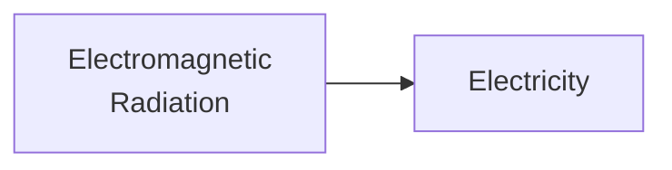

Tag: #sustainable-energy 
Previous: [[Forms of Energy]]
Link: 

[TOC]

---

Solar cell converts radiation directly to electricity. (<u>1</u>)

- [[Concentrated PV System]]

# Theory

The following figure illustrates the principles of solar cells: (<u>2</u>)

![[Pasted image 20231228150407.png|400]]

---

# Reference

1. 陳慶耀. “Sustainable Energy, Chapter 3: Fossil Fuel Energy and Basic Combustion.” NYCU EE106[GF], n.d.
2. 陳慶耀, “Sustainable Energy, Chapter 8~9: Solar Energy,” Dec. 28, 2023.

---

# Note

This note is included in GitHub repository [My-Vault](https://github.com/LittleD3092/My-Vault.git). Clone this repository and open it in [obsidian](https://obsidian.md/) to enable utilities like wikilinks and graph view.