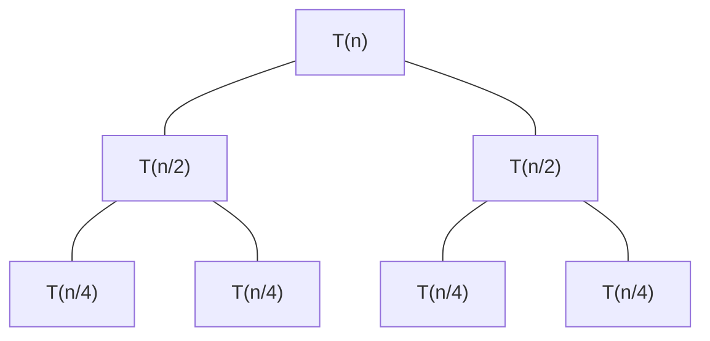

標籤: #DataStructure 

---

[TOC]

---

In [[Time Complexity]], we used steps to determine the run time of programs. However, determining the exact step count is a difficult task and expending effort to determine exact steps is not worth, since the notion of a step is itself inexact. Therefore we use "Big-O Notation".

Big-O Notation 會考慮最糟糕的情況大約會需要多長時間執行程式

| [[#Big-O Notation]]        | [[#Big-Theta Notation]]                   | [[#Big-Omega Notation]] |
| -------------------------- | ----------------------------------------- | ----------------------- |
| Focus on upper bound       | Focus on both upper bound and lower bound | Focus on lower bound    |
| $$0 \leq f(n) \leq cg(n)$$ | $$0 \leq c_1g(n) \leq f(n)\leq c_2g(n)$$  | $$0 \leq cg(n) \leq f(n)$$                        |

# Big-O Notation

## Definition

For
- $f(n)$: the steps of algorithm
- $g(n)$: some simple function

If and only if there exist positive constants $c$ and $n_0$ such that 

$$f(n) < cg(n), \qquad n \geq n_0$$

Then we can say

$$f(n) = O(g(n))$$

.

## Example

For example, for an algorithm $f(n)$, we know its number of steps is 

$$f(n) = 3n + 2$$

Then we get $g(n)$ being the upper boundary because $3n + 2 \leq 4n$ if $n_0 \geq 2$

$$4g(n) = 4n$$

Therefore we obtain the big-o notation of $f(n)$:

$$f(n) = O(n)$$

## Chart

We can use the definition to construct the chart:

n: The size of the input

| Time              | Big-O Notation   |
| ----------------- | ---------------- |
| Constant Time     | $O(1)$           |
| Logarithmic Time  | $O(\log(n))$     |
| Linear Time       | $O(n)$           |
| Linearithmic Time | $O(n\log(n))$    |
| Quadric Time      | $O(n^2)$         |
| Cubic Time        | $O(n^3)$         |
| Exponential Time  | $O(b^n),\ b > 1$ |
| Factorial Time    | $O(n!)$          | 

## Properties

$$O(n + c) = O(n)$$

$$O(cn) = O(n), \quad c > 0$$

- 因為 $n$ 是趨近無限大的數，因此可以忽略常數

如果 $f$ 是表達執行時間的 function ， $n$ 是輸入的大小

$$f(n) = 7\log(n)^3 + 15n^2 + 2n^3 + 8$$

$$O(f(n)) = O(n^3)$$

# Big-Theta Notation

## Definition

For
- $f(n)$: the steps of algorithm
- $g(n)$: some simple function

If and only if:

$$\Theta(g(n)) = \left\{
\begin{array}{}
f(n): \text{ there exist natural number } c_1, c_2, n_0 \\ \text{ that satisfy } 0 \leq c_1g(n) \leq f(n) \leq c_2g(n)
\end{array}
\right\}$$

> The definition above means that $g(n)$ can be both the lower bound $c_1g(n)$ and upper bound $c_2g(n)$ of $f(n)$.

$$\implies f(n) = \Theta(g(n))$$

## Example

$f(n) = 6n + 4$, we can find $g(n) = 2n$ or $g(n) = 5n$.

![[f2.jpg]]

Both these $g(n)$ satisfy, therefore we use simplest $g(n) = n$, and we get big-theta notation $f(n) = \Theta(n)$

# Big-Omega Notation

$$
\Omega(g(n)) = \left\{
\begin{array}{}
	f(n): \text{ there exist natural number } c, n_0 \\ \text{ and all } n \geq n_0 \text{ satisfy } 0 \leq cg(n) \leq f(n)
\end{array}
\right\}
$$

# Recursion

To solve [[#Big-O Notation]] of a recursion function, we have two methods:

1. [[#Substitution Method]]
2. [[#Recursion Tree Method]]

The first one is used to prove your answer, and the second one is used to guess an answer. Therefore, you are probably going to use both of them.

The following example is the process of solving [[#Big-O Notation]] for [[Merge Sort]] algorithm. Merge sort needs at most 

$$T(n) = T(\lfloor n / 2 \rfloor) + T(\lceil n / 2 \rceil) + c_1n$$

operations where $T(1) = c_2$.

## Substitution Method

Assume we guessed that 

$$T(n) \leq dn\log_2 n + en$$

for some constant $d > 0$, $e > 0$ in the [[#Recursion Tree Method]] section.

We use mathematical induction to prove that this guess is correct:

For $n = 1$, 

$$T(1) = c_2 \leq d \log_2 1 + e$$

if we pick $e \geq c_2$.

Suppose

$$T(n) \leq dn \log_2 n + en$$

for every $n < k$.

For $n = k$, 

$$T(k) = 
T(\lfloor k / 2 \rfloor) + 
T(\lceil k / 2 \rceil) + c_1k$$

$$\leq 2T(k / 2) + c_1k$$

$$\leq 2(d \cdot k / 2 \cdot \log_2(k / 2) + 
e \cdot k / 2) + c_1k$$

$$ = dk \cdot \log_2(k / 2) + ek + c_1 k$$

$$ = dk \cdot \log_2 k - dk + ek + c_1k$$

$$\leq dk \cdot \log_2 k + ek \quad(\text{if we pick } d \geq c_1)$$

By induction on $k$, our guess is correct. Thus, 

$$T(n) = O(n \log_2 n)$$

## Recursion Tree Method

In this section, we are going to use recursion tree method to take a guess of the [[Merge Sort]]'s [[#Big-O Notation]].

We simply need a guess, therefore we may drop the floor and the ceiling functions and ignore the constants. We get:

$$T(n) = 
\left\{
	\begin{array}{}
		2T(n / 2) + n & \text{if } n > 1 \\
		1             & \text{if } n = 1
	\end{array}
\right.$$

Based on the function above, we draw the following tree:

Each node has an approx value:

| node       | approx value |
| ---------- | ------------ |
| $T(n)$     | $n$          |
| $T(n / 2)$ | $n / 2$      |
| $T(n / 4)$ | $n / 4$      | 

The tree has a depth of $\log_2 n$. Each layer takes $n$ time, therefore the toral cost is $O(n\log_2 n)$.

---

參考資料:

[Data Structures Easy to Advanced Course](https://youtu.be/RBSGKlAvoiM)
[Asymptotic Notation - github blog](https://alrightchiu.github.io/SecondRound/complexityasymptotic-notationjian-jin-fu-hao.html)

---

link:

