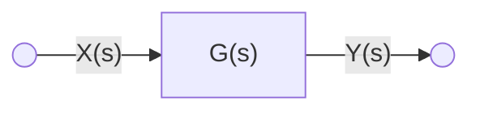
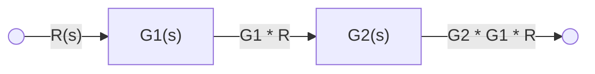
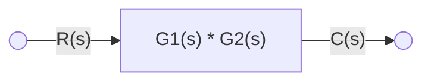
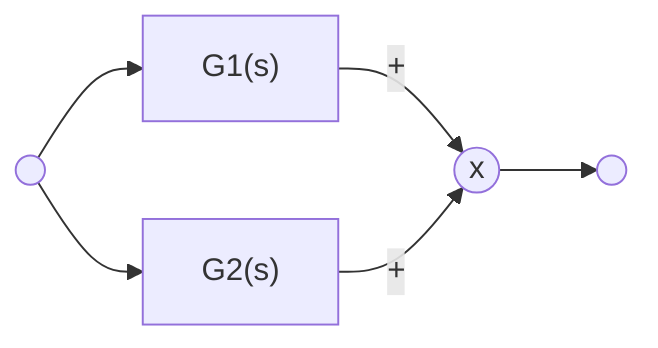
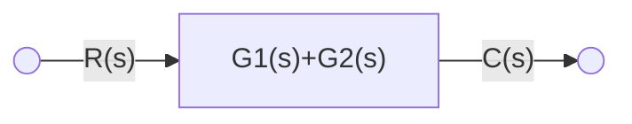
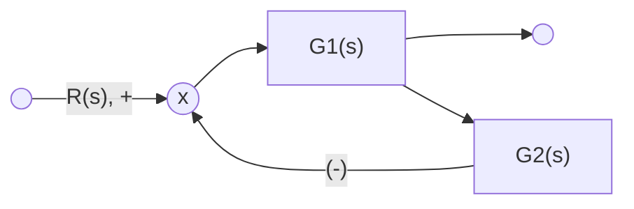

標籤: 

---

[TOC]

---

$x(t)$ -> system -> $y(t)$

Automatic system uses differential equation to analysis.

There are two ways of analysis:

- transfer function
- state space

# transfer function

$$G(s) \overset \Delta = \frac{\mathcal{L}(y(t))}{\mathcal L(x(t))} = \frac{Y(s)}{X(s)}$$

$$\equiv \overset {x(s)} \rightarrow G(s) \overset{Y(s)} \rightarrow$$

Transfer function is for linear and time-invariant.

## Impulse Response Function

When $x(t)$ if an impulse function


$$s(t) \overset \Delta =
\left\{
	\begin{array}{}
		0 & t \neq 0 \\
		\infty & t = 0
	\end{array}
\right.
\quad\& \quad 
\int_{-\infty}^\infty s(t)dt = 1
$$

Do laplace transform:

$$x(s) = \mathcal L (s(t))$$

$$ = \int_{0^-}^\infty e^{-st}s(t)dt$$

$$ = \int_{0^-}^\infty\delta(t)dt = 1$$

---

$$G(s) = \frac{Y(s)}{X(s)}$$

$$Y(s) = G(s) \cdot X(s)$$

when $x(t) = s(t)$

$$\implies x(s) = 1$$

$$\implies Y(s) = G(s)$$

$$y(t) = \mathcal L^{-1}(Y(s)) = \mathcal L^{-1}(G(s)) = g(t)$$

$\implies g(t)$ is the impulse reponse of the system

### Explaned:

the response of a linear time-invariant system to a unit impulse input when the initial conditions are zero. This can be seen as a characteristic of a system.

## Convolution

$$Y(s) = G(s) \cdot X(s)$$

$$Y(s) = \mathcal L(y(t))$$

$$X(s) = \mathcal L(x(t))$$

$$G(s) = \mathcal L(g(t))$$

Therefore

$$y(t) = \int_0^t x(\tau) \cdot g(t - \tau)d\tau$$

$$ = \int_0^t g(\tau) x(t - \tau)d\tau$$

where $g(t), x(t) = 0$ for $t < 0$

$\implies$ In a LTI system, the output response is a convolution of input function and impulse responce of the system.

# Block Diagram

Like a flowchart. We use this diagram to represent a system.

## 1. The signal is in the direction of the arrow.


$$Y(s) = G(s) \cdot X(s)$$

## 2. different configuration

### (a). In series



$$C(s) = G_2(s) \cdot G_1(s) \cdot R(s)$$

$$\underline{ 
	C = G_2\cdot G_1 \cdot R
}_\#$$

we can also use this relationship to get $G_1 \cdot G_2$:

$$\frac{C(s)}{R(s)} = G_2(s) \cdot G_1(s)$$

We may simplify the system to the diagram below:



---

An example of different configuration:

> $$G_1(s) = \frac{10}{s^2 + 2s + 10}$$
> $$G_2(s) = \frac{5}{s + 5}$$

$$\frac{C(s)}{R(s)} = G_1(s) \cdot G_2(s)$$

$$ = \frac{10}{s^2 + 2s + 10} \cdot \frac{5}{x + 5}$$

$$ = \frac{50}{s^3 + 7s^2 + 20s + 100}$$

In matlab function, there are a useful function called `series`, let's see the matlab code solving the above example:

```matlab
[num, den] = series(num1, den1, num2, den2, ...)
num1 = [10]
den1 = [1, 2, 10]
num2 = [5]
den2 = [1, 5]
```

Outcome:

```matlab
num = [50]
den = [1, 7, 20, 100]
```

### (b). In parallel



Equivalent to:



$$G_1R + G_2R = C$$

$$(G_1 + G_2) \cdot R = C$$

$$\frac C R = G_1 + G_2$$

Therefore

$$G(s) = G_1(s) + G_2(s)$$

In matlab, there is a useful function `parallel`:

```matlab
[num, den] = parallel(num1, den1, num2, den2, ...)
```

### (c). feedback



The equivalent $G(s)$ is obtained by the following steps:

$$(R - G_2 \cdot C)\cdot G_1 = C$$

$$G_1 \cdot R - G_2 G_1 C = C$$

$$G_1R = (1 + G_1G_2) \cdot C$$

$$\frac{C(s)}{R(s)} = \underline{\frac{G_1(s)}{1 + G_1(s)G_2(s)}}_\# = G(s)$$

> You have to memorize the result.

The matlab function:

```matlab
[num, den] = feedback(num1, den1, num2, den2, ...)
```

---

參考資料:

Automatic Control class

---

link:

