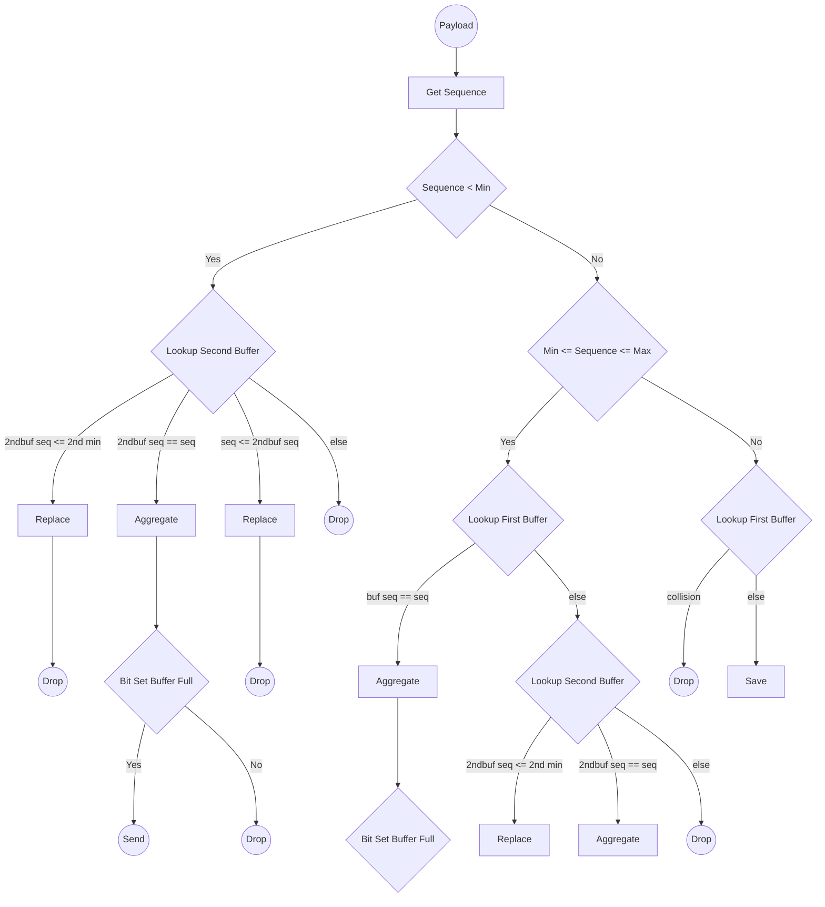

# 1. Ack

# 2. Payload

```mermaid
flowchart TB
    payload(("Payload"))
    get_seq["Get Sequence"]
    seq_l_min{"Sequence < Min"}
    lookup_second_buffer1{"Lookup Second Buffer"}
    lookup_second_buffer2{"Lookup Second Buffer"}
    min_leq_seq_leq_max{"Min <= Sequence <= Max"}
    replace1["Replace"]
    replace2["Replace"]
    replace3["Replace"]
    aggregate1["Aggregate"]
    aggregate2["Aggregate"]
    aggregate3["Aggregate"]
    drop1(("Drop"))
    drop2(("Drop"))
    drop3(("Drop"))
    drop4(("Drop"))
    drop5(("Drop"))
    drop6(("Drop"))
    lookup_first_buffer1{"Lookup First Buffer"}
    lookup_first_buffer2{"Lookup First Buffer"}
    bit_set_buffer_full1{"Bit Set Buffer Full"}
    bit_set_buffer_full2{"Bit Set Buffer Full"}
    save["Save"]
    send(("Send"))

    payload --> get_seq

    get_seq --> seq_l_min
    
    seq_l_min -- Yes --> lookup_second_buffer1
    seq_l_min -- No --> min_leq_seq_leq_max
    
    lookup_second_buffer1 --"2ndbuf seq <= 2nd min" --> replace1
    lookup_second_buffer1 --"2ndbuf seq == seq" --> aggregate1
    lookup_second_buffer1 --"seq <= 2ndbuf seq" --> replace3
    lookup_second_buffer1 --"else"--> drop1

    min_leq_seq_leq_max -- Yes --> lookup_first_buffer1
    min_leq_seq_leq_max -- No --> lookup_first_buffer2

    replace1 --> drop2

    aggregate1 --> bit_set_buffer_full1

    lookup_first_buffer1 --"buf seq == seq" --> aggregate2
    lookup_first_buffer1 --"else" --> lookup_second_buffer2

    lookup_first_buffer2 --"collision" --> drop4
    lookup_first_buffer2 --"else" --> save

    bit_set_buffer_full1 --"Yes"--> send
    bit_set_buffer_full1 --"No"--> drop3

    replace3 --> drop6

    aggregate2 --> bit_set_buffer_full2

    lookup_second_buffer2 --"2ndbuf seq <= 2nd min" --> replace2
    lookup_second_buffer2 --"2ndbuf seq == seq" --> aggregate3
    lookup_second_buffer2 --"else"--> drop5
```