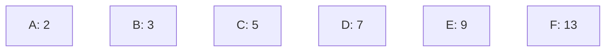
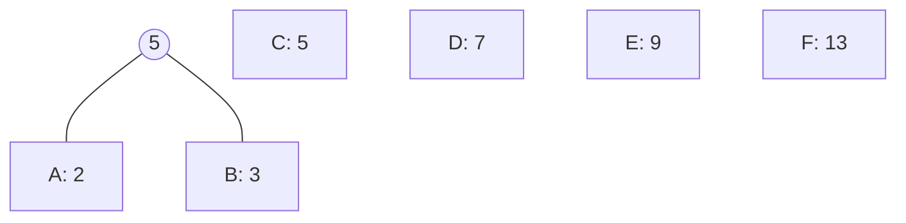
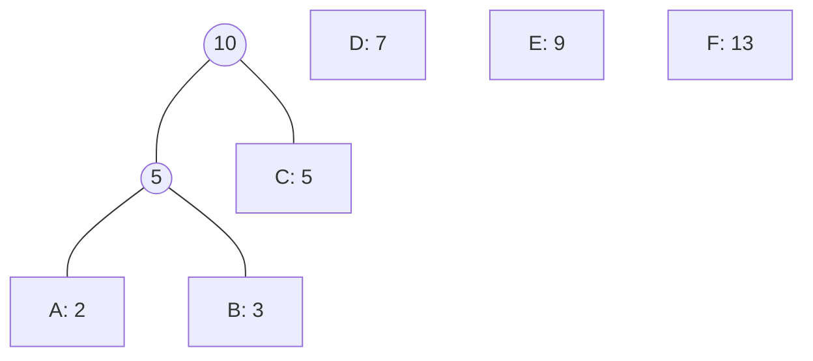
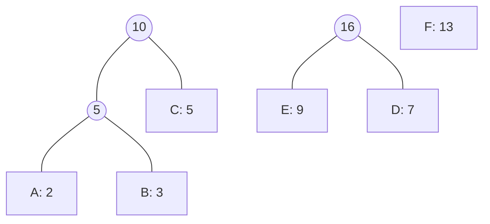
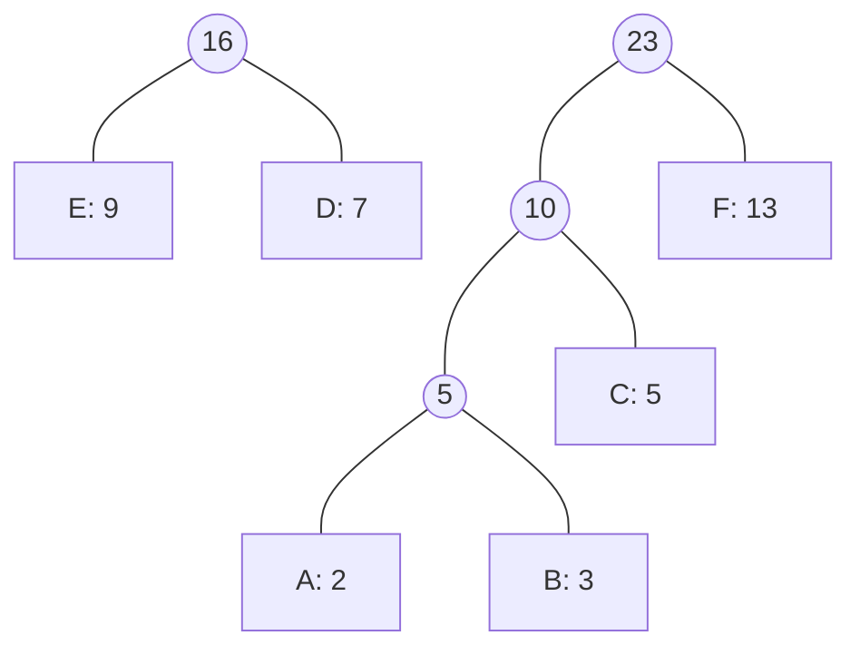
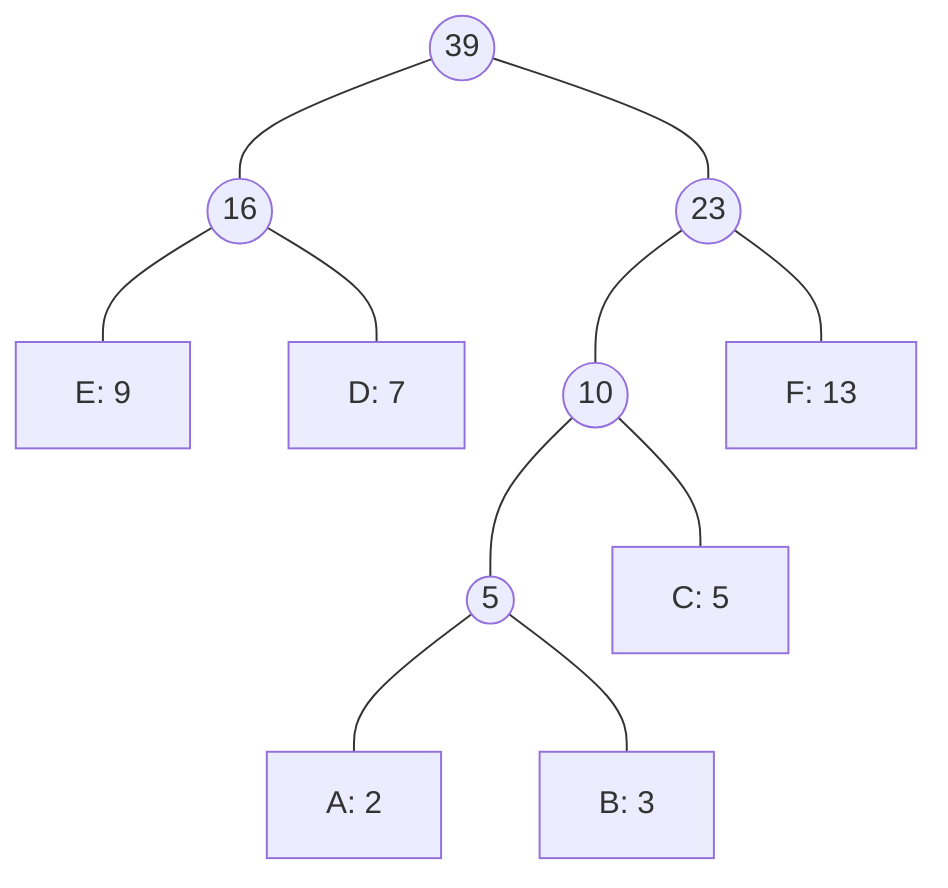

標籤: #DataStructure #algorithm 

---

[TOC]

---

Huffman tree is a method to compress data stream. This method convert the data into a new data stream, with its first part of Huffman code table and the compressed file.

![[Huffman compressing - tree.png]]

For example, we have a data stream represented in alphabets (only a portion of them is shown):

```
AABBCDEFF...
```

# Building a Huffman Tree

We follow the steps below to build the Huffman tree:

1. Count how many times the alphabets occur in the data stream. For example, we have the following frequency of each alphabet:

| Alphabet | How many of it in data? |
| -------- | ----------------------- |
| A        | 2                       |
| B        | 3                       |
| C        | 5                       |
| D        | 7                       |
| E        | 9                       |
| F        | 13                      |

2. Then, we sort them by key value:



3. We merge the nodes with lowest frequency, and calculate its parent. The parent is the sum of its children:

We merge the `A` node and the `B` node:



Then we merge the root generated on last step and merge it with `C`, since these two have lowest frequencies:



Then we merge `E` and `D`, because these two nodes have two lowest frequencies:



Then we merge `F` and `10`:



At last, we merge the remaining two trees.



This is how you build a Huffman tree.

## Pseudocode

$$
\begin{array}{l}
	& \text{Huffman}(C) \\
	1 & n = \vert C \vert \\
	2 & Q = C \\
	3 & \textbf{for } i = 1 \textbf{ to } n - 1 \\
	4 & \qquad \text{allocate a new node }z \\
	5 & \qquad z.left = x = \text{Extract-Min}(Q) \\
	6 & \qquad z.right = y = \text{Extract-Min}(Q) \\
	7 & \qquad z.freq = x.freq + y.freq \\
	8 & \qquad \text{Insert}(Q, z) \\
	9 & \textbf{return } \text{Extract-Min}(Q)\qquad \text{// return the root of the tree}
\end{array}
$$

- $C$: a set of $n$ characters

## Correctness of Huffman's Algorithm

### Proof of greedy-choice property

> *Lemma*
> 
> Let $C$ be an alphabet in which each character $c \in C$ has frequency $c.freq$. Let $x$ and $y$ be two characters in $C$ having the lowest frequencies. Then there exists an optimal prefix code for $C$ in which ==the codewords for $x$ and $y$ have the same length and differ only in the last bit==.

We start with an arbitrary optimal prefix code tree $T$.

Let $a$ and $b$ be two characters that are sibling leaves of maximum depth in $T$.

Without loss of generality, we assume that

$$
\begin{array}{}
	a.freq \leq b.freq \\
	x.freq \leq y.freq
\end{array}
$$

Since $x.freq$ and $y.freq$ are two lowest leaf frequencies, and $a.freq$ and $b.freq$ are two arbitrary frequencies,

$$
\begin{array}{}
	x.freq \leq a.freq \\
	y.freq \leq b.freq
\end{array}
$$

If $x.freq = b.freq$, then we would have $x.freq = y.freq = a.freq = b.freq$, and the lemma would be trivially true. Thus, we will assume that 

$$x.freq \neq b.freq$$

As the figure below shows, we exchange $a, x$ and then $b, y$, and we analyze the difference in cost.

![[Pasted image 20221111174557.png]]

$$\begin{array}{l}
	B(T) - B(T') \\
	= \displaystyle \sum_{c\in C} c.freq \cdot d_T(c) - 
	\sum_{c \in C} c.freq \cdot d_{T'}(c) \\
	= x.freq \cdot d_T(x) + a.freq \cdot d_{T}(a) - 
	x.freq \cdot d_{T'}(x) - a.freq \cdot d_{T'}(a) \\
	= x.freq \cdot d_T(x) + a.freq \cdot d_{T}(a) - 
	x.freq \cdot d_{T}(a) - a.freq \cdot d_{T}(x) \\
	= (a.freq - x.freq)(d_T(a) - d_T(x)) \\
	\geq 0
\end{array}$$

Similarly, $B(T') - B(T'')$ is non-negative. Thus, 

$$B(T) \geq B(T'')$$

And since $T$ is an optimal tree,

$$B(T'') \geq B(T)$$

Which implies 

$$B(T'') = B(T)$$

Thus, $T''$ is an optimal tree in which $x$ and $y$ appear as sibling leaves of maximum depth, from which the lemma follows.

### Proof of optimal-substructure property

> *Lemma*
> 
> Let $C$ be a given alphabet with frequency $c.freq$ defined for each character $c \in C$. 
> Let $x$ and $y$ be two characters in $C$ with minimum frequency. 
> Let $C'$ be the alphabet $C$ with the characters $x$ and $y$ removed and a new character $z$ added, 
> $$C' = C - \{x, y\}\cup z$$
> Define $freq$ for $C'$ as for $C$, except that 
> $$z.freq = x.freq + y.freq$$
> Let $T'$ be any tree representing an optimal prefix code for the alphabet $C'$.
> And $T$ obtained from $T'$ by replacing the leaf node for $z$ with an internal node having $x$ and $y$ as children, ==represents an optimal prefix code for the alphabet ==$C$.

Since 

$$d_T(x) = d_T(y) = d_{T'}(z) + 1$$

We have 

$$x.freq \cdot d_T(c) = (x.freq + y.freq)(d_{T'}(z) + 1)$$

$$ = z.freq \cdot d_{T'}(z) + (x.freq + y.freq)$$

From which we conclude that

$$B(T) = B(T') + x.freq + y.freq$$

$$\implies B(T') = B(T) - x.freq - y.freq$$

We now prove the lemma by contradiction.
Suppose that $T$ does not represent an optimal prefix code for $C$.
There exists an optimal tree $T''$ that $B(T'') < B(T)$.
Without loss of generality (by [[#Proof of greedy-choice property]]) $T''$ has $x$ and $y$ as siblings.
Let $T'''$ be the tree $T''$ with the common parent of $x$ and $y$ replaced by a leaf $z$ with frequency 

$$z.freq = x.freq + y.freq$$

Then 

$$
\begin{array}{l}
	B(T''') & = & B(T'') - x.freq - y.freq \\
	& < & B(T) - x.freq - y.freq \\
	& = & B(T')
\end{array}
$$

yielding a contradiction to the assumption that $T'$ represents an optimal prefix code for $C'$. Thus, $T$ must represent an optimal prefix code for the alphabet $C$.

# Using Huffman Tree

Now we have a Huffman tree, but how do we use it? Huffman tree is used as a code table to encode and decode the characters. First let's look at the tree we just built:


We can use several bits to encode the alphabets. If we need to traverse left to get to the alphabet, we use a `0`. Otherwise, we use a `1`. For example, the alphabet `D` requires us to first go left to `16`, then go right to `D`. Therefore the bits representing `D` will be `0b01`.

| Alphabet | Code     |
| -------- | -------- |
| `E`      | `0b00`   |
| `D`      | `0b01`   |
| `A`      | `0b1000` |
| `B`      | `0b1001` |
| `C`      | `0b101`  |
| `F`      | `0b11`   | 

Note that we get a data stream of codes with each code using 4 bits of space. We would need 8 bits to represent a character, but with Huffman tree, we only need 4!

Now we save the Huffman code table and the compressed code as a file. This is how to use Huffman tree to compress files.

![[Huffman compressing - tree.png]]

Note that this compress method only works when we only have a few kinds of alphabets. Otherwise, we might get a bigger compressed file compared to the original one!

---

參考資料:

Fundamental of Data Structure in C++, 2nd edition
Introduction to Algorithms, 3rd edition

---

link:

[[Tree]]
[[Greedy Algorithm]]

---

This note is included in github repository [My-Vault](https://github.com/LittleD3092/My-Vault.git). Clone this repository and open it in [obsidian](https://obsidian.md/) to enable utilities like wikilinks and graph view.