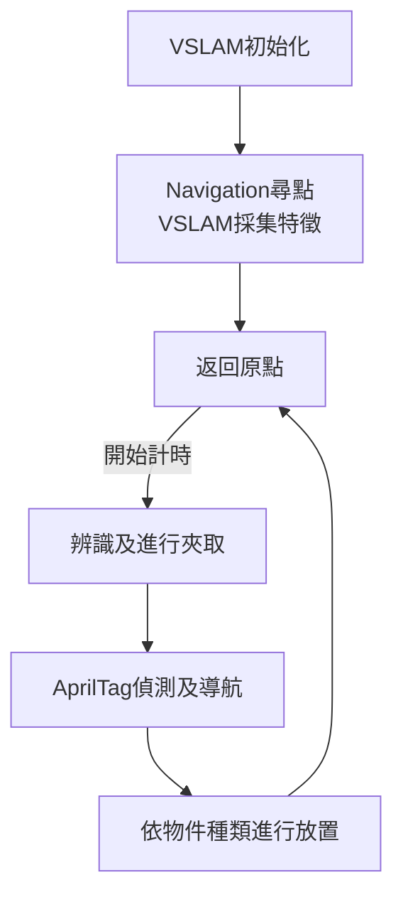
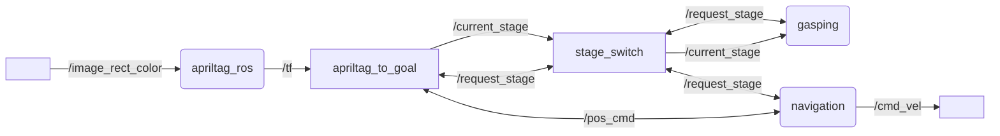

標籤: #ROS 

---

# 實做流程

```mermaid
flowchart TB
VSLAM初始化 --> Navigation尋點\nVSLAM採集特徵 --> 返回原點 -- 開始計時 --> 辨識及進行夾取 --> AprilTag偵測及導航 --> 依物件種類進行放置 --> 返回原點
```

---

# Node Graph

```mermaid
flowchart LR
id1[ ] -- /image_rect_color --> id3(apriltag_ros) -- /tf --> apriltag_to_goal
apriltag_to_goal <-- /request_stage --> stage_switch
apriltag_to_goal -- /current_stage --> stage_switch
id4(gasping) <-- /request_stage --> stage_switch
stage_switch -- /current_stage --> id4(gasping)
apriltag_to_goal <-- /pos_cmd --> id5(navigation)
stage_switch <-- /request_stage --> id5(navigation)
id5(navigation) -- /cmd_vel --> id2[ ]
```

---

參考資料:

---

link:

[[ROS]]
