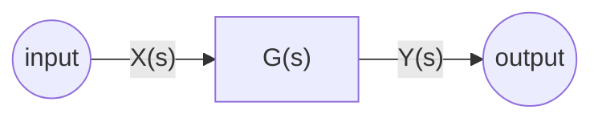
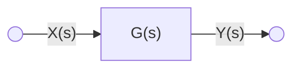
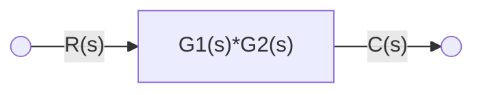
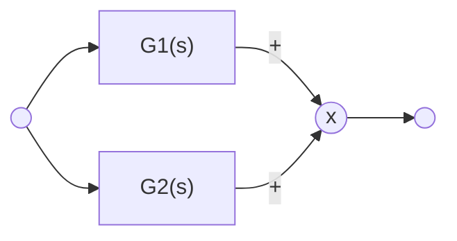
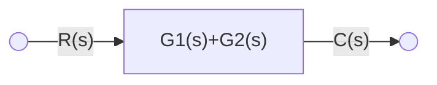
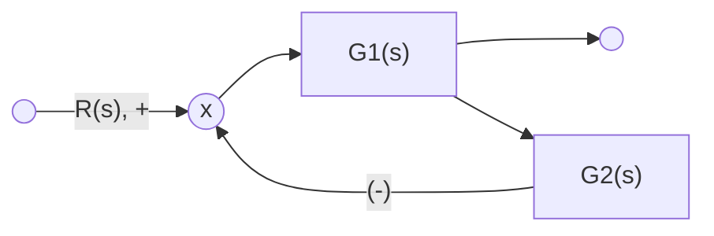

標籤: #automatic-control 

---

[TOC]

---

We use block diagram to represent a system. Block diagram is like a flowchart.

1. The signal is in the direction of the arrow. The following arrows $X(s)$ and $Y(s)$ show its directions.

The above block diagram is the same as the [[Mathematical Modeling of Control Systems|Mathematical Modeling]] below:

$$Y(s) = G(s) \cdot X(s)$$
2. There are diffrent configuration that can be seen as a simplified version. The subpoints shows different scenarios:
	1. [[#In Series]]
	2. [[#In Parallel]]
	3. [[#Feedback]]

# In Series


$$C(s) = G_2(s) \cdot G_1(s) \cdot R(s)$$
The $C-R$ relationship:
$$\underline{C = G_2 \cdot G_1 \cdot R}_\#$$

Transfer function:

$$\frac{C(s)}{R(s)} = G_2(s) \cdot G_1(s)$$

We may simplify the system to the diagram below:



## Example

> Solve the series system with $G_1$ and $G_2$:
> $$G_1(s) = \frac{10}{s^2 + 2s + 10}$$
> $$G_2(s) = \frac{5}{s + 5}$$


$$\frac{C(s)}{R(s)} = G_1(s) \cdot G_2(s)$$

$$ = \frac{10}{s^2 + 2s + 10} \cdot \frac{5}{x + 5}$$

$$ = \frac{50}{s^3 + 7s^2 + 20s + 100}$$

In matlab function, there are a useful function called `series`, let's see the matlab code solving the above example:

```matlab
[num, den] = series(num1, den1, num2, den2, ...)
num1 = [10]
den1 = [1, 2, 10]
num2 = [5]
den2 = [1, 5]
```

Outcome:

```matlab
num = [50]
den = [1, 7, 20, 100]
```

# In Parallel



The graph above is equivalent to:


The [[Mathematical Modeling of Control Systems|Mathematical Modeling]]:
$$G_1R + G_2R = C$$

$$ \implies (G_1 + G_2) \cdot R = C$$
Then we get the $C-R$ relationship:
$$\implies \frac C R = G_1 + G_2$$

Therefore we have the equivalent of the parallel system:

$$\underline{G(s) = G_1(s) + G_2(s)}_\#$$

In matlab, there is a useful function `parallel`:

```matlab
[num, den] = parallel(num1, den1, num2, den2, ...)
```

# Feedback



The equivalent $G(s)$ is obtained by the following steps:

First we go through the arrows and obtain an equation with $R$ and $C$:

$$(R - G_2 \cdot C)\cdot G_1 = C$$

$$\implies G_1 \cdot R - G_2 G_1 C = C$$

$$\implies G_1R = (1 + G_1G_2) \cdot C$$
We get the $C-R$ relationship:
$$\implies \underline{\frac{C(s)}{R(s)} = \frac{G_1(s)}{1 + G_1(s)G_2(s)} = G(s)}_\#$$

> The result above should be memorized. There will be no time for you to calculate these results.

There is a matlab function for feedback control:

```matlab
[num, den] = feedback(num1, den1, num2, den2, ...)
```

---

參考資料:

Automatic Control class

---

link:

