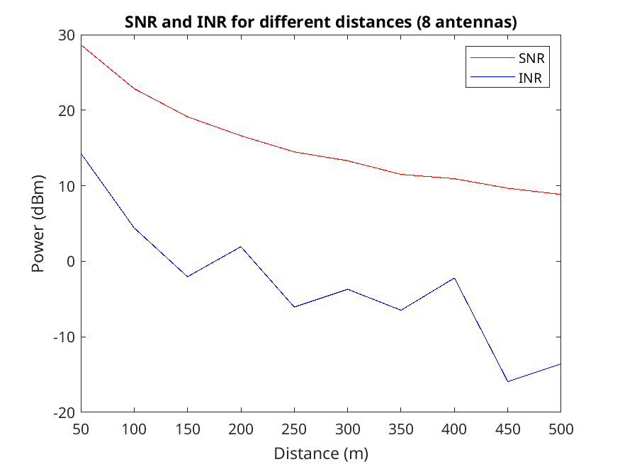
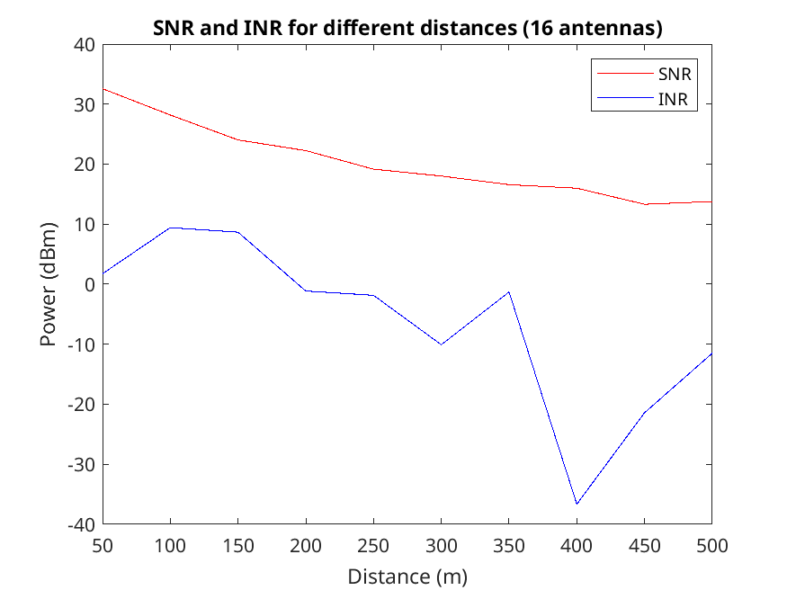
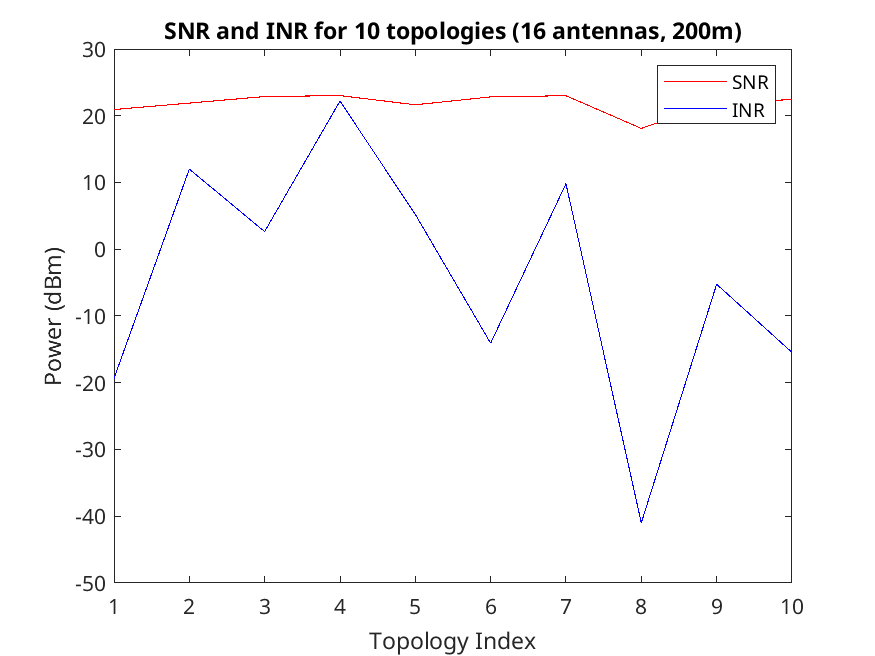
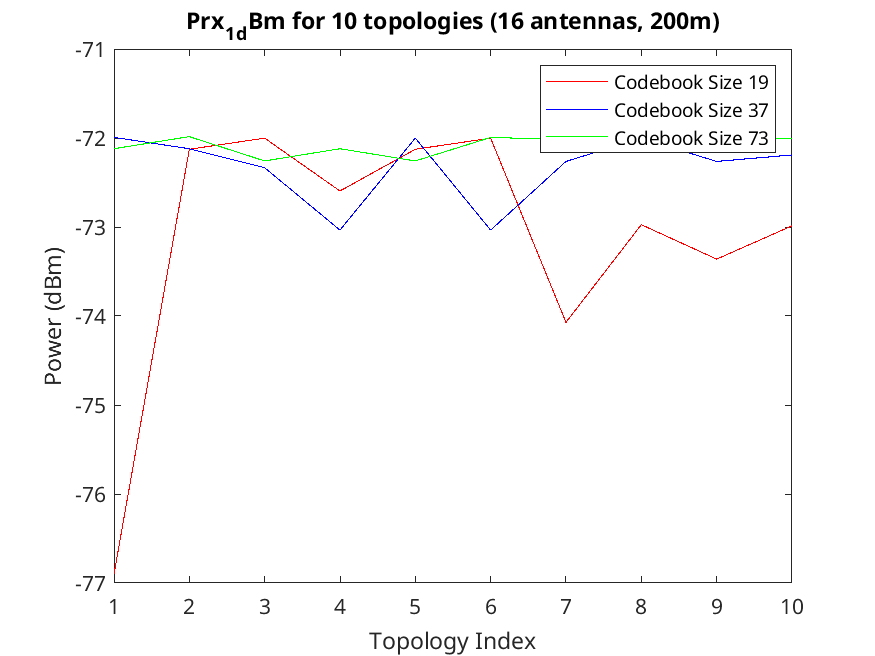
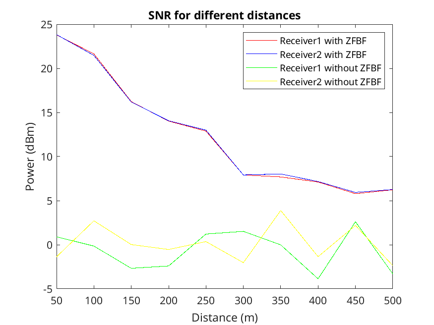
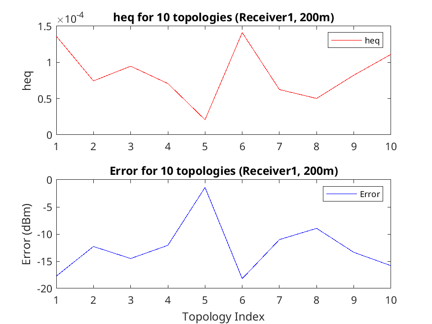

# Task 1

## 1.1. Results for d=[50:50:500]m, antenna number 8 and 16

## 1.2. SNR and INR of 10 topologies when d=200m and there are 16 antennas

### 1.2.1. Observation about the size lobe interference

We can see that there are significant variations in INR values accross the topologies. This suggests that the side lobe interference is highly dependent on the specific arrangement and orientation of the receivers.

For high INR values, the side lobes are directed towards the second receiver, causing a high level of interference.

## 1.3. Prx_1_dBm of 10 topologies for various codebook sizes when d=200m and there are 16 antennas

The codebook sizes used:

- 19, [0:10:180]
- 37, [0:5:180]
- 73, [0:2.5:180]

### 1.3.1. Observation about the impact of codebook size

We can see that the received power for codebook size 73 is the most stable and consistently higher than the other codebook sizes. Other codebook sizes like 19 shows more significant fluctuations, and codebook size 37 is more stable but still has some noticeable fluctuations.

From the observation, we can conclude that larger codebook sizes tend to provide more stable and consistent received power values.

# Task 2

## 2.1. SNR of two users with and without ZFBF for d=[50:50:500]m

## 2.2. heq, error(in dBm) of rx1 with ZFBF when d=200m

### 2.2.1. Why error varies accross different rounds of experiments?

When the channel is not orthogonal, ZFBF cannot completely eliminate the interference, leading to variations in the error values. However, when the channel has higher orthogonality, the error values are more consistent and lower.

### 2.2.2. Discuss why heq would be different in different rounds of experiments

The channel matrix is randomly generated, so the orthogonality of the channel varies in different rounds of experiments. If the channel is not orthogonal, the constant `heq` will be smaller.

The channel matrix is randomly generated to simulate the real-world scenario where the channel might not be perfectly orthogonal.

### 2.2.3. Explain your observation about the correlation between heq and error

When `heq` is higher, it means that the channel is more orthogonal. In this case, the interference is minimized, and the error is lower. When `heq` is lower, the channel is less orthogonal, leading to higher interference and higher error values.

# Questions

## 1. What have you learned from this lab?

I have learned about how digital beamforming and analog beamforming can be used to improve the performance of wireless communication systems. The calculations for the beamforming methods are complex, but through this lab, I have gained a better understanding of how they work and how they can be used to improve the performance of wireless communication systems.

## 2. What difficulty have you met in this lab?

The main difficulty I encountered in this lab was the plotting of the graphs. There were many different parameters to plot, and it was challenging to keep track of all the different plots.

Another difficulty was understanding what the required plots were since the lab instructions were not very clear. However, this is a very good exercise to consider which plots are the most informative.