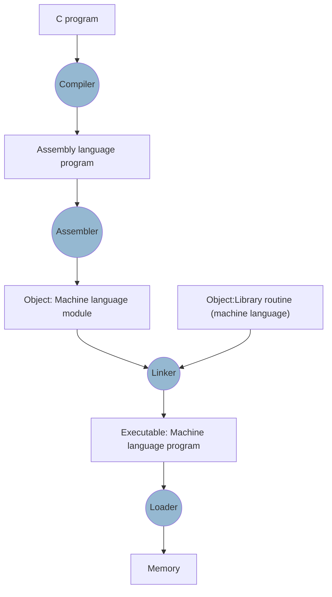

Tag: #computer-organization 
Previous: [[Computer Organization]]
Link: 

[TOC]

---

Every source code go through the following process and compiled into programs:

# Assembler

- Converts instructions that are not found in MIPS (called pseudoinstructions) to MIPS instruction.

| Pseudoinstruction | Converted Instruction |
| ----------------- | --------------------- |
| `move $t0, $t1`   | `add $t0, $zero, $t1` |
| `blt`             | `slt` and `bne`       | 

- Also allows 32-bit constants to be loaded into a register despite the 16-bit limit of the immediate instructions. See [[32-bit Immediate Instructions]] for detail.
- Accept members in a variety of bases.
- Assembly into machine code. Turns the assembly code into [[Object File]].
- [[Symbol Table]] contains pairs of symbols and addresses for conversion.

# Linker

- To avoid recompile the whole program due to few changes, the program is seperated into small procedures.
- Linker combine the procedures together.

> Dynamically Linked Library:
> Instead of linking all the libraries, link only when it is called.

---

# Reference

Computer Organization and Design, 5th edition

---

# Note

This note is included in github repository [My-Vault](https://github.com/LittleD3092/My-Vault.git). Clone this repository and open it in [obsidian](https://obsidian.md/) to enable utilities like wikilinks and graph view.