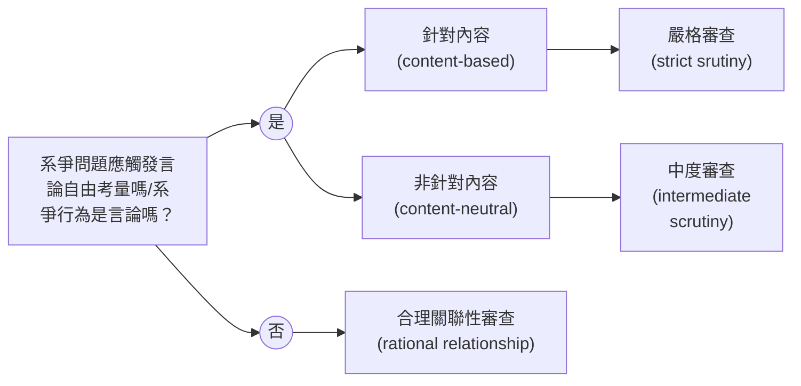

# 期末作業

## 一、關於言論自由的理論（30分）

### （一）什麼是言論自由的理論？它們有何功能？

言論自由是一種基本人權，代表個人發言時不會受到事前審查與限制，且在發布後不會受到他人或政府的報復。(<u>1</u>)

言論自由的理論包含了論證和說明，因為言論自由的原則如果少了論證與說明則它的特殊性無法立基。

言論自由可以保護少數意見。儘管發言人所發表的言論並非主流意見，也不會被限制發言。

### （二）言論自由有哪些理論？

言論自由有以下理論：(<u>2</u>)

- 雙軌理論(the two-track theory)：將政府對言論自由的規制區分為兩種。
	- 「針對言論內容之規制」(content-based regulations)：禁止的理由關係到言論的內容。
	- 「非針對言論內容之規制」(content-neutral regulations)：禁止的理由與言論的內容無關。
	- 此理論說明我們應該對「針對言論內容之規制」更小心，因為這種規制很有可能會使少數意見受到壓迫。
- 雙階理論(the two-level theory)：將經過雙軌理論分類後的規制進一步分類，有「高價值言論」與「低價值言論」兩種。
	- 「高價值言論」：
		- 政治性言論。
		- 學術性言論。
		- 宗教性言論。
	- 「低價值言論」：
		- 商業性言論。
		- 誹謗性言論。
		- 猥褻性言論。
	- 此理論區分規制的性質，並依照其性質有不同的保護範疇與限制的準則。為了保障意見的自由流通，使人民有取得充分資訊，必須依照規制的性質分類。
- 次級效果理論：
	- 涉及言論內容的限制屬於「針對言論內容之規制」。
	- 反之，言論形式對第三人影響稱為「言論次級效果」。

### （三）該如何看待不同理論間的關聯？

我認為所有理論都非常重要，彼此也環環相扣。譬如雙軌理論先對規制做第一步的分類，雙階理論針對內容性質做第二次的分類。這些分類都有自己的目的：

- 雙軌理論：避免針對言論內容的管制，使少數意見受到壓迫。
- 雙階理論：將言論的性質分類，讓人民可以較輕易取得充分資訊。

因此我認為所有理論應該並行，不同理論有不同的功能。

## 二、關於言論自由的保障範圍（coverage）和保護程度(protection)(30分)

### （一）什麼是言論自由的保障範圍和保護程度？

如果一個行為落入保障範圍，那麼國家對於此行為的干預就會受到限制。(<u>3</u>)

當政府干預的限制越多，論證負擔也就越高。行為的保護程度就是政府干預所受到的限制。(<u>3</u>)

### （二）判斷言論自由保障範圍的通說是什麼？老師的看法又是什麼？

Schauer認為以下類別的行為可以納入保障範圍：(<u>3</u>)

- 表意人有溝通/表達意圖。
- 存在某些成規(convention)，讓多數人可以理解這些行為所要傳達的訊息。
- 這些行為有某種文字可轉換性。
- 以上範圍適用於各種圖像式表達。

並且可以歸納為以下大原則：(<u>3</u>)

- 溝通必須包含**溝通意圖**。
- 溝通必須包含**溝通內容**。
- 溝通必須包含**閱聽人**（或潛在閱聽人）。

老師認為判斷保障範圍比起從行為的特徵出發，應該從管制的特徵出發。

- 言論自由問題的觸發並不在言論本身，而是因為管制的出現而有言論自由問題。
- 既然有管制的出現，我們可以探討此管制的動機為何。

### （三）什麼是針對內容的管制？該如何解釋它們應受到嚴格審查？

「針對內容的管制」是一種管制的分類方法，為下圖的其中一部分：(<u>4</u>)

若針對內容的管制並沒有受到應有的審查，將會允許國家發布針對內容的管制，很可能造成壓迫少數意見的管制出現。

## 三、言論的事前審查一定是最危險的言論管制嗎？該如何看待它們？(20%)

事前審查是最危險的言論管制。我們應該做利益衡量，衡量有事前審查與沒有事前審查的利與害。

譬如藥品的標示如果沒有事前審查的話，會造成人民誤用藥物等後果。

## 四、你認為從言論自由觀點，應如何看待所謂的假訊息？(20分，有彈性增加10分的空間)

從消極論證來看，如果要禁止假訊息的話，劃分假訊息與一般訊息的界線非常難以界定。若制定的太為嚴苛，會造成人民對於言論的自我審查。

因此，我認為假訊息在言論自由觀點不應該被限制發言。不過儘管言論自由方面無法限制假訊息，仍然有許多手段可以管理，譬如在某個言論造成一定程度的危害後禁止（以造成的結果來判斷是否該禁止）。

## 五、參考資料

1. “言論自由.” 維基百科，自由的百科全書, 4 Nov. 2023. Wikipedia, https://zh.wikipedia.org/w/index.php?title=%E8%A8%80%E8%AB%96%E8%87%AA%E7%94%B1&oldid=79619666.
2. “憲法名詞解釋- 雙軌理論與雙階理論&次級效果理論.” 公職王 國考加分+, https://plus.public.com.tw/article-20200825-645-1. Accessed 5 Jan. 2024.
3. 程源中. 7. 什麼是言論（一）. Accessed 5 Jan. 2024.
4. 程源中. 8. 什麼是言論（二）. Accessed 5 Jan. 2024.