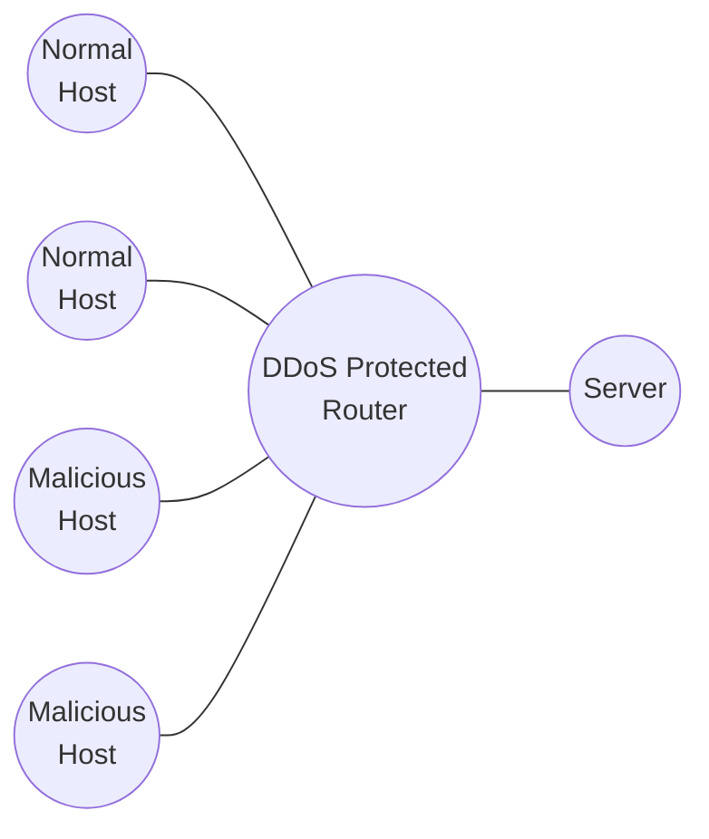

Name: 109611066 吳典謀

# 1. Abstract

In this project, I will implement three kinds of entropy detection methods to detect DDOS attacks. The three methods are included in the paper "DDoS Attack Detection Algorithms Based on Entropy Computing." (<u>1</u>)

`TODO: results and conclusion`

# 2. Introduction

Distributed Denial of Service (DDoS) attacks pose a significant threat to the network security by overwhelming the target with  flood of malicious traffic, making the target unavailable to the legitimate users. Detecting such attacks is crucial for maintaining the integrity and availability of network services. Various methods have been proposed to detect DDoS attacks, with entropy-based methods gaining notable attention due to their effectiveness in detecting anomalous traffic patterns.

This project aims to implement and evaluate three entropy-based detection methods as described by Li, Zhou, and Xiao in their paper "DDoS Attack Detection Algorithms Based on Entropy Computing." (<u>1</u>) The methods include Basic Entropy Detection, Cumulative Entropy Detection, and Time-Based Entropy Detection. These approaches are based on the concept of entropy to measure the randomness, providing a statistical measure for identifying anomalies of DDoS attacks.

These three detection methods will be implemented using Python and Ryu, an open-source software-defined networking (SDN) controller. The network environment will be simulated using Mininet to generate traffic and test the algorithms. The topology will consist of a controller, a DDoS-protected switch, and multiple hosts, including multiple normal and malicious hosts. The switch will be configured to detect DDoS attacks using the implemented entropy-based detection methods. The topology is illustrated below:

The effectiveness of the detection methods will be evaluated by analyzing their respective entropy-time figures. It is expected that the Cumulative Entropy Detection method will provide superior performance compared to Basic Entropy Detection, showing minimal fluctuation during normal traffic and significant changes during DDoS attacks. Additionally, the Time-Based Entropy Detection method is expected to produce a vector that reflects the attack patterns distinctly.

This project aim to validate the findings of the referenced paper and contribute to the understanding of entropy-based detection methods for DDoS attacks. The results will provide insights into the effectiveness of these methods and their potential applications in real-world network security scenarios.

# 3. Related Work

There are many existing methods for detecting DDoS attacks, one of the most common being entropy-based detection. This section reviews some of the significant contributions in this domain.

---

Li, Zhou, and Xiao (<u>1</u>) proposed three entropy-based methods for detecting DDoS attacks:

- Basic Entropy Detection
- Cumulative Entropy Detection
- Time-Based Entropy Detection

Their study demonstrated that these methods can effectively detect DDoS attacks by analyzing some fields of the packet header such as source IP addresses or source ports. Basic Entropy Detection calculates the entropy for each time interval, while Cumulative Entropy Detection accumulates the entropy values over time to smooth out short-term fluctuations. Time-Based Entropy Detection involves calculating a vector of entropy values over a fixed period, allowing for a detailed analysis of the attack patterns.

---

Mirkovic and Reiher (<u>2</u>) provided a taxonomy of DDoS attacks and defense mechanisms. The DDoS attacks and defense mechanisms are classified based on the target, the attacker, and the attack method. The taxonomy provides a comprehensive overview of the various types of DDoS attacks and the corresponding defense mechanisms. Although the paper does not focus on entropy-based detection methods, it offers valuable insights into the broader landscape of DDoS attacks and defense strategies.

---

# 4. Methodology

# 5. Results

# 6. Discussion

# 7. Conclusion

# 8. References

1. Li, Liying, Jianying Zhou, and Ning Xiao. “DDoS Attack Detection Algorithms Based on Entropy Computing.” In Information and Communications Security, edited by Sihan Qing, Hideki Imai, and Guilin Wang, 4861:452–66. Lecture Notes in Computer Science. Berlin, Heidelberg: Springer Berlin Heidelberg, 2007. https://doi.org/10.1007/978-3-540-77048-0_35.
2. Mirkovic, Jelena, and Peter Reiher. “A Taxonomy of DDoS Attack and DDoS Defense Mechanisms.” ACM SIGCOMM Computer Communication Review 34 (May 16, 2004). https://doi.org/10.1145/997150.997156.