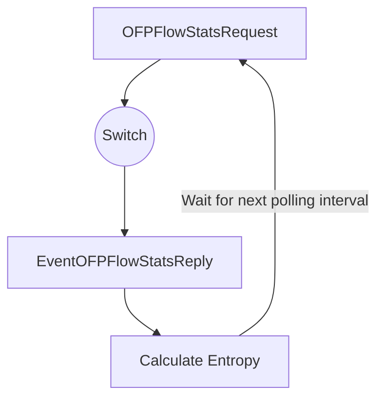

Name: 109611066 吳典謀

# 1. Abstract

In this project, I will implement three kinds of entropy detection methods to detect DDOS attacks. The three methods are included in the paper "DDoS Attack Detection Algorithms Based on Entropy Computing." (<u>1</u>)

The results show that the time-based entropy detection method is the best choice for detecting DDoS attacks. However, entropy-based detection methods are not suitable for detecting DDoS attacks if the attack pattern is more concentrated (e.g. the source IP address is fixed).

To migitate the impact of DDoS attacks, other techniques not researched in this project should be considered, such as machine learning algorithms.

# 2. Introduction

Distributed Denial of Service (DDoS) attacks pose a significant threat to the network security by overwhelming the target with flood of malicious traffic, making the target unavailable to the legitimate users. Detecting such attacks is crucial for maintaining the integrity and availability of network services. Various methods have been proposed to detect DDoS attacks, with entropy-based methods gaining notable attention due to their effectiveness in detecting anomalous traffic patterns.

This project aims to implement and evaluate three entropy-based detection methods as described by Li, Zhou, and Xiao in their paper "DDoS Attack Detection Algorithms Based on Entropy Computing." (<u>1</u>) The methods include Basic Entropy Detection, Cumulative Entropy Detection, and Time-Based Entropy Detection. These approaches are based on the concept of entropy to measure the randomness, providing a statistical measure for identifying anomalies of DDoS attacks.

These three detection methods will be implemented using Python and Ryu, an open-source software-defined networking (SDN) controller. The network environment will be simulated using Mininet to generate traffic and test the algorithms. The topology will consist of a controller, a DDoS-protected switch, and multiple hosts, including multiple normal and malicious hosts. The switch will be configured to detect DDoS attacks using the implemented entropy-based detection methods. The topology is illustrated below:

The effectiveness of the detection methods will be evaluated by analyzing their respective entropy-time figures. It is expected that the Cumulative Entropy Detection method will provide superior performance compared to Basic Entropy Detection, showing minimal fluctuation during normal traffic and significant changes during DDoS attacks. Additionally, the Time-Based Entropy Detection method is expected to produce a vector that reflects the attack patterns distinctly.

This project aim to validate the findings of the referenced paper and contribute to the understanding of entropy-based detection methods for DDoS attacks. The results will provide insights into the effectiveness of these methods and their potential applications in real-world network security scenarios.

# 3. Related Work

There are many existing methods for detecting DDoS attacks, one of the most common being entropy-based detection. This section reviews some of the significant contributions in this domain.

---

Li, Zhou, and Xiao (<u>1</u>) proposed three entropy-based methods for detecting DDoS attacks:

- Basic Entropy Detection
- Cumulative Entropy Detection
- Time-Based Entropy Detection

Their study demonstrated that these methods can effectively detect DDoS attacks by analyzing some fields of the packet header such as source IP addresses or source ports. Basic Entropy Detection calculates the entropy for each time interval, while Cumulative Entropy Detection accumulates the entropy values over time to smooth out short-term fluctuations. Time-Based Entropy Detection involves calculating a vector of entropy values over a fixed period, allowing for a detailed analysis of the attack patterns.

---

Mirkovic and Reiher (<u>2</u>) provided a taxonomy of DDoS attacks and defense mechanisms. The DDoS attacks and defense mechanisms are classified based on the target, the attacker, and the attack method. The taxonomy provides a comprehensive overview of the various types of DDoS attacks and the corresponding defense mechanisms. Although the paper does not focus on entropy-based detection methods, it offers valuable insights into the broader landscape of DDoS attacks and defense strategies.

---

In addition to entropy-based methods, machine learning approaches have also been researched. Xin et al. (<u>3</u>) reviewed machine learning and deep learning methods for cybersecurity, including anomaly detection. Their study highlighted the potential of machine learning algorithms in detecting DDoS attacks. While the focus of this project is on entropy-based detection methods, machine learning techniques could be explored in future research to enhance the detection accuracy and robustness.

# 4. Methodology

This section describes the methodology for implementing and evaluating the three entropy-based detection methods for DDoS attacks. The methods include Basic Entropy Detection, Cumulative Entropy Detection, and Time-Based Entropy Detection. The implementation will be carried out using Python and Ryu, an open-source SDN controller. The network environment will be simulated using Mininet to generate traffic and test the algorithms. The network environment consists of normal and malicious hosts, a DDoS-protected switch, and a server.

## 4.1 Network Topology

The network topology includes multiple normal hosts, multiple malicious hosts, a switch, and a server. The exact topology is included in the Introduction section. The following table provides an overview of the network settings on each component:

| Component        | IP Address | MAC Address       | Port to Switch |
|------------------|------------|-------------------|----------------|
| Normal Host 1    | 10.0.0.1   | 00:00:00:00:00:01 | 1              |
| Normal Host 2    | 10.0.0.2   | 00:00:00:00:00:02 | 2              |
| Malicious Host 1 | 10.0.0.3   | 00:00:00:00:00:03 | 3              |
| Malicious Host 2 | 10.0.0.4   | 00:00:00:00:00:04 | 4              |
| Server           | 10.0.0.10  | 00:00:00:00:00:10 | 5              |

## 4.2. Traffic Generation

Normal traffic will be generated by all hosts, including normal and malicious hosts, to simulate real-world network conditions. The malicious hosts will generate additional traffic to simulate DDoS attacks. The traffic patterns will be monitored and analyzed using the entropy-based detection methods.

Normal traffic will consist of UDP packets each containing a payload of two integers. The malicious traffic will be generated by the malicious hosts, targeting the server with a higher volume of packets. The malicious traffic will have random source IP addresses to simulate a DDoS attack.

The server will be configured to respond the incoming packets with the sum of the two integers in the payload. The switch will be configured to detect DDoS attacks using the implemented entropy-based detection methods.

The switch will be configured to detect DDoS attacks using the implemented entropy-based detection methods. The switch will monitor the incoming traffic and calculate the entropy values based on the source IP. The entropy values will be used to identify anomalous traffic patterns indicative of DDoS attacks.

## 4.3. Polling Mechanism

Since it is hard to implement the entropy-based detection methods using the switch's flow table, and calculating entropy in real-time is computationally expensive, inserting flow entries or using `EventOFPPacketIn` messages is not feasible. Instead, a polling mechanism will be implemented to periodically collect the packet statistics and calculate the entropy values.

The polling mechanism will be implemented using `OFPFlowStatsRequest` messages to query the switch for the flow statistics periodically. The switch will respond with `EventOFPFlowStatsReply` messages containing the flow statistics, which will be used to calculate the entropy values.

The block diagram below illustrates the polling mechanism:

## 4.4. Entropy-Based Detection Methods

### 4.4.1. Basic Entropy Detection

The basic entropy detection method calculates the entropy $H$ of incoming packets based on the source IP address. The entropy is computed using the following formula:

$$
H = -\sum_{i=1}^{n} p_i \log_2 p_i
$$

Where $p_i$ is the probability of each source IP address to appear in the packet stream, and $n$ is the total number of packets being analyzed.

### 4.4.2. Cumulative Entropy Detection

The cumulative entropy detection method is an extension of the basic entropy detection method. Instead of calculating the entropy for each time interval, the cumulative entropy method uses a cumulative sum (CUSUM) algorithm to detect the mean shift in the entropy values.

We define that the expected value of the entropy at time $n$ is $E(X_n)$. In normal conditions, the expected value of the entropy is $E(X_n) = \alpha$. This value must be predefined to implement the algorithm. Therefore, we may use all 4 sending hosts to generate normal traffic and calculate the expected value of the entropy. The expected value of the entropy, through experiment, is:

$$
\alpha = 2
$$

After we have the $\alpha$, we can transfer the original entropy value $X_n$ to a new biased entropy value $Z_n$:

$$
Z_n = X_n - 2\alpha
$$

Then, we can calculate the cumulative sum of the biased entropy value:

$$
\left\{
\begin{array}{ll}
y_n = y_{n-1} + Z_n & \text{if } y_{n-1} + Z_n > 0 \\
y_n = 0 & \text{otherwise} \\
y_0 = 0 & \text{(initial value)}
\end{array}
\right.
$$

Where $y_n$ is the cumulative positive value of $Z_n$. If the $y_n$ is greater than a predefined threshold, we can consider that the DDoS attack is happening.

### 4.4.3. Time-Based Entropy Detection

The time-based entropy detection method evaluates entropy over fixed time intervals and uses a time-based vector to determine the attack patterns.

First, we define the time interval $t$ and the number of time intervals included in the vector $N$. In this project, we will use $t = 2$ seconds and $N = 10$ intervals. A time-based vector $V$ is defined as:

$$
V = [-1, -1, ..., -1]
$$

With all elements initialized to -1. The vector has $N$ elements, and new values are added to the vector every $t$ seconds. The entropy value is calculated for each time interval, using the method mentioned in Basic Entropy Detection. Then the new value to be added to the vector is determined by the following rules:

First we calculate the z value $Z_n$ using the basic entropy $X_n$ and the expected normal entropy $\alpha$:

$$
\begin{array}{}
Z_n &=& X_n - 2\alpha
\end{array}
$$

Then we can determine the new value $v_{\rm new}$ to be added to the vector:

$$
\begin{array}{}
v_{\rm new} &=& \left\{
\begin{array}{ll}
1 & \text{if } Z_n > 0 \\
-1 & \text{if } Z_n < 0 \\
v_{\rm old} & \text{otherwise}
\end{array}
\right.
\end{array}
$$

Where $v_{\rm old}$ is the last element in the vector. After adding the new value to the vector, the oldest value is removed, and the vector is shifted to the left. The vector is then analyzed to identify the attack patterns based on the sequence of values. If the vector has all ones, it indicates a DDoS attack.

# 5. Results

The results of the implementation and evaluation of the three entropy-based detection methods will be presented in this section. The table below shows the results of this project and the results of the referenced paper for comparison.

In the results below, the DDoS attack happens at the 20th second and lasts for 30 seconds. The normal traffic generated by all 4 hosts will end at the 60th second.

| Method             | Paper Results             | Project Results     |
|--------------------|---------------------------|---------------------|
| Basic Entropy      | ![[paper-basic.png]]      | ![[basic.png]]      |
| Cumulative Entropy | ![[paper-cumulative.png]] | ![[cumulative.png]] |
| Time-Based Entropy | ![[paper-time-based.png]] | ![[time-based.png]] |

# 6. Discussion

## 6.1. Basic Entropy Detection

The Basic Entropy Detection method calculates the entropy of the current time interval. Therefore it is more sensitive to short-term fluctuations in the traffic patterns, and has a faster response time to DDoS attacks.

Looking at the paper results, the Basic Entropy Detection method shows the characteristics mentioned above. 

However, this project has a constant traffic pattern, so the entropy value in normal conditions is constant. The entropy value has a fast increase when the DDoS attack happens at the 20th second, and the entropy value decreases to the normal value after the attack ends.

## 6.2. Cumulative Entropy Detection

The Cumulative Entropy Detection method accumulates the entropy values over time to smooth out short-term fluctuations. 

We can see that in the paper results, the Cumulative Entropy Detection method has a slower response time, and has smaller fluctuations in the entropy value in normal conditions.

In the paper, the reducing of the entropy value is not recorded. However, in this project, the reducing of the entropy value is recorded. We can see that after the attack ends at the 50th second, the entropy value takes a long time to return to the normal value.

## 6.3. Time-Based Entropy Detection

The Time-Based Entropy Detection method evaluates entropy over fixed time intervals and uses a time-based vector to determine the attack patterns. It is expected to provide a more constant value in normal conditions and a distinct pattern during DDoS attacks.

The paper results are similar to the project results. The Time-Based Entropy Detection method has a constant value in normal conditions, and a distinct pattern during DDoS attacks.

Although not shown in the result section, the time-based vector can be used to identify the sequence of events during DDoS attacks. The vector can be analyzed to determine the attack patterns based on the sequence of values.

## 6.4. Which Method is Better?

The basic entropy detection method shows a faster response time to DDoS attacks, however is more sensitive to short-term fluctuations.

The cumulative entropy detection method has a slower response time, but is more robust to short-term fluctuations.

The time-based entropy detection method provides a more detailed analysis of the attack patterns, and can be used to identify the sequence of events during DDoS attacks.

In conclusion:

- Basic entropy detection is better if we need a faster response time. 
- Time-based entropy detection has a stable value in both normal and attack conditions. Although the response time is slower than the basic entropy detection, it is faster than the cumulative entropy detection, making it an optimal choice for detecting DDoS attacks.

# 7. Conclusion

In this project, three entropy-based detection methods are implemented and evaluated to test their effectiveness in detecting DDoS attacks. Due to the complexity of the network environment nowadays, time-based entropy detection is the best choice for detecting DDoS attacks. The time-based entropy detection method provides a stable value in both normal and attack conditions, and can be used to identify the sequence of events during DDoS attacks.

The effectiveness of the entropy-based detection methods is demonstrated, however if the attack pattern is more concentrated (e.g. the source IP address is fixed), the entropy-based detection methods will have a hard time detecting the DDoS attacks.

In addition to the entropy-based detection methods, other techniques should also be considered to enhance the detection accuracy and robustness. For example, machine learning algorithms can be used.

Future research could explore the combination of entropy-based detection methods with machine learning algorithms to improve the detection accuracy. The integration of multiple detection methods could provide a comprehensive approach to network security and help mitigate the impact of DDoS attacks.

# 8. References

1. Li, Liying, Jianying Zhou, and Ning Xiao. “DDoS Attack Detection Algorithms Based on Entropy Computing.” In Information and Communications Security, edited by Sihan Qing, Hideki Imai, and Guilin Wang, 4861:452–66. Lecture Notes in Computer Science. Berlin, Heidelberg: Springer Berlin Heidelberg, 2007. https://doi.org/10.1007/978-3-540-77048-0_35.
2. Mirkovic, Jelena, and Peter Reiher. “A Taxonomy of DDoS Attack and DDoS Defense Mechanisms.” ACM SIGCOMM Computer Communication Review 34 (May 16, 2004). https://doi.org/10.1145/997150.997156.
3. “Machine Learning and Deep Learning Methods for Cybersecurity | IEEE Journals & Magazine | IEEE Xplore.” Accessed May 19, 2024. https://ieeexplore.ieee.org/abstract/document/8359287.