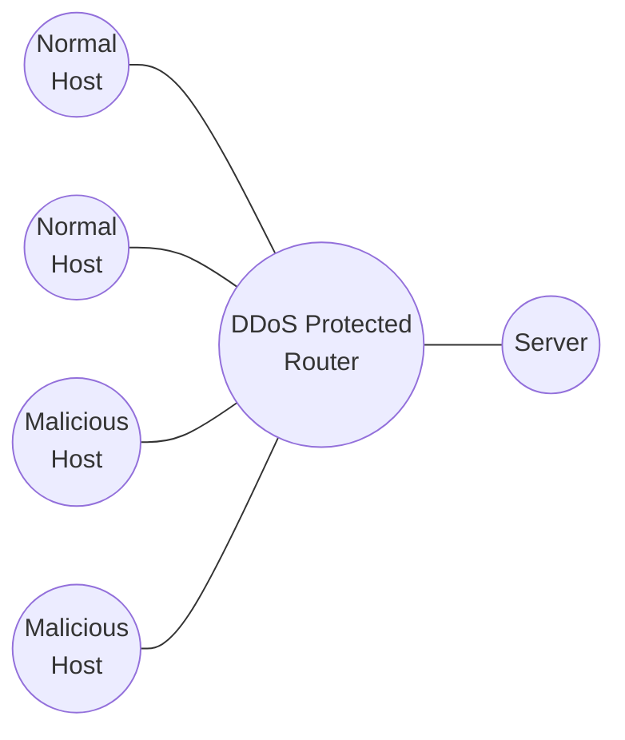

# 1. Topic

The final project will based on (<u>1</u>), a paper about DDoS attack detection. 

The author gives three kinds of entropy detection methods:

- Basic Entropy Detection
- Cumulative Entropy Detection
- Time-Based Entropy Detection

I wish to implement these three methods using python and the loopback interface for forwarding. The topology looks like below:

> There may be more than 2 normal hosts and more than 2 malicious hosts for more realistic results.

First, some normal traffic will come from the normal hosts. Then, the malicious hosts will start the DDoS attack. For the DDoS protected router, it will calculate entropy based on the port of each host.

Three methods will be tested and compared using the entropy-time figures similar to the figures in the paper.

# 2. Expected Results

The cumulative entropy detection should perform better than basic entropy detection, where there are little (or no) fluctuation when normal traffic happens, and dramatic change when DDoS happens, like the figures in the paper: (<u>1</u>)

| Basic Entropy Detection              | Cumulative Entropy Detection         |
| ------------------------------------ | ------------------------------------ |
| ![[Pasted image 20240423195557.png]] | ![[Pasted image 20240423195617.png]] |

And for the vector in time-based entropy detection, it should become $[+1 \ +1 \ \dots \ +1]$ (each element is $+1$) when the server is being attacked. The figure in the paper that shows the sum of the vector should be similar to the result: (<u>1</u>)

![[Pasted image 20240423200515.png|275]]

# 3. Reference

1. Li, Liying, Jianying Zhou, and Ning Xiao. “DDoS Attack Detection Algorithms Based on Entropy Computing.” In Information and Communications Security, edited by Sihan Qing, Hideki Imai, and Guilin Wang, 4861:452–66. Lecture Notes in Computer Science. Berlin, Heidelberg: Springer Berlin Heidelberg, 2007. https://doi.org/10.1007/978-3-540-77048-0_35.