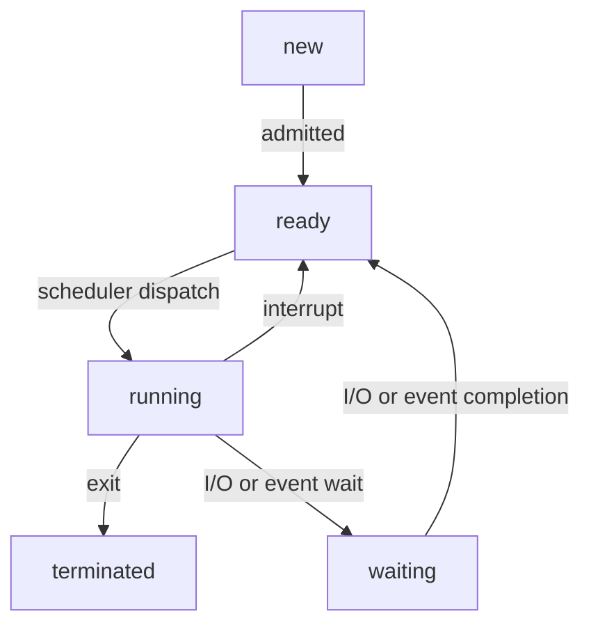

Tag: #operating-system 
Previous: [[Operating System]]
Link: 

[TOC]

---

- A **process** is a program in execution.
- Traditionally, a process contained only a single **thread**.
- Modern operating systems now support processes that have multiple threads.

A process contains:

- **Text section**: The program code.
- **Program counter**: The current activity, represented by value.
- **Stack**: Contains temporary data.
- **Data section**: Global variables.
- **Heap**: Memory that is dynamically allocated during run time.

> Note: A program by itself is not a process.
> A program is a **passive** entity, such as a file containing instructions.
> A process is an **active** entity, with a program counter specifying the next instruction to execute.

# Process State

As a process executes, it changes **state**.

A process may be in one of the following states:

- **New**: The process is being created.
- **Running**: Instructions are being executed.
- **Waiting**: The process is waiting for some event to occur.
- **Ready**: The process is waiting to be assigned to a processor.
- **Terminated**: The process has finished execution.

> Note: The names of states vary between systems, but these states are common.

The [[State Diagram|state diagram]] corresponding to the states:

# Process Control Block

- Each process is represented in the operating system by a **process control block (PCB)**.
- Process control block is also called **task control block**.

Process control block includes the following information:

- [[#Process State]]: The state of the process.
- [[Program Counter]]: Indicates the address of the next instruction.
- **CPU Registers**: This must be saved so that the process can be continued after an interrupt.
- **CPU-scheduling information**: Contains process priority, pointers to scheduling queues, and any other scheduling parameters.
- **Memory-management information**: May include the value of the base and limit registers and the page tables, or the segment tables, depending on the memory system used by the operating system.
- **Accounting information**: The amount of CPU and real time used, time limits, account numbers, job or process numbers.
- **I/O status information**: The list of I/O devices allocated to the process, a list of open files.

When CPU switch between processes $P_0$ and $P_1$:

![[Pasted image 20230626213145.png|400]]

# Process Scheduling

- The [[#Process Scheduler|process scheduler]] selects an available process for program execution.

Operating systems use queues to schedule processes.

- As processes enter the system, they are put into a **job queue**.
- The processes that are stored in main memory and ready to execute are in a list called **ready queue**.
- The list of processes waiting for a particular I/O device is called a **device queue**.
- The queues are stored in [[Linked List|linked lists]].

> A process migrates among the various scheduling queues throughout its lifetime.

![[Pasted image 20230627140155.png|400]]

A representation of process scheduling is a **queueing diagram**:

![[Pasted image 20230627140336.png|400]]

- Each rectangular box represents a queue.
- The circles represent the resources that serve the queues.
- The arrows indicate the flow of processes in the system.
- A new process is initially put in the ready queue, waiting to be selected for execution, or **dispatched**.

## Process Scheduler

- Operating systems must select processes from these queues in some fashion.
- The selection process is carried out by the appropriate **scheduler**.

Often, there are more processes submitted than can be executed immediately. The processes are spooled to a mass-storage device.

To select processes from different places, there are two schedulers:

|                        | Long-term Scheduler                                                                                                           | Short-term Scheduler                                        |
| ---------------------- | ----------------------------------------------------------------------------------------------------------------------------- | ----------------------------------------------------------- |
| Alias                  |                                                                                                                               | Also called **CPU scheduler**.                              |
| Function               | Selects processes from the mass-storage device, and loads them into memory.   Controls the **degree of multiprogramming**. | Selects from among the processes that are ready to execute. |
| Frequency of Execution | If the **degree of multiprogramming** is stable, the scheduler is invoked only when a process leaves the system.              | At least once every 100 milliseconds.                       |

- **Degree of Multiprogramming**: The number of processes in the memory.

### Long-term Scheduler

- It is important that the long-term scheduler select a good **process mix** of **I/O-bound process** and **CPU-bound process**.

| I/O-bound process           | CPU-bound process                   |
| --------------------------- | ----------------------------------- |
| Spends more time during I/O | Spends more time doing computations | 

- If all processes are I/O bound, the ready queue will almost always be empty. The short-term scheduler will have little to do.
- If all processes are CPU bound, the I/O waiting queue will almost always be empty. Devices will go unused.

### Medium-term Scheduler

- Some operating systems may use **medium-term scheduler**, which is an intermediate level of scheduling.
- It uses a scheme called [[Swap|swapping]].

![[Pasted image 20230628160302.png|400]]

---

# Reference

Operating System Concepts, 9th edition

---

# Note

This note is included in GitHub repository [My-Vault](https://github.com/LittleD3092/My-Vault.git). Clone this repository and open it in [obsidian](https://obsidian.md/) to enable utilities like wikilinks and graph view.