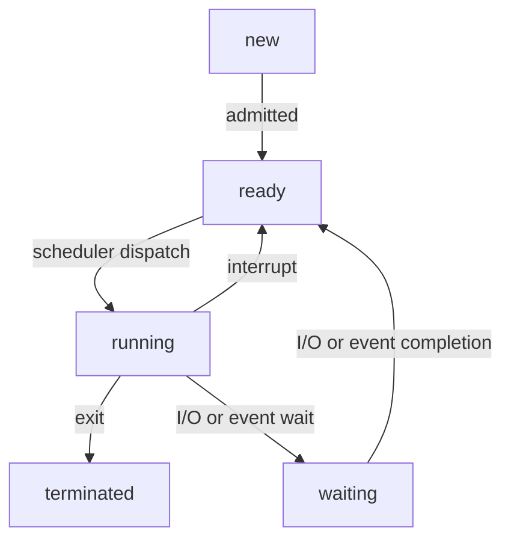

Tag: #operating-system 
Previous: [[Operating System]]
Link: 

[TOC]

---

- A **process** is a program in execution.
- Traditionally, a process contained only a single **thread**.
- Modern operating systems now support processes that have multiple threads.

A process contains:

- **Text section**: The program code.
- **Program counter**: The current activity, represented by value.
- **Stack**: Contains temporary data.
- **Data section**: Global variables.
- **Heap**: Memory that is dynamically allocated during run time.

> Note: A program by itself is not a process.
> A program is a **passive** entity, such as a file containing instructions.
> A process is an **active** entity, with a program counter specifying the next instruction to execute.

# Process State

As a process executes, it changes **state**.

A process may be in one of the following states:

- **New**: The process is being created.
- **Running**: Instructions are being executed.
- **Waiting**: The process is waiting for some event to occur.
- **Ready**: The process is waiting to be assigned to a processor.
- **Terminated**: The process has finished execution.

> Note: The names of states vary between systems, but these states are common.

The [[State Diagram|state diagram]] corresponding to the states:

# Process Control Block

- Each process is represented in the operating system by a **process control block (PCB)**.
- Process control block is also called **task control block**.

Process control block includes the following information:

- [[#Process State]]: The state of the process.
- [[Program Counter]]: Indicates the address of the next instruction.
- **CPU Registers**: This must be saved so that the process can be continued after an interrupt.
- **CPU-scheduling information**: Contains process priority, pointers to scheduling queues, and any other scheduling parameters.
- **Memory-management information**: May include the value of the base and limit registers and the page tables, or the segment tables, depending on the memory system used by the operating system.
- **Accounting information**: The amount of CPU and real time used, time limits, account numbers, job or process numbers.
- **I/O status information**: The list of I/O devices allocated to the process, a list of open files.

When CPU switch between processes $P_0$ and $P_1$:

![[Pasted image 20230626213145.png|400]]

---

# Reference

Operating System Concepts, 9th edition

---

# Note

This note is included in GitHub repository [My-Vault](https://github.com/LittleD3092/My-Vault.git). Clone this repository and open it in [obsidian](https://obsidian.md/) to enable utilities like wikilinks and graph view.