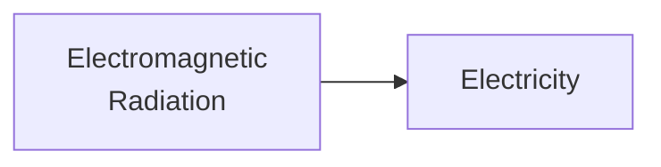

Tag: #sustainable-energy 
Previous: [[Forms of Energy]]
Link: 

[TOC]

---

Solar cell converts radiation directly to electricity. (<u>1</u>)

---

# Reference

1. 陳慶耀. “Sustainable Energy, Chapter 3: Fossil Fuel Energy and Basic Combustion.” NYCU EE106[GF], n.d.

---

# Note

This note is included in GitHub repository [My-Vault](https://github.com/LittleD3092/My-Vault.git). Clone this repository and open it in [obsidian](https://obsidian.md/) to enable utilities like wikilinks and graph view.