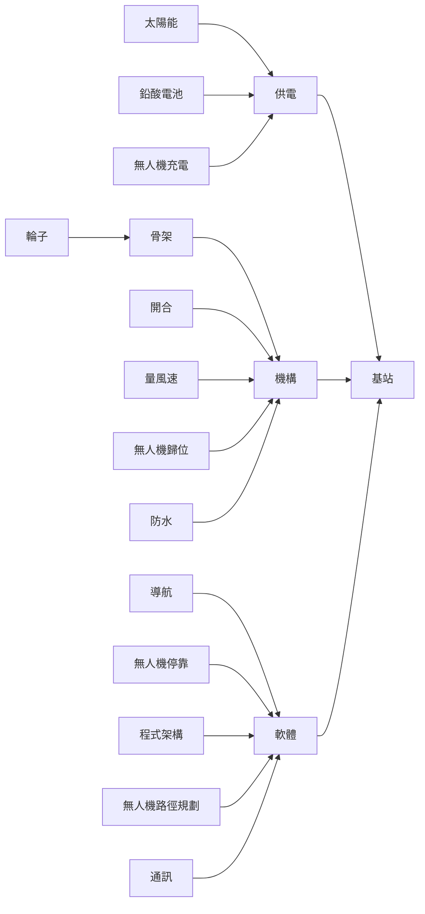
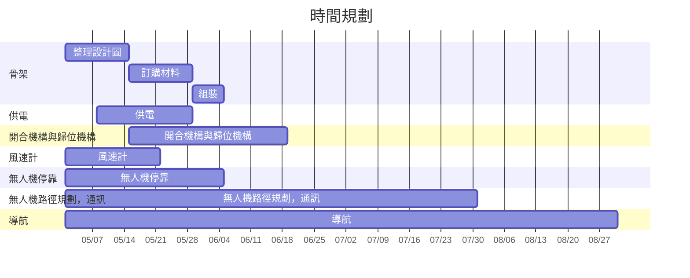

日期：112年5月1日
姓名：吳典謀
主題：其他（會議記錄）
題目：會議記錄

---

# 目的

上次找登湖開會後，登湖指示將技術不足的地方（需要教授教）與材料需求（需要和教授借或買）統整後傳給他。

# 內容

## 次系統規劃圖

由於大家對於基站開發不了解，因此需要先將無人機基站分成較小次系統，讓大家了解並且在分工上更明確。

## 技術需求與設備需求

根據以上的次系統圖，我們產生了以下的技術需求與設備需求：

- 技術需求：
	- 太陽能充電進電池：防止突波、穩壓等電路我們不懂
	- 無人機充電停止電路：如何測量無人機的電壓，並比較無人機充飽了沒有？
	- 蓋子加工方法：頂蓋的形狀複雜，若要防水就會需要一體成形，該如何加工？
	- 工廠許可：希望跟教授要到工廠許可
	- 無人機路徑規劃：我們對無人機不熟悉，需要問登湖這方面的知識。已經找到學長可以問了
	- 網路程式設計：我們沒有寫過利用網路程式的經驗，請問該如何開始比較好？
- 設備需求：
	- 太陽能板
	- 鉛酸電池x2：一顆備用
	- 無人機：用於測試
	- 鋁擠
	- 輪子
	- 風速儀
	- 伺服馬達（大扭力）
	- 相機x4+1：四顆相機照周圍，一顆照內部
	- 光達（小的）：用於開發導航程式
	- 4G模組（一組）：用於通訊

## 時間規劃

將部份工作發派下去後，時間規劃如下：

