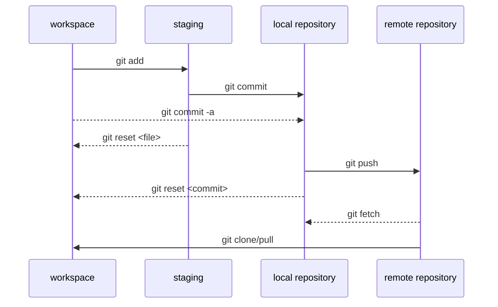

## 簡介


---

## 什麼是 git

- 專案管理的系統，專門用來管理版本
- 由 Linux 的作者 Linus Torvalds 開發

---

## Before you start using version control system...

*I think I can manage my project very well without git*

![[code 1.png]]

---

*I think I can manage my project very well without git*

![[code 2.png]]

---

*I think I can manage my project very well without git*

![[code 3.png]]

---

## Inefficient!

![[Inefficient.png]]

---

## Structure of git



---

## example

file structure

```
/project
	happy.cpp
```

---

## git init

```bash
# 為資料夾做git初始化
$ git init
```

---

## git status

```bash
# 顯示git 目前的工作環境狀態
$ git status
```

---

## git add

```bash
//將git加入暫存當中
$ git add [檔名]
//全部加入
$ git add . 
```

---

## git commit

```bash
# 寫下註解 
# -m message 最簡單的註解方式 
$ git commit -m "  " 
```

---

## git config

```bash
$ git config --global user.name
 
# 增加設定
$ git config  --global --add user.name eason27271563
$ git config  --global --add user.email eason27271563.me05@nctu.edu.tw
 
# 删除設定
$ git config  --global --unset user.name
 
# 改便設定
$ git config --global user.name EasonHuang-tw

# 查詢已建立的設定
git config --list
```

---

## ReadMe.md 
- 使其他人了解專案內容與執行方式
- 用 MarkDown 形式寫

> EX:
> [example](https://github.com/zonghan0904/NCRL_Huskey_CV/blob/master/README.md)

---

## git ignore

.gitignore 內寫入不要被git 追縱的檔案
EX:不想追蹤執行檔

```
*.exe
```

---

## Create remote repository

---

## git clone

```bash
# 按下clone 按鈕 並複製網址
git clone "複製的網址"
```