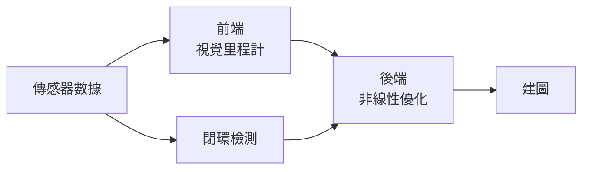

Tag: #slam
Previous: 
Link: [[Hector Slam]]

---

[TOC]

---

SLAM 包含以下幾個重要的算法組合而成：

- Visual Odometry [[#視覺里程計]]
- Optimization [[#後端優化]]
- Loop Closure [[#閉環檢測]]
- Mapping [[#地圖構建]]

# 視覺里程計

- 相鄰圖像之間的**相機運動**
	- 為了定量估計相機運動，需要了解**相機與空間點的幾何關係**
- 因為視覺里程計只估計兩個圖片的運動，會有**累積漂移**
	- 需要[[#閉環檢測]]

# 後端優化

- 解決**噪聲**帶來的誤差

前端（視覺里程計）與後端（非線性優化）的差別：

| 

# 閉環檢測

# 地圖構建

---

參考資料:

視覺 SLAM 十四講 從理論到實踐

---

This note is included in github repository [My-Vault](https://github.com/LittleD3092/My-Vault.git). Clone this repository and open it in [obsidian](https://obsidian.md/) to enable utilities like wikilinks and graph view.