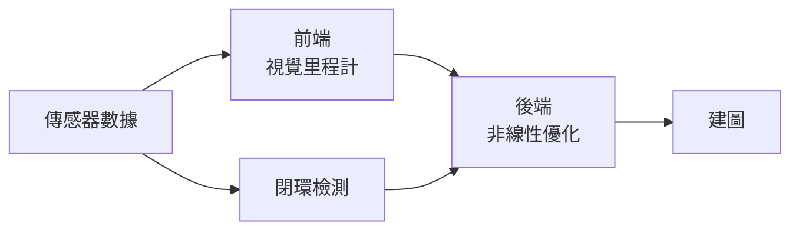

| Tag: #slam
Previous: 
Link: [[Hector Slam]]

---

[TOC]

---

# 組成

SLAM 包含以下幾個重要的算法組合而成：

- Visual Odometry [[#視覺里程計]]
- Optimization [[#後端優化]]
- Loop Closure [[#閉環檢測]]
- Mapping [[#地圖構建]]

## 視覺里程計

- 相鄰圖像之間的**相機運動**
	- 為了定量估計相機運動，需要了解**相機與空間點的幾何關係**
- 因為視覺里程計只估計兩個圖片的運動，會有**累積漂移**
	- 需要[[#閉環檢測]]

## 後端優化

- 解決**噪聲**帶來的誤差

前端（視覺里程計）與後端（非線性優化）的差別：

|      | 前端       | 後端             |
| ---- | ---------- | ---------------- |
| 領域 | 計算機視覺 | 濾波與非線性優化 | 

## 閉環檢測

- 解決位置**隨時間漂移**的問題
- 需要讓機器有「**識別到過的場景**」的能力
	- 譬如利用**圖像間的相似性**

## 地圖構建

- 有許多種
	- 2D, 3D
	- 地圖可不可以事先得知
	- 建構的地圖格式
		- 三角面片建模
		- 一組空間點
- 大致分為
	1. [[#度量地圖]]
	2. [[#拓樸地圖]]

### 度量地圖

- 分類
	- 稀疏 (Sparse)
		- 選擇一部分物體（稱為路標, Landmark）紀錄
		- 用於定位
		- 無法用於導航
	- 稠密 (Dense)
		- 建模所有看到的東西
		- 可用於導航
		- 組成：
			- 二維的小格子 (Grid)
			- 三維的小方塊 (Voxel)

### 拓樸地圖

- 強調地圖間元素的關係
- 利用 [[Graph]] 儲存
- 不擅長表達有複雜結構的地圖，導航與路徑規劃還是難題

# 數學表達

- 假設機器在未知環境中運動
- 時間：
	- 一段連續的時間
	- 以 $$t = 1, 2, \dots, K$$ 表達
- 位置：
	- 以 ${\bf x}$ 表達
	- 每個時刻的位置即為 $${\bf x}_1, {\bf x}_2, \dots, {\bf x}_K$$
- 路標 (Landmark)：
	- 以 ${\bf y}$ 表達
	- 假設有 $N$ 個路標
	- 以 $${\bf y}_1, {\bf y}_2, \dots, {\bf y}_N$$ 表達
- 運動：
	- 假設傳感器輸入為 ${\bf u}_k$
	- 假設噪聲為 ${\bf w}_k$
	- 運動會以函式表達 $${\bf x}_k = f({\bf x}_{k - 1}, {\bf u}_k, {\bf w}_k)$$稱為**運動方程**
- 觀測：
	- 描述「當機器在 ${\bf x}_k$ 位置看到路標點 ${\bf y}_j$ ，產生觀測數據 ${\bf z}_{k, j}$」
	- 假設噪聲為 ${\bf v}_{k, j}$
	- 觀測會以函數表達 $${\bf z}_{k, j} = h({\bf y}_j, {\bf x}_k, {\bf v}_{k, j})$$

## 旋轉

---

參考資料:

視覺 SLAM 十四講 從理論到實踐

---

This note is included in github repository [My-Vault](https://github.com/LittleD3092/My-Vault.git). Clone this repository and open it in [obsidian](https://obsidian.md/) to enable utilities like wikilinks and graph view.