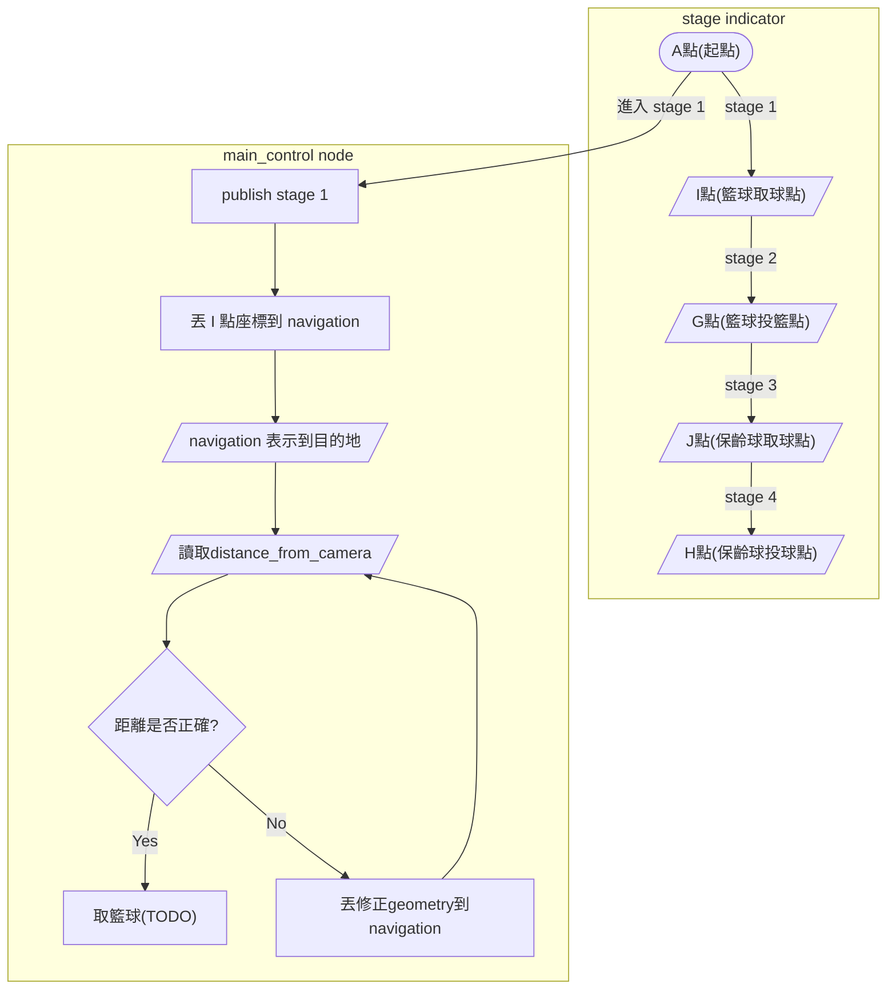

```mermaid
graph TD

    A(["A點(起點)"])
    I[/"I點(籃球取球點)"/]
    G[/"G點(籃球投籃點)"/]
    J[/"J點(保齡球取球點)"/]
    H[/"H點(保齡球投球點)"/]

    subgraph "stage indicator"
    A --"stage 1"--> I
    I --"stage 2"--> G
    G --"stage 3"--> J
    J --"stage 4"--> H
    end

    subgraph "main_control node"

    main2navI["丟 I 點座標到 navigation"]
    nav2main[/"navigation 表示到目的地"/]
    mainPubStage1["publish stage 1"]
    disFromCam[/"讀取distance_from_camera"/]
    disCheck{"距離是否正確?"}
    getBasketball["取籃球(TODO)"]
    adjustPos["丟修正geometry到navigation"]

    A --"進入 stage 1"--> mainPubStage1
    mainPubStage1 --> main2navI
    main2navI --> nav2main
    nav2main --> disFromCam
    disFromCam --> disCheck
    disCheck --"Yes" --> getBasketball
    disCheck --"No" --> adjustPos
    adjustPos --> disFromCam

    end
```
![[tdk2022 地圖.png]]