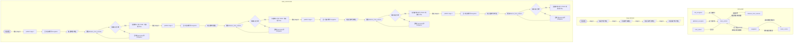

```mermaid
graph TD
	subgraph "node graph"
	dot_recognize 			-- 丟一個數字 --> 
	main_control
	alphabet_recognize 		-- 丟一個字母 --> 
	main_control
	color_detect 			-- 丟byte --> 
	main_control

	distance_from_camera 	-. 距離或離中間距離 .->
	main_control 			-- 目前狀態 --> 
	distance_from_camera

	navigation 				-.得到目前位置座標.->
	main_control		 	-- 丟一個geometry --> 
	navigation

	navigation 				-- 丟前進後退等指令 -->
	motor_control 			-. 得到速度等資訊 .-> 
	navigation
	end
	
	%% point reached
    A(["A點(起點)"])
    A1(["A點(起點)"])
    I[/"I點(籃球取球點)"/]
    I1[/"I點(籃球取球點)"/]
    G[/"G點(籃球投籃點)"/]
    G1[/"G點(籃球投籃點)"/]
    J[/"J點(保齡球取球點)"/]
    J1[/"J點(保齡球取球點)"/]
    H[/"H點(保齡球投球點)"/]
    H1[/"H點(保齡球投球點)"/]
	
	%% main ask navigation server to move
	main2navI["丟 I 點座標到 navigation"]
	main2navG["丟 G 點座標到 navigation"]
	main2navJ["丟 J 點座標到 navigation"]
	main2navH["丟 H 點座標到 navigation"]
	adjustPos["丟修正geometry到navigation"]
	adjustPos2["丟修正geometry到navigation"]
	adjustPos3["丟修正geometry到navigation"]
	adjustPos4["丟修正geometry到navigation"]
	
	%% publish stages
    mainPubStage1["publish stage 1"]
	mainPubStage2["publish stage 2"]
	mainPubStage3["publish stage 3"]
	mainPubStage4["publish stage 4"]
	
	%% read from distance from camera node
    disFromCam[/"讀取distance_from_camera"/]
    disFromCam2[/"讀取distance_from_camera"/]
    disFromCam3[/"讀取distance_from_camera"/]
    disFromCam4[/"讀取distance_from_camera"/]
	
	%% determine whether distance is right or not
    disCheck{"距離是否正確?"}
    disCheck2{"距離是否正確?"}
    disCheck3{"距離是否正確?"}
    disCheck4{"距離是否正確?"}
	
	%% get ball, throw ball movement
    getBasketball["取籃球(三次) (TODO: 未決定node)"]
	throwBasketball["投籃球(三次) (TODO: 未決定node)"]
	getBowling["取保齡球(三次) (TODO: 未決定node)"]
	throwBowling["丟保齡球(三次) (TODO: 未決定node)"]

	%% --------------------------------------

    subgraph "stage indicator"
    A --"stage 1"--> 
	I --"stage 2"-->
    G --"stage 3"-->
    J --"stage 4"-->
	H
    end
	
	%% ---------------------------------------
	
    subgraph "main_control node"
	
	%% stage 1 起點到取球點並取球
    A1    			--"進入 stage 1"-->
    mainPubStage1 	-->
    main2navI 		-->
    I1 				-->
    disFromCam
	disFromCam 		-->
	disCheck 		--"Yes" --> 
	getBasketball
	disCheck 		--"No" -->
	adjustPos 		--> 
	disFromCam
	
	%% stage 2 到達投籃點並投籃
	getBasketball 	-- "進入 stage 2" -->
	mainPubStage2 	-->
	main2navG 		-->
	G1 				-->
	disFromCam2 	-->
	disCheck2 		--"Yes"--> 
	throwBasketball
	disCheck2 		--"No"-->
	adjustPos2 		--> 
	disFromCam2
	
	%% stage 3 到達取保齡球點並取保齡球
	throwBasketball --"進入 stage 3"-->
	mainPubStage3 	-->
	main2navJ 		-->
	J1 				-->
	disFromCam3 	-->
	disCheck3		--"Yes"-->
	getBowling
	disCheck3 		--"No"-->
	adjustPos3		-->
	disFromCam3
	
	%% stage 4 到達投保齡球點並丟出保齡球
	getBowling 		--"進入 stage 4"-->
	mainPubStage4 	-->
	main2navH		-->
	H1				-->
	disFromCam4		-->
	disCheck4		--"Yes"-->
	throwBowling
	disCheck4		--"No"-->
	adjustPos4		-->
	disFromCam4
	
    end
```

![[tdk2022 地圖.png]]