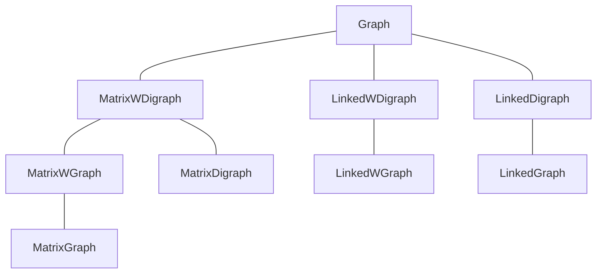

標籤: #DataStructure 

---

[TOC]

---

- Degree of a vertex: The number of edges incident to it.

# Eularian

For every graph, there is a walk starting at any vertex, going through each edge exactly once and terminating at the start vertex iff the degree of each vertex is even.

## Proof

> Proof: Graph is Eularian iff all vertices have even degree.

Let's first assume graph $G$ is Eularian, and assume $C$ is an $u-u$ (starting at vertex $u$, ending at vertex $u$) Eularian circuit.

For each vertex $v$ in the path $C$ that is not the starting nor the end point $u$, it has $2k$ edges attached to it. $k$ is a natural number.

> This is true because one must enter and leave the vertex, causing the edges attached to it to be even

For the starting and ending vertex $v$, there is the first edge in the path and the last edge in the path. Therefore the degree of $v$ is

$$\underbrace{1}_{\text{first edge}} + 2j + \underbrace{1}_{\text{last edge}}, \quad j \text{ is an natural number or 0. }$$

Now we prove that if graph is Eularian, all vertices have even degree. After that, we try the other way around. We are trying to prove that if all vertices are even, the graph is Eularian.

---

$G$ is a connected and non-trivial graph that all the degrees of all vertices are even.

We first assume that the trail is not a $u-u$ circuit. Let $T$ be a trail of maximum length in $G$. $T$ is a $u-v$ trail.

Suppose $u \neq v$, $v$ will have an end edge and $2k$ edges for getting in and out of the vertex.

$$degree(v) = \underbrace{1}_{\text{last edge}} + 
\underbrace{2k}_{\text{vertex as middle of the trail}}$$
$$\text{where }k \text{ is natural number or 0}$$

This is odd number, which does not agree with our statement of $G$ ($G$'s vertices are even). Therefore, $u = v$. 

Therefore we have proven that $T = C$ is a circuit with maximum length. Next we prove that $C$ does contain every edge.

Assume $C$ doesn't contain every edge, and the edge not contained is $(x, y)$:

![[prove of Eularian - graph.jpeg|400]]

Note that $(x, y)$ should connect to $C$, otherwise $G$ is not connected.

Vertex $x$ has $2k + 1$ edges, which does not satisfy that every vertex has even edges. Therefore $C$ contains every edge, and $C$ is Eularian.

Now we have proven the two statements:

1. If graph is Eularian, all vertices have even degree.
2. If all vertices have even degree, the graph must be Eularian

Therefore we found out that "graph is Eularian iff all vertices have even degree".

# Basics

- Graph consists of two sets, $V$ and $E$.
	- $V$ is a set of vertices.
	- $E$ is a set of pairs of vertices, which is called edges.
	- Example: $V(G) = \{0, 1, 2, 3\}$; $E(G) = \{(0, 1), (0, 2), (0, 3), (1, 2), (1, 3), (2, 3)\}$ is a graph as shown:

![[example graph 1 - graph.jpeg|300]]

- The number of distinct unordered pairs $(u, v)$ with $u \neq v$ in a graph with $n$ vertices is $n(n-1)/2$
- An $n$-vertex, undirected graph with exactly $n(n-1) / 2$ edges is said to be ==complete==.
- If $(u, v)$ is an edge in $E(G)$, then we say $u$ and $v$ are ==adjacent== and that the edge $(u, v)$ is ==incident== on vertices $u$ and $v$.
- A ==path== from vertex $u$ to vertex $v$ is a sequence of vertices, where any adjacent vertices in the sequence has an edge between them.
- A ==simple path== is a path that has no repeated edge.
- A ==cycle== is a simple path that the first and the last vertices are the same.
- Vertices $u$ and $v$ are ==connected== iff there is a path in graph $G$ from $u$ to $v$ and $G$ is undirected.
- A ==component== is a maximum connected subgraph. The graph below has two components.

![[component example - graph.jpeg|600]]

- A directed graph $G$ is said to be ==strongly connected== iff for every pair of distinct vertices $u$ and $v$, there is a direct path from $u$ to $v$ and also from $v$ to $u$.
- For a directed graph $G$, the ==in-degree== of a vertex $v$ is the number of edges pointed to $v$.
- For a directed graph $G$, the ==out-degree== of a vertex $v$ is the number of edges which their tails are $v$.

# Abstract Data Type

```cpp
class Graph
// objects: A nonempty set of vertices and a set of undirected edges, 
//          where each edge is a pair of vertices.
{
public:
	// virtual destructor
	virtual ~Graph(){}

	// return true iff graph has no vertices
	bool isEmpty() const { return n == 0; }

	// return number of vertices in the graph
	int NumberOfVertices() const { return n; }

	// return number of edges in the graph
	int NumberOfEdges() const { return e; }

	// return number of edges incident to vertex u
	virtual int Degree(int u) const = 0;

	// return true iff graph has the edge (u, v)
	virtual bool ExistEdge(int u, int v) const = 0;

	// insert vertex v into graph; v has no incident edges
	virtual void InsertVertex(int v) = 0;

	// insert edge(u, v) into graph
	virtual void InsertEdge(int u, int v) = 0;

	// delete v and all edges incident to it
	virtual void DeleteVertex(int v) = 0;

	// delete edge(u, v) from the graph
	virtual void DeleteEdge(int u, int v) = 0;

private:
	int n; // number of vertices
	int e; // number of edges
};
```

# Graph Representations

To implement graph, we have three ways:

1. [[#Adjacency Matrices]]
2. [[#Adjacency Lists]]
3. [[#Adjacency Multilists]]

## Adjacency Matrices

- This representation uses a matrix to represent graph. 
- Assume the graph $G = (V, E)$ has $n$ vertices, $n \geq 1$. The adjacency matrix is a two dimentional $n \times n$ array $a$. $a[i][j] = 1$ iff the edge $(i, j)$ or $<i, j>$ is in $E(G)$. $a[i][j] = 0$ if no such edge exists.
- The matrix $a$ is symmetry for undirected graph, but may not be symmetry for directed graph.
- It takes $O(n^2)$ time to answer non-trivial questions, such as how many edges are there in $G$?

## Adjacency Lists

- Because the [[#Adjacency Matrices]] have some spaces unused, in some cases it would be a waste of space if we implement graph using [[#Adjacency Matrices]]. So we may use an array of lists, which each list stores only the edges linked.
- Below is the representation for the example graphs.

![[example graph g1 - graph.jpeg|200]]
![[example graph g3 - graph.jpeg|100]]
![[example graph g4 - graph.jpeg|300]]
![[adjacent lists example - graph.jpeg|400]]

### Sequential Array

We can also store a [[#Adjacency Lists]] in a sequential array. The figure below shows the sequential representation of graph $G_4$:

![[example graph g4 - graph.jpeg|300]]

![[sqeuqntial representation of example graph g4 - graph.jpeg|600]]

`nodes[0:8]` act as a "index" of where the [[#Adjacency Lists]] begin. For example, `nodes[9]` and `nodes[10]` is the edge of vertex `0`.

### Inverse Adjacency Lists

If we need to keep track of the in-degree more than the out-degree, we use inverse adjacency lists, shown below.

![[example graph g3 - graph.jpeg|100]]

![[inverse adjacency lists for g3 - graph.jpeg|500]]

## Adjacency Multilists

In this list, each edge will be exactly one node, shared by two vertices. The node is like the following:

| `m` | `vertex1` | `vertex2` | `link1` | `link2` | 
| --- | --------- | --------- | ------- | ------- |

- `m`: A boolean field to indicate whether this edge has been examined.
- `vertex1`, `vertex2`: The vertices of the edge
- `link1`: The `*next` pointer for `vertex1`
- `link2`: The `*next` pointer for `vertex2`

Below is an example of graph $G_1$:

![[example graph g1 - graph.jpeg|200]]

![[adjacency multilists for g1 - graph.jpeg|600]]

# C++ Implementation

There are two graph types

- undirected
- directed

and two weighing options

- weighted
- unweighted

and may be imported in four methods:

- [[#Adjacency Matrices]]
- [[#Adjacency Lists]]
- [[#Sequential Array]]
- [[#Adjacency Multilists]]

This leaves to us 16 kinds of implementation. We often use class hierarchy for our graph classes. Like below:



Note that only [[#Adjacency Matrices]] and [[#Adjacency Lists]] is shown in the graph.

# Elementary Operations

Given a graph $G = (V, E)$, we wish to visit all vertices is $G$ that are reachable from a vertex $v$. We have two ways of doing it:

- [[#Depth-First Search]]
- [[#Breadth-First Search]]

## Depth-First Search

```cpp
virtual void Graph::DFS() // Driver
{
	// visited is declared as a bool* data member of Graph
	visited = new bool [n];
	fill(visited, visited + n, false);
	DFS(0); // start search at vertex 0
	delete [] visited;
}

virtual void Graph::DFS(const int v) // Workhorse
// Visit all previously unvisited vertices that are reachable from vertex v.
{
	visited[v] = true;
	for(each vertex w adjacent to v) // actual code uses an iterator
		if(!visited[w])    DFS(w);
}
```

## Breadth-First Search

```cpp
virtual void Graph::BFS(int v)
// A breadth first search of the graph is carried out beginning at vertex v.
// visited[i] is set to true when v is visited. The function uses a queue
{
	visited = new bool [n];
	fill(visited, visited + n, false);
	visited[v] = true;
	Queue<int> q;
	q.Push(v);
	while(!q.IsEmpty())
	{
		v = q.Front();
		q.Pop();
		for(all vertices w adjacent to v) // actual code uses an iterator
		{
			if(!visited[w])
			{
				q.Push(w);
				visited[w] = true;
			}
		} // end of for loop
	} // end of while loop
	delete [] visited;
}
```

## Conected Components

To find all components in the undirected graph $G$, we use the code:

```cpp
virtual void Graph::Components()
// Determine the connected components of the graph.
{
	// visited is assumed to be declared as a bool* data member of Graph
	visited = new bool [n];
	fill(visited, visited + n, false);
	for(i = 0; i < n; i++)
	{
		if(!visited[i])
		{
			DFS(i); // find a component
			OutputNewComponent();
		}
	}
	delete [] visited;
}
```

# Spanning Trees

When doing a [[#Depth-First Search]] or a [[#Breadth-First Search]], not all the edges will be traversed. The edges being traversed form a tree, which is a spanning tree.


![[a spanning tree example - graph.jpeg|500]]

- A spanning tree constructed using a [[#Depth-First Search]] is called a depth-first spanning tree.
- A spanning tree constructed using a [[#Breadth-First Search]] is called a broad-first spanning tree.
- If any nontree edge $(v, w)$ is added on a spanning tree, a cycle is formed. The cycle contains the edge $(v, w)$ and the path from $v$ to $w$ in the spanning tree.

## Minimum-Cost Spanning Trees

When building spanning trees, we can sum all the weights of the edges. This is the ==cost== of the spanning tree. We have three ways of finding the minimum-cost spanning tree:

1. [[#Kruskal's Algorithm]]
2. [[#Prim's Algorithm]]
3. [[#Sollin's Algorithm]]

The three algorithms above are ==greedy methods==. This means that they choose their best choice, and never change the choice after decision.

### Kruskal's Algorithm

Kruskal's algorithm simultaneously choose the minimum weight edge that do not form a cycle. We finish when the edge used is exactly $n - 1$.

![[Kruskal's algorithm example - graph.jpeg|500]]

#### Determine Cycle

To verify whether the cycle is formed, we place the component into multiple sets. Assume we have a graph like the above one, and we are going to find out whether edge $(3, 6)$ form a cycle. We go through the following steps:

1. Group the graph by component using depth first search. In this case, we have the following sets:
	- $\{0, 5\}$
	- $\{1, 2, 3, 6\}$
	- $\{4\}$
2. We look for the edge, see whether it is in the same set or not. If the edge is in the same set, it forms a cycle. In this case, edge $(3, 6)$ is in the same set $\{1, 2, 3, 6\}$, therefore forms a cycle and should be discarded.

#### Pseudocode

The pseudocode of Kruskals's algorithm is demonstrated in the code block below.

```cpp
T = {};
while((T contains less than n - 1 edges) && (E not empty))
{
	choose an edge (v, w) from E of lowest cost;
	delete (v, w) from E;
	if((v, w) does not create a cycle in T)
		add (v, w) to T;
	else
		discard (v, w);
}

if(T contains fewer than n - 1 edges)
	cout << "no spanning tree" << endl;
```

### Prim's Algorithm

The [[#Kruskal's Algorithm]] forms a forest. Prim's algorithm is like growing a tree. We first choose a vertex, `0` in the example below. We choose the edge that has least weight and is adjacent to the tree.

![[Prim's algorithm example - graph.jpeg|500]]

#### Pseudocode

The pseudocode of this algorithm is as shown:

```cpp
// Assume that G has at least one vertex
TV = {0}; // start with vertex 0 and no edges
for(T = {}; T contains fewer than n - 1 edges; add (u, v) to T)
{
	Let (u, v) be a least-cost edge such that u is in TV and v is not in TV;
	if(there is no such edge) break;
	add v to TV;
}
if(T contains fewer than n - 1 edges)
	cout << "no spanning tree" << endl;
```

### Sollin's Algorithm

This algorithm is like merging subtrees. At first, each vertex is a subtree. At each stage, each subtree "grow" an edge to connect to other vertex. The subtree may "grow" the same edge.

The example below has two stages:

![[Sollin's algorithm example - graph.jpeg|500]]

# Biconneced Components

- A vertex $v$ of $G$ is an ==articulation point== iff the deletion of $v$, together with the deletion of all edges incident to $v$, leaves behind a graph that has at least two connected components.
- A ==biconnected graph== is a connected graph that has no articulation points.
- A ==biconnected component== of a connected graph $G$ is a maximal biconnected subgraph $H$ of $G$.

![[biconnected components example - graph.jpeg|400]]

- The number that represent the sequence in which the vertices are visited during the [[#Depth-First Search]] is called ==depth-first number==. The graph $(b)$ below shows the depth-first number of each vertex.

![[depth-first spanning tree with depth-first number - graph.jpeg|500]]

- The broken lines are non-tree edges. Edges like this are called ==back edge.== A back edge $(u, v)$ is non-tree edge, and either $u$ is $v$'s ancestor or $v$ is $u$'s ancestor.
- A non-tree edge that is not a back edge is called a ==cross edge==.

## Finding Articulation Points

![[depth-first spanning tree with depth-first number - graph.jpeg|500]]

To find articulation points, we first need to construct two array, the depth-first number `dfn[]` and the lowest depth-first number `low[]`.

We already know how to generate `dfn[]`, so let's see how to generate `low[]`. We look for its children and find the maximum `dfn[]`. But, we can use the cross edge, marked in dot lines in the figure above.

1. node `3`: It has the lowest `dfn`, which is `1`. `low[3] = 1`.
2. node `4`: Going down and using the cross edge, `4 -> 2 -> 1 -> 3`, we have `low[4] = dfn[3] = 1`.
3. node `2` and node `1` also use the cross edge, `low[2] = low[1] = dfn[3]`
4. ...

Continuing this process, we have the following table:

| vertex  | `0` | `1` | `2` | `3` | `4` | `5` | `6` | `7` | `8`  | `9` |
| ------- | --- | --- | --- | --- | --- | --- | --- | --- | ---- | --- |
| `dfs[]` | `5` | `4` | `3` | `1` | `2` | `6` | `7` | `8` | `10` | `9` |
| `low[]` | `5` | `1` | `1` | `1` | `1` | `6` | `6` | `6` | `10` | `9` | 

Then we determine the articulation point using the following condition:

- For every edge in spanning tree, if `low[child] >= dfs[parent]`, the parent vertex is articulation point.

# Shortest Path

In a directed weighed graph, we wish to find a shortest path from a vertex (we call it ==source==) to another vertex (we call it ==destination==). We have three algorithms to do this:

1. [[#Dijkstra Algorithm]]: Can only solve positive weighed graph. Use a table.
2. [[#Bellman-Ford Algorithm]]: Can solve negative weighed graph. Use a table and a list of edges.
3. [[#Floyd-Warshall Algorithm]]: Can solve negative weighed graph and calculate all pairs of starting and ending point at the same time. Use matrices.

Before we jump into the algorithms, we must know what ==relaxation== means. Relaxation compares the current recoded distance with the new possible distance, and choose the smaller one. Like this:

```cpp
// d[] is the current distance in record
// c(u, v) is the weight of the edge (u, v)

if(d[u] + c(u, v) < d[v])
	d[v] = d[u] + c(u, v) // update distance
```

## Dijkstra Algorithm

If we have the graph below, and we want to find out the shortest path starting from `1`:

![[shortest distance example graph - graph.jpeg|400]]

We get the following table:

| chosen vertex | 1     | 2        | 3        | 4        | 5        | 6        | Description                                                                                                                                                   |
| ------------- | ----- | -------- | -------- | -------- | -------- | -------- | ------------------------------------------------------------------------------------------------------------------------------------------------------------- |
| 1             | ==0== | $\infty$ | $\infty$ | $\infty$ | $\infty$ | $\infty$ | Starting with vertex `0`, we choose it                                                                                                                        |
| 2             | ==0== | ==2==    | 4        | $\infty$ | $\infty$ | $\infty$ | `0 -> 2` has weight `2` and `0 -> 3` weight `3`, both smaller than its previous distance $\infty$. We choose `2` this time because it has the least distance. |
| 3             | ==0== | ==2==    | ==3==    | 9        | $\infty$ | $\infty$ | `2 -> 3` has weight `1`, the distance of `3` can be reduced to `dis[2] + 1`, which is `3`. Also we relax distance of `4`.                                     |
| 5             | ==0== | ==2==    | ==3==    | 9        | ==6==    | $\infty$ |                                                                                                                                                               |
| 4             | ==0== | ==2==    | ==3==    | ==8==    | ==6==    | 11       |                                                                                                                                                               |
|               | ==0== | ==2==    | ==3==    | ==8==    | ==6==    | 9        |                                                                                                                                                               |

## Bellman-Ford Algorithm

![[shortest distance example graph - graph.jpeg|400]]

To use Bellman-Ford algorithm, we have the following two steps:

1. List all edges.

| from | to  | weight |
| ---- | --- | ------ |
| 1    | 2   | 2      |
| 1    | 3   | 4      |
| 2    | 3   | 1      |
| 2    | 4   | 7      |
| 3    | 5   | 3      |
| 4    | 6   | 1      |
| 5    | 4   | 2      |
| 5    | 6   | 5      |

2. Relax all edges $(n - 1)$ times, where $n$ is the number of the vertices.

| k   | 1    | 2    | 3    | 4    | 5    | 6    |
| --- | ---- | ---- | ---- | ---- | ---- | ---- |
| 1   | 0    | 2    | 3    | 8    | 6    | 10   |
| 2   | 0    | 2    | 3    | 8    | 6    | 9    |
| 3   | \`\` | \`\` | \`\` | \`\` | \`\` | \`\` |
| 4   | \`\` | \`\` | \`\` | \`\` | \`\` | \`\` |
| 5   | \`\` | \`\` | \`\` | \`\` | \`\` | \`\` |

> ### Negative Weight Cycle
> Note that Bellman-Ford does not solve negative weight cycles. In face, if we keep going around the negative cycle, we will have lower and lower costs.
> 
> Although we can't solve negative weight cycles, there is a way to check them. After we finish $(n - 1)$ times of relaxation using Bellman-Ford, we do it again and check whether the distance changes. If the distance changes, there is a negative cycle.

## Floyd-Warshall Algorithm

This algorithm generates matrices $A_0, A_1, A_2, A_3, A_4, A_5, A_6$. Actually, the first matrix $A_0$ is the same as [[#Adjacency Matrices]]. The remaining matrices are using the current number $i$ in $A_i$ as a midpoint vertex, and see if the distance is shorter.

See [Floyd-Warchall Algorithm - youtube](https://youtu.be/oNI0rf2P9gE) for more.

---

參考資料:

Fundamental of Data Structures in C++, 2nd edition
[Articulation Point and Biconnected Components - youtube](https://youtu.be/jFZsDDB0-vo)
[Dijkstra Algorithm - youtube](https://youtu.be/XB4MIexjvY0)
[Bellman-Ford Algorithm - youtube](https://youtu.be/FtN3BYH2Zes)
[Floyd-Warchall Algorithm - youtube](https://youtu.be/oNI0rf2P9gE)

---

link:

