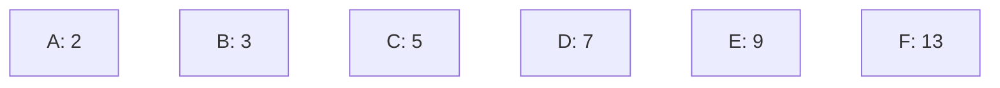
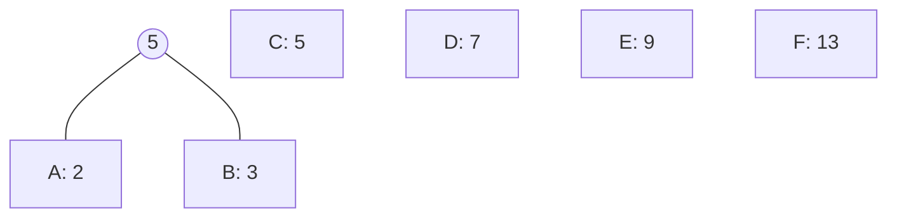
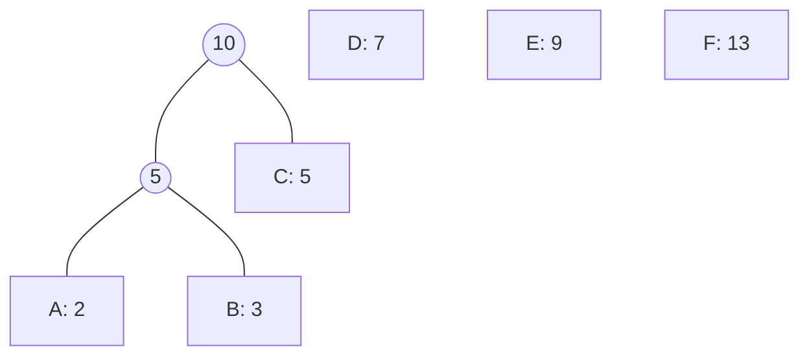
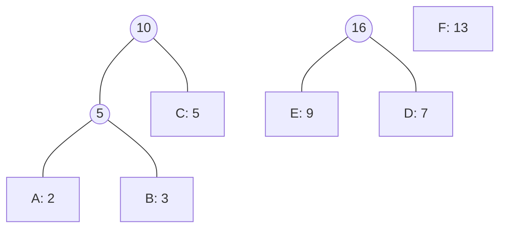
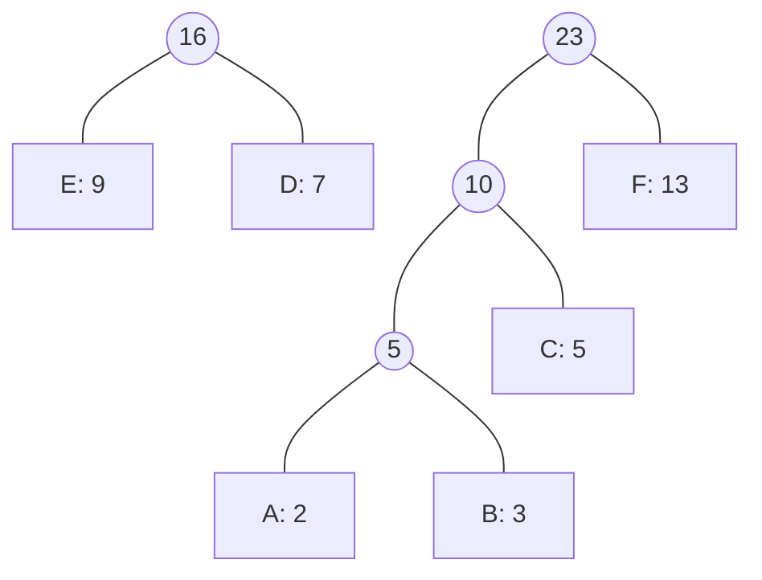
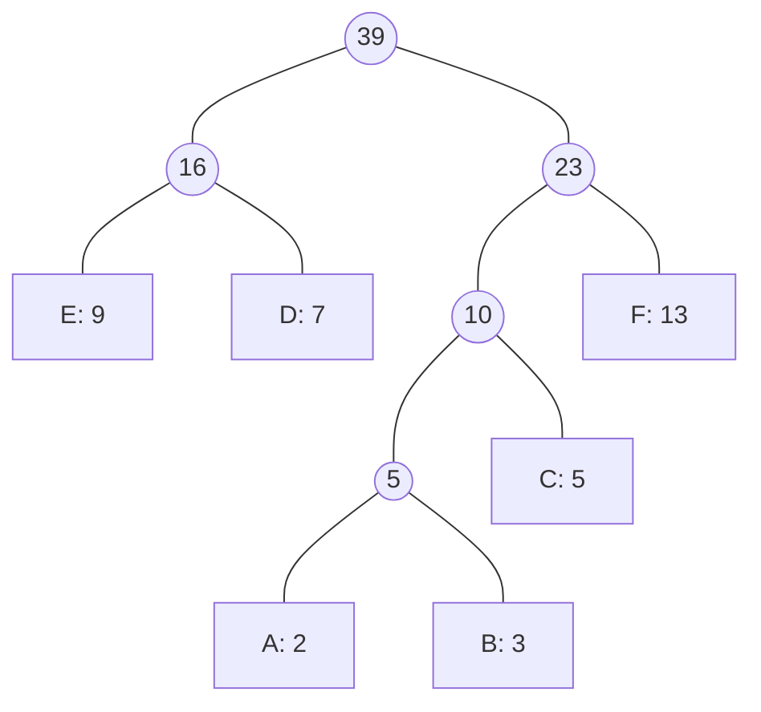
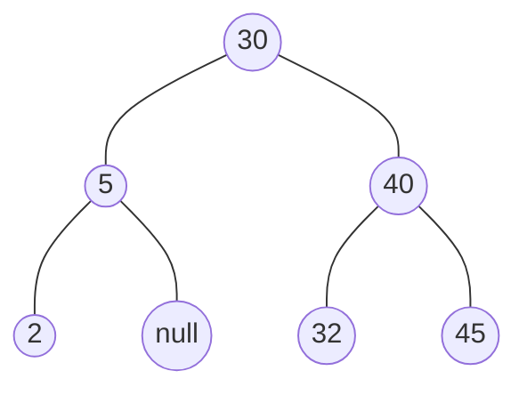
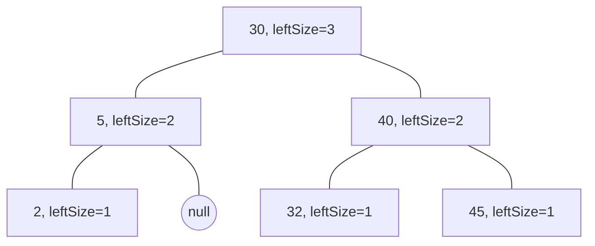

標籤: #DataStructure 

---

[TOC]

---

A tree structure means that the data are organized in a hierarchical manner. It is a finite set of one or more nodes such that

1. There is a specially designated node called the "root".
2. The remaining nodes are partitioned into $n \geq 0$ disjoint sets $T_1, \dots, T_n$, where each of these sets is a tree. $T_1, \dots, T_n$ are called the "subtrees" of the root

There are two types of genealogical charts that are used to present such data:

- [[#Pedigree Chart]]
- [[#Lineal Chart]]

# Pedigree Chart

- normally two-way branching
- not allow for inbreeding
- show ancestors

An example of pedigree chart, shows the ancesters relationship:

![[pedigree chart - tree.png]]

In this case, Brandy and Honey Bear are Dusty's parents.

# Lineal Chart

- show decendents
- each item can produce several others

An example of lineal chart, it shows the descendents of European language:

![[lineal chart - tree.png]]

# Terms

## Degree

The number of subtrees of a node is called its "degree". For example, in the example in [[#Lineal Chart]], "Proto Indo-European" has a degree of 3.

## Leaf

Nodes that have [[#Degree]] 0 are called "leaf" or "terminal" nodes.

## Nonterminal

Nodes that are not [[#leaf]] are called "nonterminals".

## Children

The roots of the subtrees of a node $X$ are called "the children of $X$".

For example, the nodes $B, C, D$ are the children of the node $A$:

![[sample tree - tree.png]]

## Parent

Node $X$ is the "parent" of its children.

For example, the node $A$ is the parent of the children $B, C, D$.

![[sample tree - tree.png]]

## Siblings

[[#Children]] of the same parent are said to be "siblings".

## Degree of a Tree

The "degree of a tree" is the maximum of the [[#Degree]] of the nodes in the tree.

## Ancestor

The "ancestors" of a node are all the nodes along the path from the root to that node.

## Level

The "level" of a node is defined by letting the root be at level one. If a node is at level $l$, then its children are at level $l + 1$.

## Height or Depth of a Tree

The "height" or "depth" of a tree is defined to be the maximum level of any node in the tree.

# Representation

## List Representation

The following tree

![[sample tree - tree.png]]

can be represented by the following list

$$(A(B(E(K, L), F), C(G), D(H(M), I, J)))$$

Since the degree of each node may be different, we may be tempted to use memory nodes with a varying number of pointer fields. However, as it is often easier to write algorithms for a data representation when the node size is fixed, in practice one uses only nodes of a fixed size to represent tree nodes. This node structure is very wasteful of space.

## Left Child-Right Sibling Representation

The node structure will look like this:

![[node structure of the left child-right sibling node - tree.png|350]]

And the tree will be represented like this:

![[the tree representation of the left child-right sibling representation - tree.png]]

## Binary Tree (Degree-two Tree)

This topic is important, therefore we seperate this section to [[#Binary Tree]]. Because binary tree is still a kind of representation of tree, we put this heading here for completeness.

# Binary Tree

- To obtain the degree-two tree representation, we simply rotate the sibling link of [[#Left Child-Right Sibling Representation]] by $45\degree$.
- Note that the right child of the root node of the tree is empty. This is always true because the root of the tree can never have a sibling.
- This is also known as "degree-two tree".

![[degree-two tree representation - tree.png|300]]

## Abstract Data Type

This specification defines only a minimal set of operations on binary trees.

```cpp
template <class T>
class BinaryTree
// objects: A finite set of nodes either empty or consisting of a 
// root node, left BinaryTree and right BinaryTree.
{
public:
	BinaryTree();
	// creates an empty binary tree

	bool IsEmpty();
	// return true iff the binary tree is empty

	BinaryTree(BinaryTree<T>& bt1, T& item, BinaryTree<T>& bt2);
	// creates a binary tree whose left subtree is bt1, 
	// whose right subtree is bt2, 
	// and whose root node contains item

	BinaryTree<T> LeftSubtree();
	// return the left subtree of *this

	BinaryTree<T> RightSubtree();
	// return the right subtree of *this

	T RootData();
	// return the data in the root node of *this
};
```

## Skewed Binary Trees

Skewed binary trees are like lists, they look like a straight line. The following is a skewed tree that skewed to the left:

![[skewed binary tree - tree.png|300]]

Of course there are a corresponding skewed tree that skewed to the right.

## Complete Binary Trees

![[complete binary tree - tree.png|500]]

## Representations

### Array Representation

We may use an ordinary 1D array to represent the tree. We use `a[n + 1]` for array declaration, with $n$ nodes starting from `a[1]` to `a[n]`.

To navigate through the tree, we should define where "parent", "left child" and "right child" are. The following are the definition of the three relative nodes. $i$ is the node index.

1. `parent(i)` is at $\lfloor i / 2 \rfloor$ if $i \neq 1$. If $i = 1$, $i$ is at the root and has no parent.
2. `leftChild(i)` is at $2i$ if $2i \leq n$. If $2i > n$, then $i$ has no left child.
3. `rightChild(i)` is at $2i + 1$ if $2i + 1 \leq n$. If $2i + 1 > n$, then $i$ has no right child.

In this representation, there is one flaw. If the trees we are representing are [[#Skewed Binary Trees]] or something similar, there will be a lot of memory waste. Therefore this representation is only good for [[#Complete Binary Trees]].

### Linked Representation

Although the array representation is good for complete binary trees, it is wasteful for many other binary trees. Also, insertion and deletion of the nodes require a lot of time.

These problems can be solved by using "linked representation".

```cpp
template <class T> class Tree; // forward declaration

template <class T>
class TreeNode
{
friend class Tree<T>;
private:
	T data;
	TreeNode<T> *leftChild;
	TreeNode<T> *rightChild;
};

template <class T>
class Tree
{
public:
	// Tree operations
private:
	TreeNode<T> *root;
};
```

## Traversal

If we let $L, V, R$ stand for moving left, visiting the node, and moving right when at a node, then there are six possible combinations of traversal:

$$LVR, LRV, VLR, VRL, RVL, RLV$$

If we adopt the convention that we traverse left before right, then only three traversals remain:

$$LVR, LRV, VLR$$

To these we assign the names:

1. $LVR$: "inorder"
2. $LRV$: "postorder"
3. $VLR$: "preorder"

In the following subsections, we will use the following binary tree as an example:

![[binary tree with arithmetic expression - tree.png|500]]

### Inorder Traversal of a Binary Tree

Inorder traversal calls for moving down the tree toward the left until you can go no farther. Then you "visit" the node, move one node to the right and continue.

```cpp
template<class T>
void Tree<T>::Inorder()
// Driver calls workhorse for traversal of entire tree.
// The driver is declared as a public member function of Tree.
{
	Inorder(root);
}

template<class T>
void Tree<T>::Inorder(TreeNode<T> *currentNode)
// Workhorse traverses the subtree rooted at currentNode.
// The workhorse is declared as a private member function of Tree.
{
	if(currentNode)
	{
		Inorder(currentNode -> leftChild);
		Visit(currentNode);
		Inorder(currentNode -> rightChild);
	}
}
```

The elements of the example binary tree get output in the following order:

$$A / B * C * D + E$$

### Preorder Traversal of a Binary Tree

```cpp
template<class T>
void Tree<T>::Preorder()
// Driver
{
	Preorder(root);
}

template<class T>
void Tree<T>::Preorder(TreeNode<T> *currentNode)
// Workhorse.
{
	if(currentNode)
	{
		Visit(currentNode);
		Preorder(currentNode -> leftChild);
		Preorder(currentNode -> rightChild);
	}
}
```

The elements of the example binary tree get output in the following order:

$$+**/ABCDE$$

Which is prefix form of the expression.

### Postorder Traversal of a Binary Tree

```cpp
template<class T>
void Tree<T>::Postorder()
// Driver.
{
	Postorder(root);
}
```

The elements of the example binary tree get output in the following order:

$$AB/C*D*E+$$

Which is postfix form of the expression.

### Iterative Inorder Traversal

Since we want to iterate through all the elements in the tree one by one, we first need to implement the inorder traversal method without using recursion.

```cpp
template<class T>
void Tree<T>::NonrecInorder()
// Nonrecursive inorder traversal using a stack.
{
	Stack<TreeNode<T>*> s; // declare and initialize stack
	TreeNode<T> *currentNode = root;
	while(1)
	{
		while(currentNode)
		// move down leftChild fields
		{
			s.Push(currentNode); // add to stack
			currentNode = currentNode -> leftChild;
		}
		if(s.IsEmpty())
			return;
		currentNode = s.Top();
		s.Pop(); // delete from stack
		Visit(currentNode);
		currentNode = currentNode -> rightChild;
	}
}
```

We can now use the function `NonrecInorder` to obtain an inorder iterator for a tree. The class `InorderIterator` is a nested class (and a friend) of `Tree`.

```cpp
class InorderIterator
{
public:
	InorderIterator(){ currentNode = root };
	T* Next();
private:
	Stack<TreeNode<T>*> s;
	TreeNode<T> *currentNode;
};
```

```cpp
T* InorderIterator::Next()
{
	while(currentNode)
	{
		s.Push(currentNode);
		currentNode = currentNode -> leftChild;
	}
	if(s.IsEmpty())
		return 0;
	currentNode = s.Top();
	s.Pop();
	T& temp = currentNode -> data;
	currentNode = currentNode -> rightChild;
	return &temp;
}
```

### Level-Order Traversal of a Binary Tree

Whether written iteratively or recursively, the [[#Inorder]], [[#Preorder]], and [[#Postorder]] traversals all require a stack. We now turn to a traversal that requires a queue.

This traversal visits the nodes level by level and left to right.

```cpp
template<class T>
void Tree<T>::LevelOrder()
// Traverse the binary tree in level order.
{
	Queue<TreeNode<T>*> q;
	TreeNode<T> *currentNode = root;
	while(currentNode)
	{
		Visit(currentNode);
		if(currentNode -> leftChild)
			q.Push(currentNode -> leftChild);
		if(currentNode -> rightChild)
			q.Push(currentNode -> rightChild);
		if(q.IsEmpty())
			return;
		currentNode = q.Front();
		q.Pop();
	}
}
```

## Copying

Using the recursive version of the traversals, we can easily copy a tree.

```cpp
template<class T>
Tree<T>::Tree(const Tree<T>& s) // driver
// Copy constructor
{
	root = Copy(s.root);
}

template<class T>
TreeNode<T>* Tree<T>::Copy(TreeNode<T> *origNode) // Workhorse
// Return a pointer to an exact copy of the binary tree 
// rooted at origNode.
{
	if(!origNode)
		return 0;
	return new TreeNode<T>(origNode -> data,
						   Copy(origNode -> leftChild),
						   Copy(origNode -> rightChild));
}
```

## Testing Equality

The following example uses [[#Preorder]] traversing, but any order could be used.

```cpp
template<class T>
bool Tree<T>::operator==(const Tree& t) const
{
	return Equal(root, t.root);
}

template<class T>
bool Tree<T>::Equal(TreeNode<T>* a, TreeNode<T>* b)
// Workhorse.
{
	if((!a) && (!b))
		return true; // both a and b are 0
	return(a && b
	       // both and b are non-zero
		     && (a -> data == b -> data) 
		        // data is the same
		     && Equal(a -> leftChild, b -> leftChild)
		        // left subtrees equal
		     && Equal(a -> rightChild, b -> rightChild));
		        // right subtrees equal
}
```

# Threaded Binary Trees

We may found out that in a [[#Binary Tree]], there are more `nullptr` than actual pointers. Therefore A. J. Perlis and C. Thornton thought that they can use "threads" to replace these null pointers.

A "thread" is constructed by the following rules:

1. A null `rightChild` pointer will be replaced by a pointer to the node that would be visited after [[#Inorder]] traversing current node `p`.
2. A null `leftChild` pointer will be replaced by a pointer to the node that immediately precedes current node `p` in [[#Inorder]].

A thread tree will look like the following, with the dotted line representing threads:

![[threaded binary tree example - tree.png]]

If we traverse this tree [[#Inorder]], the nodes will be visitted in the following order:

$$H, D, I, B, E, A, F, C, G$$

To use threaded binary tree, we usually use boolean parameters `leftThread` and `rightThread` to our tree node. These two boolean parameters indicates whether this node's left or right child is used as a thread. Also, we add a root node and point the left-most and right-most threads to it.

![[memory representation of threaded tree - tree.png]]

## Traversal

By using the threads, we can perform an [[#Inorder]] traversal without making the use of a stack.

```cpp
T* ThreadedInorderIterator::Next()
// Return the inorder successor of currentNode 
// in a threaded binary tree
{
	ThreadedNode<T> *temp = currentNode -> rightChild;
	if(!currentNode -> rightThread)
		while(!temp -> leftThread)
			temp = temp -> leftChild;
	currentNode = temp;
	if(currentNode == root)
		return 0;
	else
		return &currentNode -> data;
}
```

## Inserting

There are two scenarios:

(a): the right subtree is empty
(b): the right subtree is not empty

![[insertion of r as a right child of s in a threaded binary tree - tree.png]]

```cpp
template<class T>
void ThreadedTree<T>::InsertRight(ThreadedNode<T> *s,
								  ThreadedNode<T> *r)
// Insert r as the right child of s.
{
	r -> rightChild = s -> rightChild;
	r -> righThread = s -> rightThread;
	r -> leftChild = s;
	r -> leftThread = true; // leftChild is a thread
	s -> rightChild = r;
	s -> rightThread = false;
	if(!r -> rightThread)
	{
		// returns the inorder successor of r
		ThreadedNode<T> *temp = InorderSucc(r);
		
		temp -> leftChild = r;
	}
}
```

# Huffman Tree

Huffman tree is a method to compress data stream. This method convert the data into a new data stream, with its first part of Huffman code table and the compressed file.

![[Huffman compressing - tree.png]]

For example, we have a data stream represented in alphabets (only a portion of them is shown):

```
AABBCDEFF...
```

## Building a Huffman Tree

We follow the steps below to build the Huffman tree:

1. Count how many times the alphabets occur in the data stream. For example, we have the following frequency of each alphabet:

| Alphabet | How many of it in data? |
| -------- | ----------------------- |
| A        | 2                       |
| B        | 3                       |
| C        | 5                       |
| D        | 7                       |
| E        | 9                       |
| F        | 13                      |

2. Then, we sort them by key value:



3. We merge the nodes, and calculate its parent. The parent is the sum of its children:

We merge the `A` node and the `B` node:



Then we merge the node generated on last step and merge it with `C`:



Then we merge `E` and `D`:



Then we merge `F` and `10`:



At last, we merge the remaining two trees.



This is how you build a Huffman tree.

## Using Huffman Tree

Now we have a Huffman tree, but how do we use it? Huffman tree is used as a code table to encode and decode the characters. First let's look at the tree we just built:


We can use several bits to encode the alphabets. If we need to traverse left to get to the alphabet, we use a `0`. Otherwise, we use a `1`. For example, the alphabet `D` requires us to first go left to `16`, then go right to `D`. Therefore the bits representing `D` will be `0b01`.

| Alphabet | Code     |
| -------- | -------- |
| `E`      | `0b00`   |
| `D`      | `0b01`   |
| `A`      | `0b1000` |
| `B`      | `0b1001` |
| `C`      | `0b101`  |
| `F`      | `0b11`   | 

Note that we get a data stream of codes with each code using 4 bits of space. We would need 8 bits to represent a character, but with Huffman tree, we only need 4!

Now we save the Huffman code table and the compressed code as a file. This is how to use Huffman tree to compress files.

![[Huffman compressing - tree.png]]

Note that this compress method only works when we only have a few kinds of alphabets. Otherwise, we might get a bigger compressed file compared to the original one!

# Binary Search Trees

- A dictionary is a collection of pairs, each pair has a key and an associated element. We may use the key to access the correspond element.
- Dictionary is implemented in [[Standard Template Library]].
- A binary search tree has a better performance than any of the data structures when the functions to be performed are search, insert, and delete. Therefore it is the best to implement dictionary using binary search trees.

An abstract data type of a dictionary:

```cpp
template <class K, class E>
class Dictionary 
{
public:
	// return true iff the dictionary is empty
	virtual bool IsEmpty() const = 0;

	// return pointer to the pair with specified key;
	// return 0 if no such pair
	virtual pair<K, E>* Get(const K&) const = 0;

	// insert the given pair;
	// if key is a duplicate update associated element
	virtual void Insert(const pair<K, E>&) = 0;

	// delete pair with specified key
	virtual void Delete(const K&) = 0;
};
```

## Properties

A binary search tree is a [[#Binary Tree]]. It may be empty. If it is not empty then it satisfies the following properties:

1. Every element has a key and no two elements have the same key (i.e. the keys are distinct).
2. The keys (if any) in the left subtree are smaller than the key in the root.
3. The keys (if any) in the right subtree are larger than the key in the root.
4. The left and right subtrees are also binary search trees.

## Searching

The searching can be implemented using recursive function, since the [[#Properties]] of binary search trees specifies that it is recursive.

- If the root is 0, then the search tree contains no elements and the search is unsuccessful.
- Otherwise, we compare the key $k$ that we are searching with the root. 
	- If $k$ is larger than the key in the root, then only the right subtree needs to be searched.
	- If $k$ is smaller than the key in the root, then only the left subtree needs to be searched.
- If $k$ equals the key in the root, the search terminates successfully.

### Code for Recursive Search

The following is the code for recursive search of a binary search tree:

```cpp
template<class K, class E> // Driver
pair<K, E>* BST<K, E>::Get(const K& k)
// Search the binary search tree (*this) for a pair with key k.
// If such a pair is found, return a pointer to this pair;
// otherwise, return 0.
{
	return Get(root, k);
}

template<class K, class E> // Workhorse
pair<K, E>* BST<K, E>::Get(TreeNode<pair<K, E>>* p,
						   const K& k)
{
	if(!p)
		return 0;
	if(k < p -> data.first)
		return Get(p -> leftChild, k);
	if(k > p -> data.first)
		return Get(p -> rightChild, k);
	return &p -> data;
}
```

### Code for Iterative Search

```cpp
template<class K, class E> // Iterative version
pair<K, E>* BST<K, E>::Get(const K&k)
{
	TreeNode<pair<K, E>> *currentNode = root;
	while(currentNode)
	{
		if(k < currentNode -> data.first)
			currentNode = currentNode -> leftChild;
		else if(k > currentNode -> data.first)
			currentNode = currentNode -> rightChild;
		else
			return &currentNode -> data;
	}

	// no matching pair
	return 0;
}
```

### Code for Search by Rank

#### What is rank?

Ranks in binary tree represent how big or small a value in the node is. For a tree that puts its smaller node leftside, we have the smallest node rank 1. Then the second smallest node is rank 2, and so on.

For example, the tree below



will have a rank and corresponding key like the chart below.

| Rank | Key |
| ---- | --- |
| 1    | 2   |
| 2    | 5   |
| 3    | 30  |
| 4    | 32  |
| 5    | 40  |
| 6    | 45  | 

#### Searching by rank

We sometimes want to search the tree by rank. If we wish to do so, each node must have an additional field called `leftSize`, which is 1 + the number of elements in the left subtree of the node. The tree we see in the section above will therefore have the field `leftSize` like this:


To search by rank, we compare the rank to the element `leftSize` of the current node we are looking. If the current rank is bigger, we go right and reduce rank by `leftSize`. If the current rank is smaller, we go left. For example, we need to find rank `5`:

1. Compare to node `30`, rank `5` is greater than `leftSize` `3`. We go right to node `40`, and the rank reduced to `2`.
2. In node `40`, `leftSize` `2` is equal to the current rank `2`. This means we found the node correspond to rank `5`.

#### Code

```cpp
template<class K, class E> // search by rank
pair<K, E>* BST<K, E>::RankGet(int r)
// Search the binary search tree for the rth smallest pair.
{
	TreeNode<pair<K, E>>* currentNode = root;
	while(currentNode)
	{
		if(r < currentNode -> leftSize)
			currentNode = currentNode -> leftChild;
		else if(r > currentNode -> leftSize)
		{
			r -= currentNode -> leftSize;
			currentNode = currentNode -> rightChild;
		}
		else
			return &currentNode -> data;
	}
	return 0;
}
```

## Insertion

- To insert a pair, we must first search to verify that its key is different from those of existing elements.
- If the search is unsuccessful, then the element is inserted at the point the search terminated.
- If the dictinoary already contains a pair with the key $k$, we simply update the element associated with this key to $e$.

```cpp
template<class K, class E>
void BST<K, E>::Insert(const pair<K, E>& thePair)
// Insert thePair into the binary search tree.
{
	// search for thePair.first, pp is parent of p
	TreeNode<pair<K, E>> *p = root, *pp = 0;
	while(p)
	{
		pp = p;
		if(thePair.first < p -> data.first)
			p = p -> leftChild;
		else if(thePair.first > p -> data.first)
			p = p -> rightChild;
		else // duplicate, update associated element
		{
			p -> data.second = thePair.second;
			return;
		}
	}

	// perform insertion
	p = new TreeNode<pair<K, E>>(thePair);
	if(root) // tree not empty
	{
		if(thePair.first < pp -> data.first)
			pp -> leftChild = p;
		else
			pp -> rightChild = p;
	}
	else
		root = p;
}
```

## Deletion

- The deletion of [[#Leaf]] is easy. Simply set the left or right child field to 0 will do the work.
- The deletion of a nonleaf element that has only one child is also easy. The node containing the element to be deleted is disosed, and the single-child takes the place of the disposed node.
- When the element to be deleted is in a nonleaf node that has two children, the element is replaced by either the largest element in its left subtree or the smallest one in its right subtree. Then we perform a deletion on this replacing element from the subtree from which it was taken. (like recursion deleting!)

# Selection Tree

When we are merging multiple ordered sequence, we may use selection tree. There are two kinds of selection trees:

1. [[#Winner Trees]]
2. [[#Loser Trees]]

## Winner Trees

- A winner tree is a complete tree.
- Each node represent the smaller of its children.

![[winner trees example - tree.png]]

The "winner" `6` is output, and the tree will reconstruct with `15` in run 4.

![[winner tree after one record has been output and the tree restructured - tree.png]]

Note that not all tree need to be restructured, only some of them. If we keep doing this process, we will have all 8 runs sorted.

## Loser Trees

![[loser tree - tree.png]]

# Forests

A forest is a set of $n \geq 0$ disjoint trees.

The following is a three-tree forest:

![[a three tree forest - tree.png]]

## Transforming a Forest into a Binary Tree

To transform a forest into a single binary tree, we first obtain the binary tree representation of each of the trees in the forest and then link these binary trees together through the `rightChild` field of the root nodes.

![[binary tree representation of forest - tree.png]]

## Traversals

### Preorder Traversal of a Forest

The preorder traversal of a forest is similar to the [[#Preorder Traversal of a Binary Tree]]. We visit the trees in forest one by one, and we visit the nodes in a tree preorderly.

1. If forest $F$ is empty then return.
2. Visit the root of the first tree of $F$
3. Traverse the subtrees of the first tree in forest preorder.
4. Traverse the remaining trees of $F$ in forest preorder.

### Inorder Traversal of a Forest

Inorder traversal of tree $T$ is equivalent to visiting the nodes of forest $F$ in forest inorder. The steps are as follows:

1. If $F$ is empty then return.
2. Traverse the subtrees of the first tree in forest inorder.
3. Visit the root of the first tree.
4. Traverse the remaining trees in forest inorder.

### Postorder Traversal of a Forest

There is no natural analog for postorder traversal of the corresponding binary tree of a forest. Nevertheless, we can define the postorder traversal of a forest as follows:

1. If $F$ is empty then return.
2. Traverse the subtrees of the first tree of $F$ in forest postorder.
3. Traverse the remaining trees of $F$ in forest postorder.
4. Visit the root of the first tree of $F$.

### Level-Order Traversal of a Forest

In level-order traversal of a forest, nodes are visitted level by level. Note that the level-order traversal of a forest and [[#Level-Order Traversal of a Binary Tree]] do not necessarily yield the same result.


---

參考資料:

Fundamental of Data Structure in C++, 2nd edition

---

link:

[[Linked Lists]]
[[Evaluation of Expressions]]
[[Standard Template Library]]